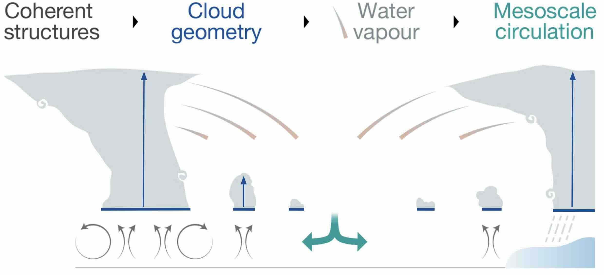
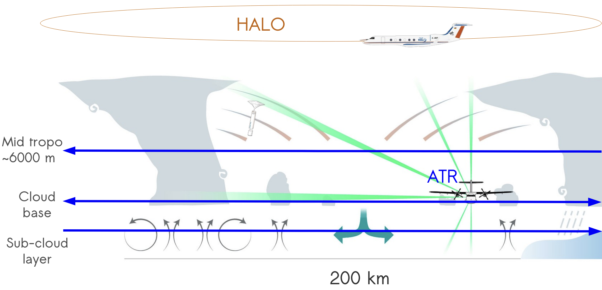
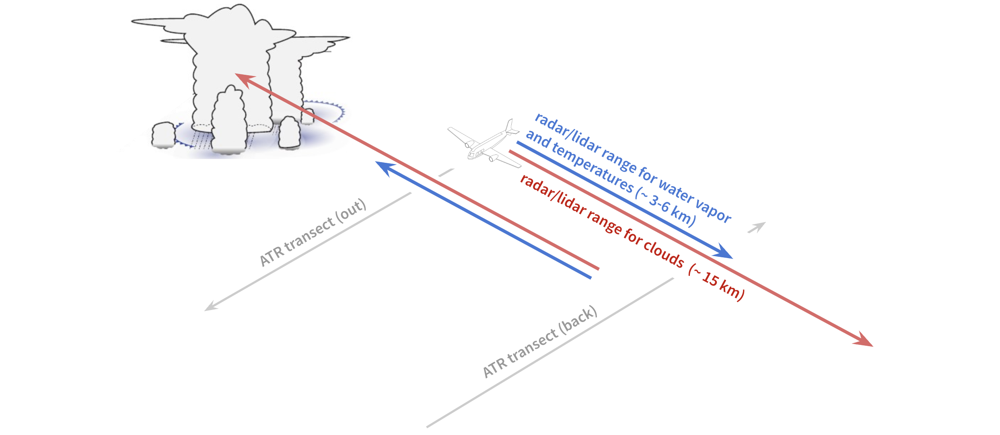
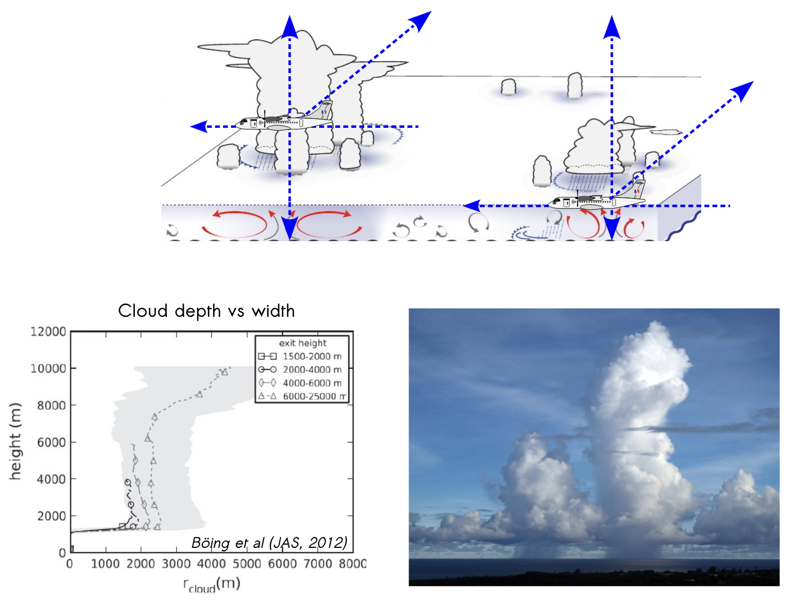
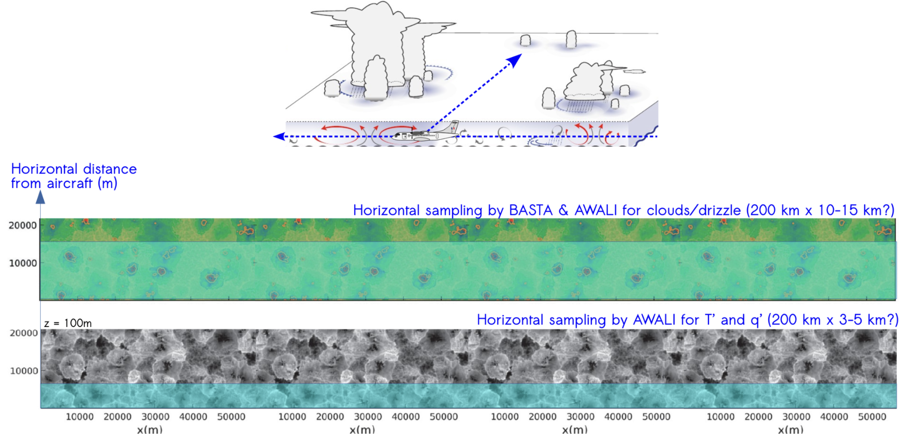
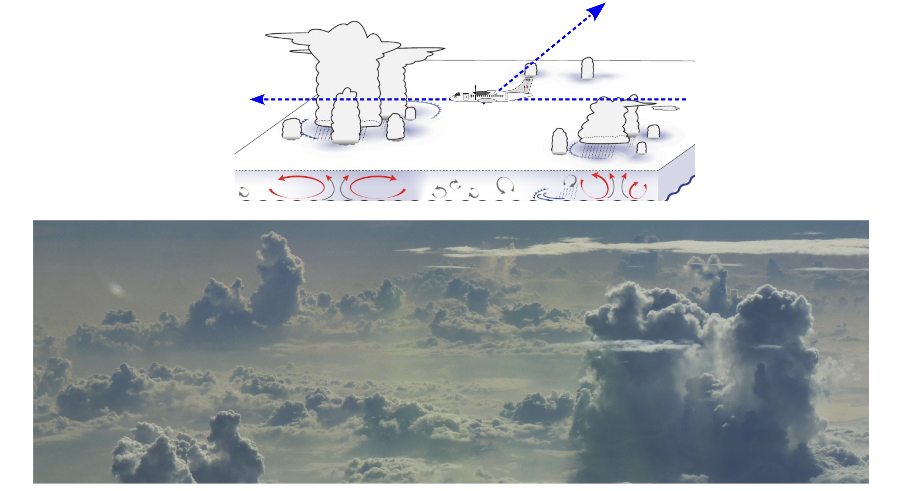
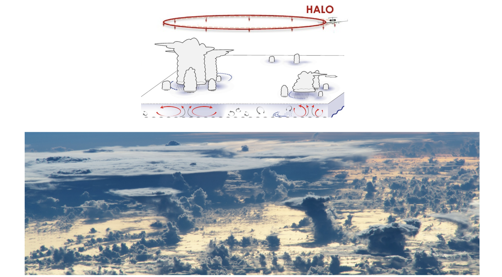
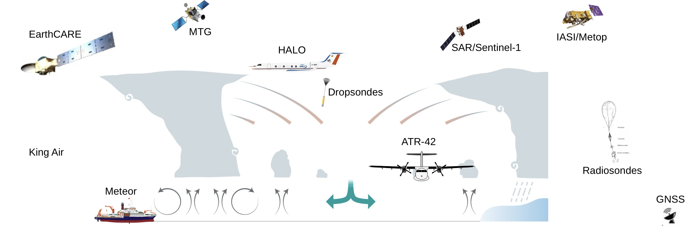

# MAESTRO

**Mesoscale organisation of tropical convection**

*Lead PIs: Sandrine Bony (LMD), Julien Delanoë (LATMOS), Jean-Christophe Canonici (SAFIRE)*

## Overview

MAESTRO is a French initiative that uses the French research aircraft SAFIRE ATR-42 and is funded by the European Research Council (ERC).

The organization of tropical convection is a critical issue for the regulation of Earth's energy balance, the occurence of precipitation extremes, and weather and climate modeling.

The project involves an airborne field campaign from 10 August - 10 September 2024 to collect the observations needed to:

* Test mechanisms hypothesized to control the mesoscale organisation of shallow and deep convection
* Assess the quality of the new EarthCARE satellite observations 
* Understand how the organisation of convection impacts the Earth’s radiation budget through water vapour and clouds
* Assess the ability of high resolution models to predict the interplay between the mesoscale organisation of convection and climate

All types of mesoscale organization will be of interest, including:
* Transitions among patterns of shallow convection
* Transitions from shallow to deep convection
* Convergence lines
* Cloud flowers (mini mesoscale convective systems)
* Early growth of mesoscale convective systems
* Isolated vs clustered convection
* Range of precipitable water regimes
* Northern edge of the ITCZ

### Conceptual Framework

The guiding conceptual framework behind this study is that coherent structures in the boundary layer help dicate cloud geometry, which in turn controls the distribution of water vapor. Clouds and water impact the radiation budget, driving mesoscale circulations that act to create, reinforce, and evolve coherent structures.

### Measurement Strategy
To measure these elements, the aircraft will be equipped with in-situ and remote sensing instrumentation.

A standardized flight pattern of about 1000 km over 3.5 hours will be used to allow for statistical sampling. About 20 to 25 flights are expected over the entire campaign.

A typical flight will begin by departing from Sal, ascending to FL200 (~6000 m), and completing a 200 km transect. Then, the plane will descend to cloud base to fly the transect twice (out and back). These two legs will be flown with a slight offset so that the remote sensing measurements can be verified with in-situ measurements. Then, the plane will descend to the sub cloud layer and fly one more transect. If conditions are favorable, the plane may fly a portion of this leg near the surface (~100 m). Finally, the flight will return Sal. 

Some of these flights will be supported the HALO aircraft flying a circle over the measurement area. Dropsondes will be launched along this circle, allowing the mesocale vertical velocity to be computed.

### From MAESTRO Objectives to Measurements
With the ATR performing transects at multiple levels in rapid succession, MAESTRO will be able to measure:

1. Clouds (their height, width, and in-cloud properties)
    * Cloud populations: cloud size (horizontal and vertical) distributions
    * in-cloud vertical velocity `w(z)`
    * in-cloud mass flux `M(z)`
    * ice water content `IWC(z)`
    * precipitation

2. Below clouds (coherent structures in sub-cloud layer)
    * To assess turbulent vs mesoscale organization, measure spatial heterogeneties.
    * To assess the subcloud structure vs clouds, measure Coherent structures such as thermals and cold pools

3. Around and in-between clouds
    * To assess moist halo around clouds, measure relative humidity `RH(x,z)`
    * Gravity waves? Measure clear-sky vertical velocity `w(x,z)`

4. Cloud ensembles and organization
    * To assess subcloud vs top-down influences on cloud spacing, measure large-scale and mesoscale vertical velocity `w(z)`, humidity variance `<q(x)*q(x')>`, and radiation budget

### Integration into ORCESTRA
There will be a strong connection to the other parts of the ORCESTRA campaign, especially space observations (EarthCARE CalVal, SAR, MTG, IASI), radiosondes, and GNSS data on Cape Verde.

### Further reading
Details on the science, flight strategy and instrumentation are available from the [official MAESTRO website](https://maestro.aeris-data.fr/).
