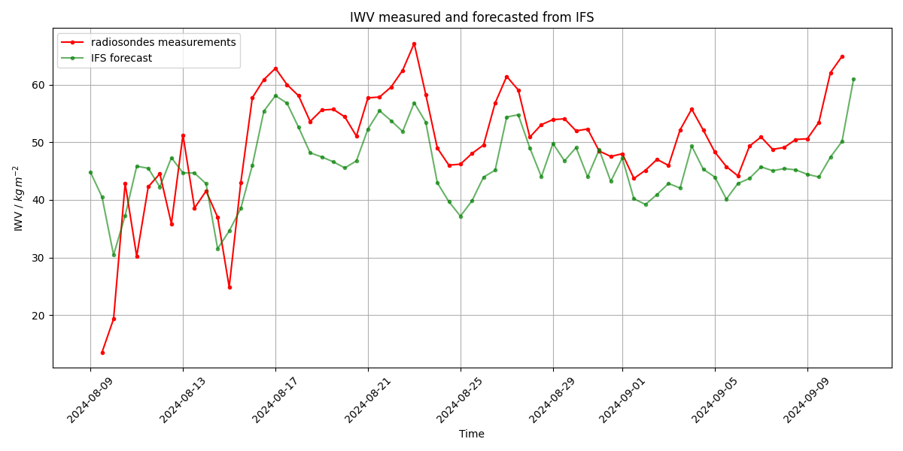

<!-- This file was created automatically -->

# BCO: Radiosondes

Lorem ipsum dolor sit amet, consectetur adipiscing elit. Nullam at nisl nec urna tincidunt tincidunt. Duis nec metus at nulla pellentesque gravida. Morbi efficitur velit eu nibh ultrices, sed suscipit mi aliquam.

---

  
<strong>ORCESTRA at BCO:</strong>

  
  <strong>The BCO Radiosonde Team</strong>
   

  |  |  |
  |:---------------------------------:|:---------------------------------:|

  
<strong>ORCESTRA versus EUREC4A:</strong>

  
  Comparison between ORCESTRA and EUREC4A.
   
  

  
<strong>How good was IFS forecasting:</strong>

  
  
  Comparison of IWV from IFS forecasts and radiosondes measurements.

  
<strong>African Easterly waves passing on top of Sal:</strong>

  

