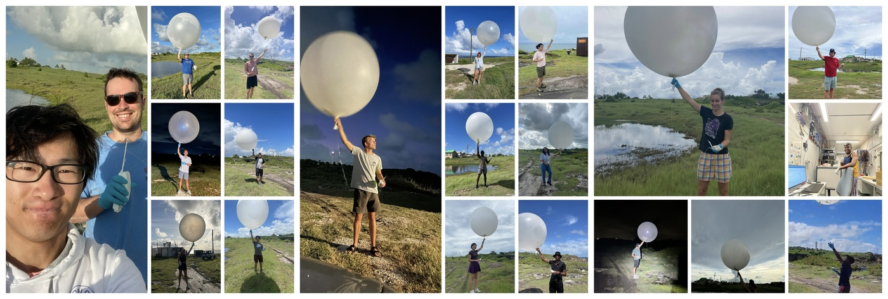
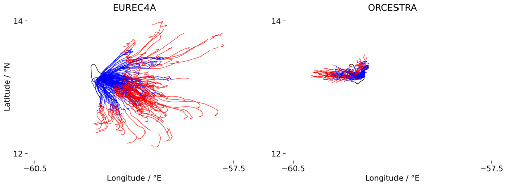

<!-- This file was created automatically -->

# ORCESTRA at BCO

The ORCESTRA field campaign, conducted at the Barbados Cloud Observatory (BCO) between September 7 and 28, 2024, brought together a team of 20 scientists dedicated to advancing our understanding of tropical weather systems and the interplay of clouds, moisture, and winds. Over the course of the campaign, 141 radiosondes were launched, providing critical data for investigating atmospheric processes in the tropical Atlantic. 

This webpage presents an overview of the data collected, highlights initial findings, and lays the groundwork for future analyses that could deepen our understanding of tropical climate dynamics. Explore the sections below to delve into comparisons between different campaigns, analyze forecast accuracy, and understand how African Easterly Waves influence the local weather.

This part of the campaign was made possible thanks to the invaluable support of Friedhelm Jansen and Björn Brügmann, whose technical expertise ensured the success of the radiosonde launches.

---

## The BCO Radiosonde Team

  
<strong>ORCESTRA versus EUREC4A:</strong>

   

  The figure compares the radiosonde tracks observed during two field campaigns: EUREC4A (January-February 2020, left) and ORCESTRA (September 2024, right). Blue lines represent ascending radiosondes, and red lines represent descending ones. The much broader spread of trajectories during EUREC4A suggests a more turbulent and variable wind field, with significant horizontal displacement. This could indicate a more dynamic atmospheric situation with stronger and more variable winds, likely associated with the synoptic weather systems and large-scale convection typical for that period.

  In contrast, the ORCESTRA wind field shows a more concentrated pattern, with less horizontal displacement of the radiosondes, suggesting more stable conditions with weaker and less variable winds. The confined dispersion of the trajectories during ORCESTRA indicates a quieter atmospheric state, potentially influenced by more stable trade wind conditions during the September period. This contrast between the two campaigns highlights the different atmospheric dynamics and wind regimes during the respective field campaigns.

  
<strong>BCO versus Sal:</strong>

  

  In the provided figure, we observe a comparison of air temperature and relative humidity profiles between BCO (blue) and Sal (green) in the upper panels, with the corresponding differences in the lower panels. The air temperature profiles (top left) are quite similar, with only minor variations below 1000 m where Sal shows slightly cooler temperatures. The relative humidity profiles (top right) show a more distinct difference: Sal exhibits higher humidity at lower altitudes (below 2000 m), while BCO has slightly higher humidity between 2000 and 5000 m. The lower panels highlight these differences more clearly, where we can see that BCO is warmer above 1000 m and slightly drier in the lower atmosphere, confirming the subtle but important variations in the thermodynamic conditions between the two locations.

  
<strong>How good was IFS forecasting ?</strong>

  The IFS (Integrated Forecasting System from ECMWF) was utilized throughout the campaign to plan flights and monitor the synoptic situation. Integrated water vapor data was obtained both from the forecasts and radiosondes, enabling direct comparisons to assess the accuracy of both the soundings and the forecasts. Additionally, radiosondes were launched every six hours from Grantley Adams Airport in Barbados. These observations can also be compared with the LAM (Limited Area Model), which was initialized with IFS data and ran continuously during the campaign.

  All of these datasets are compared in the plot below:
  

  Our observations consistently show higher moisture levels compared to other products. At the BCO, the measurements taken from the airport closely align with the IFS model. Since these observations were made further inland, where land influences may contribute to atmospheric drying, this could explain the consistent moisture difference.

  On Sal, a similar dry bias is observed in the IFS model, which is also reflected in the LAM. This is expected, as the LAM is initialized with IFS data and then runs for 48-hour periods. 

  Overall, despite a consistent moister atmosphere from ou rmeasurements, the trends are well captured by IFS and the LAM, and the IWV values follow closely the African Easterly Waves pattern (see following section).

  
<strong>African Easterly waves passing on top of Sal:</strong>

  As before, IWV is derived from radiosonde measurements. The dates of African Easterly Wave (AEW) passages over Sal have been identified and analyzed to study their impact on IWV. Typically, dry phases are observed ahead of the AEW, followed by more humid conditions after its passage. The wave axis crossing is marked by a sharp increase in moisture. As expected, the cyclonic circulation of the AEW drives dry air southward to the west of the wave axis, while moist air is transported northward to the east, leading to an increase in IWV over Sal.

  Additionally, the top 20% strongest wind events have been highlighted on the plot (dashed gray lines), showing that wind strength generally peaks either before or after the wave. The green line represents equivalent potential temperature, with its minimums occurring after the wave's passage, within the ridge pattern.

  
  

