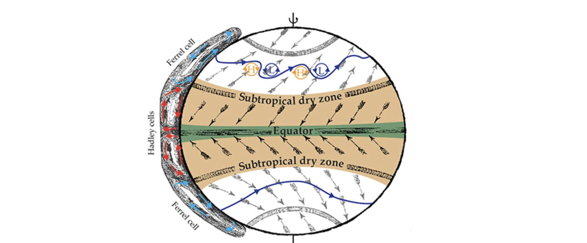

#  PERCUSION

**Persistent EarthCare underflight studies of the ITCZ and organized convection**

*Lead PIs: Silke Gross (DLR), Bjorn Stevens, Julia Windmiller (MPI-M)*

PERCUSION is a German initiative that uses the German research aircraft [HALO](https://halo-research.de) and ESA's [EarthCARE](https://earth.esa.int/eogateway/missions/earthcare) satellite aiming to test factors hypothesized to influence the organization of deep maritime convection in the tropics, and the influence of convective organization on its larger-scale environment.
PERCUSION will extend the NARVAL missions and EUREC4A cases to missing convective (and aerosol) regimes and contribute to a broader view of cloud-circulation coupling over the tropical oceans. PERCUSION will add a new dimension to the previous measurements through it’s focus on deep convection close to and at the Intertropical Convergence Zone (ITCZ). This will complement the EUREC4A measurements, which have focused on the winter downstream trade-wind regimes and provide a more comprehensive picture of the tropical circulation.
Moreover, the impact of different aerosol regimes are studied. HALO will operate three weeks in the western (42W-60W) tropical Atlantic flying out of Barbados, and three weeks in the eastern (25W-43W) flying out of Cape Verde, respectively. This will contrast clouds and circulation in relatively particulate-free air, or in aged dust layers, in the west, with air masses with large (Saharan) dust burdens in the east.
Towards a global coverage by locally validating EarthCARE. The upcoming EarthCARE satellite will become a spaceborne cloud observatory and will enable us to extend local studies to global scale. To establish confidence in EarthCARE products and inform their most intelligent use, we will intensively use HALO underflights for validation purposes.

---
## Focus area

<div style="background-color: rgb(220, 220, 220);">

### The Intertropical Convergence Zone (ITCZ) -  Position, strength, and variability

What controls the position, strength, and variability of tropical rainbelts (Bony et al, 2015)?

Most tropical rain is concentrated within a narrow latitudinal band known as the Inter-Tropical Convergence Zone (ITCZ). This band shifts in position, width and longitude on tim    escales from days to millenia, with consequences for the billions of people who live within its reach.


````{dropdown} Click for more


*Figure 1. William Ferrel's schematic depiction of Earth’s surface wind. Figure taken from Birner et al, 2014 and adapted from Ferrel, 1856.*

These variations in the ITCZ have been linked to changes in the atmosphere's energy balance, but this balance is itself hard to constrain --- it depends on mesoscale circulations which are notoriously difficult to measure. Without these observations, we are unable to constrain our theories and computer simulations, limiting our ability to predict future changes in the width and position of the ITCZ.

Will the islands of Cape Verde, which lie at the edge of the ITCZ, get wetter or dryer in the next 50 years? What about the Sahel? We cannot yet confidently say what will happen.

To break this deadlock, one of PERCUSION's scientific objectives is to measure the mesoscale vertical velocity $w$ at the center and edges of the ITCZ. When these dynamics are connected with quantities such as vorticity, divergence, cloud condensates, surface fluxes and radiative heating, this will allow, for the first time, a process-level observational estimate of the ITCZ's circulation and energy export. With this information, we will be able to peer into the inner life of the ITCZ and understand why it billows and blows.

###  Energetic constraints on the ITCZ

The ITCZ rainfall is fed by warm and moist surface trade winds. Their convergence leads to deep convective clouds that precipitate and detrain in the upper troposphere. This divergent air then sinks in the subtropics and returns to the ITCZ as a surface flow, completing the meridional Hadley circulation (Figure 1).

The ITCZ is an emergent feature of Earth's atmosphere, one that involves precipitation, clouds, and winds. We could look at each of these quantities in isolation to study the ITCZ, but doing so would provide an incomplete picture, as in the story of blinfolded men describing an elephant. (One feels its tail and reports that the elephant is thin and ropy, one feels the side and reports that it is broad and leathery, etc.)

To better understand the location and width of this emergent feature, it is helpful to start by considering energetic constraints. (This lets us gloss over the "details" of precipitation, clouds, and winds for now. Later on, we will look at how these "details" can modify or complement energetic constraints.)

For instance, the ITCZ receives more energy from the sun than it emits back out to space in the zonal- and annual-mean, so the ITCZ must be exporting energy in the vertically-integrated net. In particular, it is the vertically integrated moist static energy $\langle m \rangle = \langle c_p T + Lq + gz \rangle$, where $\langle \cdot \rangle$ denotes a vertical integral, that is being exported. (We study $m$ rather than other variables such as the dry static energy, because $m$ is approximately conserved during deep convection, making it ideal for studying its transport throughout the atmosphere.)

From this constraint, one can deduce the location of the ITCZ by looking at where the vertically integrated meridional energy transport of moist static energy ($\partial_y \langle v m \rangle$) changes direction (Kang et al, 2008; Schneider et al, 2014). Determining the change in width of the ITCZ requires additional considerations about the mass balance of the Hadley Cell (Byrne and Schneider, 2016), and it primarily depends on the Gross Moist Stability ($\mathcal{M}$) of the atmosphere, a measure of how efficient the export of moist static energy from the ITCZ is.

Thus, if one can understand where moist static energy is being exported ($\partial_y \langle v m \rangle$) and how efficiently this is done ($\mathcal{M}$), then one can obtain a basic understanding of where the ITCZ lies and how wide it should be.

```{admonition} Caution
:class: warning dropdown

The trouble is, as we will soon see, that these theories are hard to constrain observationally, which limits our ability to predict future changes in rainfall. Relevant questions such as how the width of the ITCZ change as a function of longitude also remain unclear. This calls for the need to improve our observations of moist static energy export and its efficiency.

```

###  The trouble with Gross Moist Stability

Look at the ITCZ in the zonal and annual mean and you will find a clearly defined band of precipitation and slow, convergent winds (Figure 2).


*Figure 2. Annual-mean precipitation and surface winds. Precipitation maxima is marked by red lines. The right panel shows the zonal-mean precipitation data from the Tropical Rainfall Measuring Mission Multisatellite Precipitation Analysis for 1998–2012. The wind data are from the European Centre for Medium-Range Weather Forecasts interim reanalysis for the same years. Figure taken from Schneider et al, 2014.*

But, as has been known for decades, look at the ITCZ on daily timescales and you will find mesoscale patches of rain and sharp convergence lines; clear-skies and calm winds (Figure 3 and Frank, 1983).

*Figure 3. The morphology of the ITCZ changes from day-to-day, with distinct mesoscale variations. Snapshots from VIIRS (NOAA-20) from the 1st of July 2021 until the 15th of July 2021 in the East Atlantic (26°W to 20°W, 0° to 14°N). Credit: Julia Windmiller*

Sometimes you may find "centrally intensified" convection; other times you find "edge intensified" convection (Figure 4).

*Figure 4. The morphology of the ITCZ seems to have two modes: one with centrally-intensified convection (left); one with edge-intensified edge-intensified convection. Credit: Julia Windmiller*

This turns out to impact $\mathcal{M}$, the efficiency with which the ITCZ exports moist static energy (Masunaga, 2023). To see why, consider idealized thermodynamic profiles and meoscale circulations that are representative of the ITCZ.

*Figure 5. Typical mesoscale circulations within the ITCZ, suggested by sattelites and reanalysis (Masunaga, 2023). Credit Marty Singh.*

Mesoscale circulations can be decomposed into two modes: a "top heavy" deep circulation typical of a centrally-intensified ITCZ (Figure 5, left); and a "bottom heavy" shallow circulation typical of an edge-intensified ITCZ (Figure 5, middle). Given the profile of $w$ (Figure 5, right), one can use mass conservation to determine the primary outflow level of the height as where $-\partial_z w$ is maximized. For the top heavy circulation, this should peak in the upper troposphere; for the bottom heavy circulation, in the mid troposphere.

If one assumes horizontal gradients in moist static energy are small (as was done, for instance, in Neelin and Held, 1987), then one can show the Gross Moist Stability should be proportional to the vertically integrated product of moist static energy and horizontal divergence. That is,

$\mathcal{M} \sim - \int_{\text{z}_s}^{z_\text{TOA}}  dz \quad m \cdot \partial_z w$,

where $z_s$ is the surface and $z_\text{TOA}$ is the top of the atmosphere. (One can show this proportionality by starting with the definition of Gross Moist Stability from Equation 2.3 of Raymond et al, 2009, then assuming horizontal gradients in moist static energy to be zero, and then integrating by parts. The boundary term should be zero since $w$ is zero at the surface and the top of the atmosphere.)

The benefit of this re-arrangement is that it makes clear the connection between Gross Moist Stability $\mathcal{M}$ and horizontal convergence/divergence ($\partial_z w$).


*Figure 6. Typical moist static energy profile of the tropical atmosphere (here denoted by $h$ rather than $m$) and the dependence of moist static energy export on the type of circulation. The vertical line represents the profile of a convecting air parcel. Figure taken from Julia Windmiller (see also Raymond et al, 2009).*

At the edges of the ITCZ, we generally expect an import of moist static energy at the surface due to the convergence of warm and moist trade winds. The export of this energy aloft, however, will depend on the type of mesoscale circulation present.

For a typical c-shaped moist static energy profile of the environment (Figure 6), $\mathcal{M}$ will depend on the outflow level of the circulation. A shallow circulation will export a smaller amount of $m$ than a deep circulation will, since $m$ is less in the mid troposphere than the upper troposphere.

The trouble with the energetic constraints on the ITCZ is that $\mathcal{M}$ depends on mesoscale circulations which are notoriously difficult to observe with satellite remote sensing (vertical winds are usually many orders of magnitude smaller than horizontal winds). They are also difficult to infer theoretically since it is only the tropical-scale circulation that is energetically constrained (e.g. Held and Soden, 2006), rather than the mesoscale circulations within the ITCZ.


```{admonition} Knowledge Check
:class: tip dropdown

**To summarize:** we know that Gross Moist Stability $\mathcal{M}$ is a key quantity in predicting the ITCZ's changes, but we don't understand it well because it is hidden within the ITCZ's inner life, that is, its dynamic and thermodynamic mesoscale structure.
```


###  Reassessing our view of the ITCZ

To advance our understanding of what controls the position, strength and variability of the tropical rain belts, we must observe how clouds, winds, and precipitation couple to one another and influence the energetic budget we are trying to construct. Thus, we are not only interested in observing the mesocale circulations within and at the edges of the ITCZ, but also surface fluxes of moisture and heat, the distribution of cloud condensates and atmospheric radiative heating, and the dynamical evolution of vorticity and divergence.

To do this, we follow the successful application of dropsonde circles during the EUREC4A campaign to infer mesoscale circulations (Bony, 2017). Dropsonde circles of about 130 km in radius will be placed at the center and the edges of the ITCZ on each of the 20+ flights planned for August - September 2024. The dropsondes measure the horizontal wind as a function of height (via a gps tracking the drift of the sonde), and then the mesocale vertical wind of the entire circle can be inferred from the divergence theorem.

We need to be able to identify the edges and the center of the ITCZ. Ideally, we should use a metric that is forecastable yet physically relevant. Although we will sometimes look directly at surface winds, clouds, and precipitation to identify the edges of the ITCZ; we choose to primarily look at precipitable water since it is bimodal --- its sharp geographic gradients separate the dry and moist regions of the tropics and often coincide with the convergent winds, clouds and precipitation associated with the ITCZ (Mapes 2018, Masunaga and Mapes 2020).

Advancing our understanding of the position, strength and variability of the ITCZ requires an all-encompasing view of cloud-precipitation-circulation coupling; one that is qualitatively different from older "dry" theories of the Hadley Cell (Held and Hou, 1980; Lindzen and Hou, 1983). Consider what Edward Lorenz wrote in 1969:

> The previous generation was greatly concerned with the dynamics of pressure systems and talked about highs and lows. Today we have not lost interest in these systems but we tend to look upon them as circulation systems. This change in attitude has led to a deeper understanding of their dynamics. Perhaps the next generation will be talking about the dynamics of water systems.

One of PERCUSION's guiding principle is that a deeper understanding of how clouds and moist processes interact with the circulation might help us think about large-scale and regional climate. Our theoretical framework is, for now, primarily based on conservation of moist static energy and gross moist stability -- a classical pillar of tropical meteorology. But this is not the only way to interpret our results.

We can use and test ideas from self aggregation by examining bimodality in column water vapor. We can test ideas of air-sea interactions (eg. Lindzen and Nigam, 1987; Philander et al, 1996). We can use dynamical ideas such as how the conservation of momentum impacts the evolution of vorticity and divergence, and study how this relates to the ITCZ by examining the connection between the doldrums, subsiding air, and surface wind divergence (Figure 7 and Windmiller, 2024). And we can open up the possibility of tying process-level observations with long term climate change by validating EarthCARE.

These examples illustrate how PERCUSION will provide the observations necessary to test many scientific hypotheseses, not just about the ITCZ but also regional and tropical climate more generally.


*Figure 7. Potential causes for the low-wind speed events known as the "doldrums". Credit: Julia Windmiller.*

PERCUSION will let us assess the realism of a new class of climate models that can study the interactions between the mesoscales and the general circulation (e.g. Klocke, 2017) and which have the chance to advance our skill in climate prediction (Slingo et al, 2022).

The ITCZ's inner life will be characterized to a degree not seen since the GATE field campaign took place exactly fifty years ago (Frank, 1983). GATE took place at the dawn of the era of General Circulation Models to help guide their development and use for understanding global climate change. Is it not fitting that PERCUSION will take place at the dawn of the era of Global Storm Resolving Models, guiding their development and helping us to understand regional climate change?

````

```{dropdown} References

* **Birner et al, 2024** *The changing width of Earth’s tropical belt*
* **Bony et al, 2015** *Clouds, circulation and climate sensitivity*
* **Bony et al, 2017** *EUREC4A: A Field Campaign to Elucidate the Couplings Between Clouds, Convection and Circulation*
* **Byrne and Schneider, 2016** *Narrowing of the ITCZ in a warming climate: Physical mechanisms*
* **Ferrel, 1856** *Essay on the winds and ocean currents*
* **Frank, 1983** *The Structure and Energetics of the East Atlantic Intertropical Convergence Zone*
* **Held and Hou, 1980** *Nonlinear Axially Symmetric Circulations in a Nearly Inviscid Atmosphere*
* **Held and Soden, 2006** *Robust Responses of the Hydrological Cycle to Global Warming*
* **Kang et al, 2008** *The Response of the ITCZ to Extratropical Thermal Forcing: Idealized Slab-Ocean Experiments with a GCM*
* **Klocke et al, 2017** *Rediscovery of the doldrums in storm-resolving simulations over the tropical Atlantic*
* **Lindzen and Hou, 1988** *Hadley Circulations for Zonally Averaged Heating Centered off the Equator*
* **Lindzen and Nigam, 1987** *On the Role of Sea Surface Temperature Gradients in Forcing Low-Level Winds and Convergence in the Tropics*
* **Mapes et al, 2018** *The Meandering Margin of the Meteorological Moist Tropics*
* **Masunage and Mapes, 2020** *A mechanism for the maintenance of sharp tropical margin*
* **Masunaga, 2023** *The Edge Intensification of Eastern Pacific ITCZ Convection*
* **Muller, 2022** *Spontaneous Aggregation of Convective Storms*
* **Neelin and Held, 1987** *Modeling Tropical Convergence Based on the Moist Static Energy Budget*
* **Pierrehumbert, 1995** *Thermostats, radiator fins, and the local runaway greenhouse effect*
* **Philander et al, 1996** *Why the ITCZ Is Mostly North of the Equator*

```

</div>
