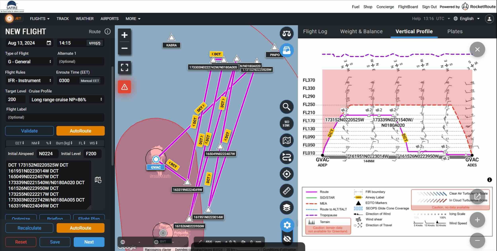

---
jupytext:
  text_representation:
    extension: .md
    format_name: myst
    format_version: 0.12
    jupytext_version: 1.7.1
kernelspec:
  display_name: Python 3
  language: python
  name: python3
platform: ATR
flight_id: ATR-20240813a
takeoff: "2024-08-13 14:15:00Z"
landing: "2024-08-13 17:15:00Z"
departure_airport: GVAC
arrival_airport: GVAC
crew:
  - name: tbd
    job: Pilot
  - name: tbd
    job: Pilot
  - name: tbd
    job: Mechanics
  - name: tbd
    job: Expé Principal
  - name: tbd
    job: Expé 
  - name: Louis Jaffeux
    job: PI
  - name: tbd
    job: LNG
  - name: tbd
    job: aWALI
  - name: tbd
    job: Microphys 1
  - name: tbd
    job: Microphys 2
  - name: tbd
    job: RASTA
  - name: tbd
    job: BASTA
orphan: true
categories: [ec_under]

---

# Flight plan - {front}`flight_id`

```{badges}
```

## Flight plan
* The flight is planned to take off at {front}`takeoff` UTC and land at {front}`landing` UTC.

* EC Meeting time at 15:30:00 UTC.

```{code-cell} python3
:tags: [hide-input]
from orcestra.flightplan import sal, bco, LatLon, IntoCircle, path_preview, plot_cwv
from datetime import datetime
import intake

cat = intake.open_catalog("https://tcodata.mpimet.mpg.de/internal.yaml")

date_time = datetime(2024, 8, 6, 12, 0, 0)
date_time_str = date_time.strftime('%Y-%m-%d')
flight_time = datetime(2024, 8, 13, 12, 0, 0)

radius = 100e3

airport = sal
wp1 = LatLon(lat=17.531111, lon=-22.090278, label='wp1')
wp2 = LatLon(lat=16.330833, lon=-22.503889, label='wp2')
meeting_pt = LatLon(lat=16.846944, lon=-22.401944, label='EC meeting pt')
wp3 = LatLon(lat=17.560833, lon=-22.261111, label='wp3')
wp4 = LatLon(lat=16.257222, lon=-22.663889, label='wp4')
wp5 = LatLon(lat=17.548611, lon=-22.371389, label='wp5')
wp6 = LatLon(lat=17.550833, lon=-22.461667, label='wp6')
wp7 = LatLon(lat=16.555278, lon=-22.680278, label='wp7')


path = [airport, wp1, wp2, meeting_pt, wp3, wp4, wp5, wp6, wp7, airport]

ds = cat.HIFS(refdate=date_time_str, reftime=date_time.hour).to_dask()
cwv_flight_time = ds["tcwv"].sel(time=flight_time, method = "nearest")

ax = path_preview(path)
plot_cwv(cwv_flight_time)


```
* SAFIRE Flight Plan submitted to Air Traffic Control (ATC)



* See higher resolution pdf [here](./SAFIRE-ATR-20240813a.pdf). 

```{code-cell} python3
:tags: [hide-input]
import pandas as pd
from dataclasses import asdict

pd.DataFrame.from_records(map(asdict, path)).set_index("label")
```

## Crew

```{crew}
```