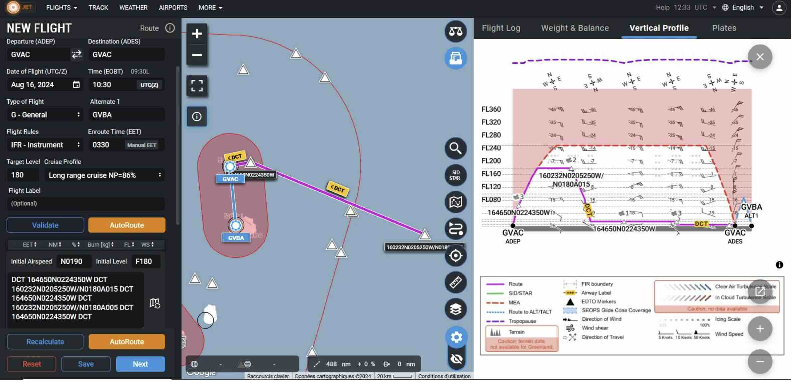

---
jupytext:
  text_representation:
    extension: .md
    format_name: myst
    format_version: 0.12
    jupytext_version: 1.7.1
kernelspec:
  display_name: Python 3
  language: python
  name: python3
platform: ATR

flight_id: ATR-20240816a
takeoff: "2024-08-16 10:30:00Z"
landing: "2024-08-16 14:00:00Z"
departure_airport: GVAC
arrival_airport: GVAC
crew:
  - name: Guillaume Seurat
    job: Pilot
  - name: Jean-François Bourdinot
    job: Pilot
  - name: Thierry André
    job: Mechanics
  - name: Greg Ehses
    job: Expé Principal
  - name: Clément Bezier
    job: Expé 
  - name: Marie Lothon
    job: PI
  - name: Sophie Bounissou
    job: LNG
  - name: Jérémy Lagarrigue
    job: aWALI
  - name: Pierre Coutris
    job: Microphys 1
  - name: Antoine Baudoux
    job: Microphys 2
  - name: Julien Delanoë
    job: RASTA
  - name: Emmeline François
    job: BASTA
orphan: true
categories: []

---

# Flight plan - {front}`flight_id`

```{badges}
```

## Flight plan
* The flight is planned to take off at {front}`takeoff` UTC and land at {front}`landing` UTC.
* Normal MAESTRO flight pattern.
* Deep convection expected.
```{code-cell} python3
:tags: [hide-input]
from orcestra.flightplan import sal, bco, LatLon, IntoCircle, path_preview, plot_cwv
from datetime import datetime
import intake

cat = intake.open_catalog("https://tcodata.mpimet.mpg.de/internal.yaml")

date_time = datetime(2024, 8, 6, 12, 0, 0)
date_time_str = date_time.strftime('%Y-%m-%d')
flight_time = datetime(2024, 8, 11, 12, 0, 0)

from orcestra.flightplan import sal, bco, LatLon, IntoCircle, path_preview, plot_cwv
from datetime import datetime
import intake

cat = intake.open_catalog("https://tcodata.mpimet.mpg.de/internal.yaml")

date_time = datetime(2024, 8, 6, 12, 0, 0)
date_time_str = date_time.strftime('%Y-%m-%d')
flight_time = datetime(2024, 8, 16, 12, 0, 0)

airport = sal
wp1 = LatLon(lat=16.781, lon=-22.731, label='wp1')
wp2 = LatLon(lat=16.042 , lon=-20.881, label='wp2')
path = [airport, wp1, wp2, wp1, wp2, wp1, airport]

ds = cat.HIFS(refdate=date_time_str, reftime=date_time.hour).to_dask()
cwv_flight_time = ds["tcwv"].sel(time=flight_time, method = "nearest")

ax = path_preview(path)
plot_cwv(cwv_flight_time)


```


* SAFIRE Flight Plan submitted to Air Traffic Control (ATC)



```{code-cell} python3
:tags: [hide-input]
import pandas as pd
from dataclasses import asdict

pd.DataFrame.from_records(map(asdict, path)).set_index("label")
```

## Crew

```{crew}
```