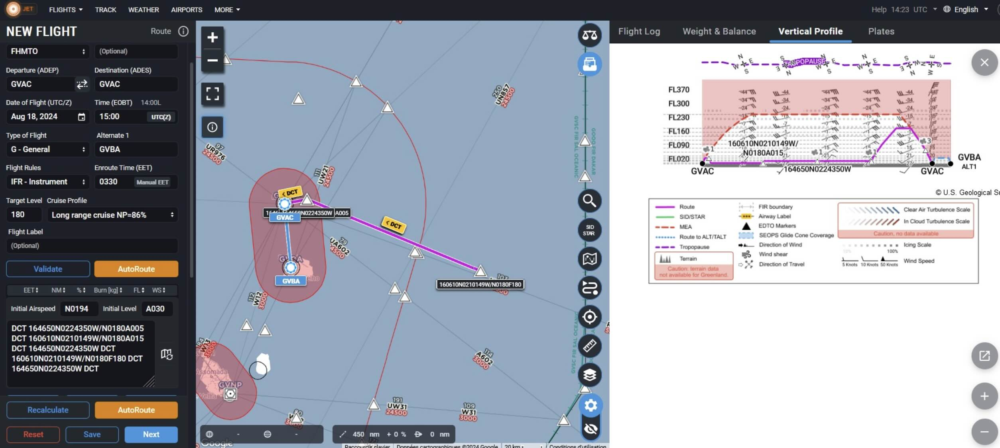

---
jupytext:
  text_representation:
    extension: .md
    format_name: myst
    format_version: 0.12
    jupytext_version: 1.7.1
kernelspec:
  display_name: Python 3
  language: python
  name: python3
platform: ATR

flight_id: ATR-20240818a
takeoff: "2024-08-19 15:00:00Z"
landing: "2024-08-19 18:30:00Z"
departure_airport: GVAC
arrival_airport: GVAC
crew:
  - name: tbd
    job: Pilot
  - name: tbd
    job: Pilot
  - name: tbd
    job: Mechanics
  - name: tbd
    job: Expé Principal
  - name: tbd
    job: Expé 
  - name: tbd
    job: PI
  - name: tbd
    job: LNG
  - name: tbd
    job: aWALI
  - name: tbd
    job: Microphys 1
  - name: tbd
    job: Microphys 2
  - name: tbd
    job: RASTA
  - name: tbd
    job: BASTA
orphan: true
categories: [atr_circ]

---

# Flight plan - {front}`flight_id`

```{badges}
```

## Flight plan
* The flight is planned to take off at {front}`takeoff` UTC and land at {front}`landing` UTC.
* Normal MAESTRO flight pattern is reversed, i.e. the first leg will be in the boundary layer, then two legs at cloud base, then near the freezing level. This is done so that cloud base can be ID'd during the boundary layer leg with the upward pointing lider LNG.
* Potential for deep convection. 
* Doldrum-like wind speeds.
* Coordination with HALO: atr circle will be flown around 18:00 UTC.
```{code-cell} python3
:tags: [hide-input]
from orcestra.flightplan import sal, bco, LatLon, IntoCircle, path_preview, plot_cwv
from datetime import datetime
import intake

cat = intake.open_catalog("https://tcodata.mpimet.mpg.de/internal.yaml")

from orcestra.flightplan import sal, bco, LatLon, IntoCircle, path_preview, plot_cwv
from datetime import datetime
import intake

cat = intake.open_catalog("https://tcodata.mpimet.mpg.de/internal.yaml")

date_time = datetime(2024, 8, 16, 12, 0, 0)
date_time_str = date_time.strftime('%Y-%m-%d')
flight_time = datetime(2024, 8, 18, 12, 0, 0)

airport = sal
wp1 = LatLon(lat=16.7806, lon=-22.7306, label='wp1')
wp2 = LatLon(lat=16.1028 , lon=-21.0303, label='wp2')
path = [airport, wp1, wp2, wp1, wp2, wp1, airport]

radius = 70e3 # units: km
circle_atr = LatLon(lat=16.4212, lon=-21.83150, label="circle_atr")
halo_circle = IntoCircle(circle_atr, radius, 360)

ds = cat.HIFS(refdate=date_time_str, reftime=date_time.hour).to_dask()
cwv_flight_time = ds["tcwv"].sel(time=flight_time, method = "nearest")

ax = path_preview(path)
path_preview([circle_atr.course(0, radius), halo_circle], ax=ax)  # HACK: Add HALO circle
ax.scatter(circle_atr.lon, circle_atr.lat, color="tab:orange")
ax.text(circle_atr.lon+0.05, circle_atr.lat, color="tab:orange", s='HALO_Circle', bbox=dict(facecolor='white',edgecolor='white', boxstyle='round,pad=0.1'))
plot_cwv(cwv_flight_time)


```
Note that flight levels are reverse, i.e. the low legs are flown first, then at cloud base, then in the free troposphere/freezing level.


* SAFIRE Flight Plan submitted to Air Traffic Control (ATC)



```{code-cell} python3
:tags: [hide-input]
import pandas as pd
from dataclasses import asdict

pd.DataFrame.from_records(map(asdict, path+[circle_atr])).set_index("label")
```

## Crew

```{crew}
```