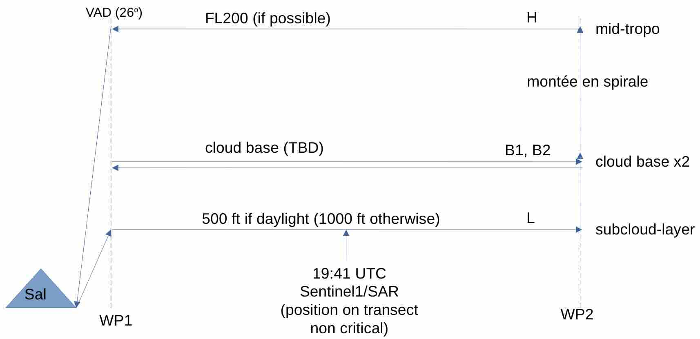

---
jupytext:
  text_representation:
    extension: .md
    format_name: myst
    format_version: 0.12
    jupytext_version: 1.7.1
kernelspec:
  display_name: Python 3
  language: python
  name: python3
platform: ATR
flight_id: ATR-20240825a
takeoff: "2024-08-25 19:15:00Z"
landing: "2024-08-25 22:45:00Z"
departure_airport: GVAC
arrival_airport: GVAC
crew:
  - name: Dominique Duchano
    job: Pilot
  - name: Guillaume Seurat
    job: Pilot
  - name: Thierry André
    job: Mechanics
  - name: Tania Jiang
    job: Expé Principal
  - name: Greg Ehses
    job: Expé 
  - name: Marie Lothon
    job: PI
  - name: Sophie Bounissou
    job: LNG
  - name: Frédérique Laly
    job: aWALI
  - name: Pierre Coutris
    job: Microphys 1
  - name: Guy Lefebvre
    job: Microphys 2
  - name: Julien Delanoë
    job: RASTA
  - name: Kevin Huet
    job: BASTA
categories: [sar_under, c_atr]
orphan: true
---

{logo}`MAESTRO`

# Flight plan - {front}`flight_id`

```{badges}
```

## Flight plan
* The flight is planned to take off at {front}`takeoff` UTC and land at {front}`landing` UTC.
* The HALO circle around the ATR-transects will be of radius 70 km centered.
* flight track designed for coordination with SAR on Sentinel-1 at 19:42 UTC (to study coherent structures near the ocean surface)
* nighttime conditions (better range for Raman lidar)
* two circle locations shown depending on whether ATC can accomodate requested changes

```{code-cell} python3
:tags: [hide-input]
from orcestra.flightplan import sal, bco, LatLon, IntoCircle, path_preview, plot_cwv
from datetime import datetime
import intake

cat = intake.open_catalog("https://tcodata.mpimet.mpg.de/internal.yaml")

date_time = datetime(2024, 8, 23, 12, 0, 0)
date_time_str = date_time.strftime('%Y-%m-%d')
flight_time = datetime(2024, 8, 25, 12, 0, 0)

radius = 70e3 # units: km
circle_atr = LatLon(lat=15.5, lon=-22.1, label="circle_atr")
halo_circle = IntoCircle(circle_atr, radius, 360)

airport = sal
wp1 = LatLon(lat=16.757, lon=-22.622, label='wp1')
wp2 = LatLon(lat=14.929, lon=-22.333, label='wp2')

path = [airport, wp1, wp2, wp1, airport]

ds = cat.HIFS(refdate=date_time_str, reftime=date_time.hour).to_dask()
cwv_flight_time = ds["tcwv"].sel(time=flight_time, method = "nearest")

ax = path_preview(path)
path_preview([circle_atr.course(0, radius), halo_circle], ax=ax)  # HACK: Add HALO circle
ax.scatter(circle_atr.lon, circle_atr.lat, color="tab:orange")
ax.text(circle_atr.lon+0.05, circle_atr.lat, color="tab:orange", s='HALO_Circle', bbox=dict(facecolor='white',edgecolor='white', boxstyle='round,pad=0.1'))

ax.set_extent([-24, -21, 14.8, 17])


plot_cwv(cwv_flight_time)


```


<!-- * SAFIRE Flight Plan submitted to Air Traffic Control (ATC)

 -->

```{code-cell} python3
:tags: [hide-input]
import pandas as pd
from dataclasses import asdict

pd.DataFrame.from_records(map(asdict, path+[circle_atr])).set_index("label")
```

## Crew

```{crew}
```