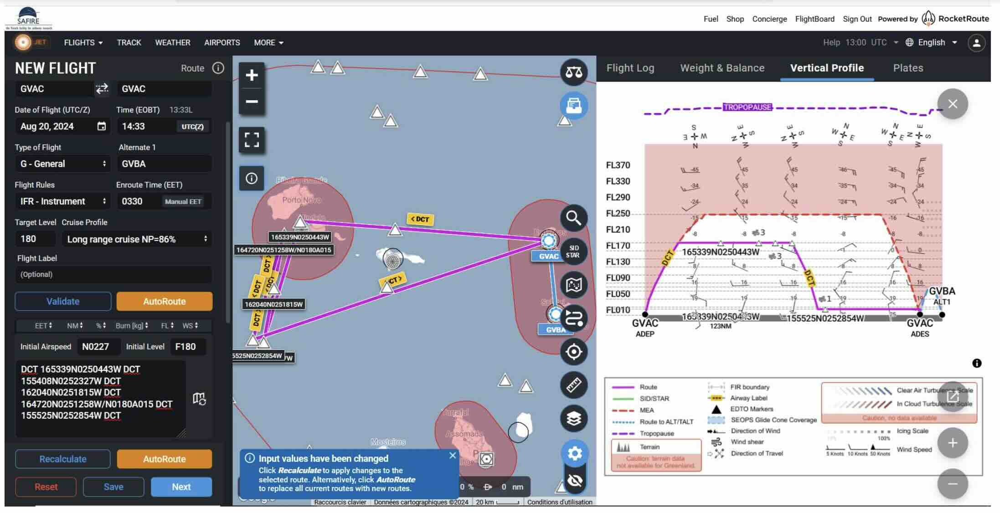

# ATR Flight Planning

## Overview
The goal of MAESTRO is to better understand convective organization and its impact on climate. Our current understanding of this organization suggests that we should measure coherent structures in the sub cloud layer, cloud geometry at cloud base, and clouds, water vapor, and mesocale circulations at multiple levels. This, along with ATR's in-situ and remote-sensing instruments and range of 3h 30m (1000 km), suggests a flight plan that consists of:
* One 200 km leg in the subcloud layer
* Two 200 km legs at cloud base
* One 200 km leg in the free troposphere

With this flight template, we can begin flight planning.

## 1 - 3 days before flight
1. **Decide where and when to fly** 
    * **EarthCARE** — if its track is within ~250 km of Sal, then the highest leg (~FL200) should coincide with EarthCare during its overpass.
    * **The convective situation** --- where and when is it cloudy? Look at [AROME forecasts](https://observations.ipsl.fr/aeris/maestro/#/map) of cloud liquid water content and total column integrated water vapour. Note that these predictions are subject to change.
    * **Coordination and dropsonde circles** --- If HALO is flying and able to complete a circle of dropsondes around the ATR, then it is preferable to choose a flight track > 80 km from the surrounding islands so that the dropsonde profiles of horizontal velocity are not influenced by them. It is also preferable to do the ATR legs as close as possible to when HALO can fly the circle. (HALO's flight time is usually dicated by where it meets EarthCare.)
    * **Flight history** --- We hope to sample both clear-sky, shallow and deep convective conditions. If we have have many flights that have already sampled clear-sky and shallow convection, then it may be preferable to try and sample deep convection (if the conditions permit it).
    * **Multiple flights** --- If two flights are planned, the second should start at least two hours after the first flight has ended.
    * **Other considerations** --- Sometimes it is preferrable to fly the subcloud layer leg first, for instance, when we want to precisely know the level of cloud base before flying there. Flying the lower legs first also saves fuel and increases the ATR's range. Sometimes flying cloud base first is preferrable when we want to measure clouds before they dissipate. Sometimes flying in the mid troposphere first is best, since flying the lower legs first can contaminate the windows of the lidars and decrease their performance.
    * **Communication** --- There are daily meetings at 10:30 with the pilots and flight crew.

2. **Submit a flight plan**
    * This should include departure and arrival times, along with way points and flight levels for each leg.
    * Ideally, this should be submitted 3 days before the flight. However, this can be relaxed as the campaign progresses.
    * Here is an example of a flight plan submitted to the air traffic control (ATC).
    
    
3. **Coordinate**
    * Begin discussing coordination with HALO and KingAir, if this has not already begun. Often these coordination plans are not finalized until the day before the flight.

## 1 day before flight
1. If it is an EarthCare flight, verify the coordinates and timing of the meeting point.
2. Revisit forecasts and adjust plans accordingly.
3. Confirm timings, waypoints, and coordination so that everyone is on the same page.

## Day of flight
* Revisit the forecasts one last time. 
* Check the latest radiosondings to help identify cloud base. Check also the lidar at Mindelo.
* Check the satellite imagery. Here are a few resources:
    * PLANET - see the flight track and various types of imagery from MSG.
    * [MODIS Images On Worldview](https://worldview.earthdata.nasa.gov/) - select the Terra image for higher resolution visual images
    * [GOES16 Movies](https://www.tropicaltidbits.com/sat/satlooper.php?region=eatl&product=ir)
    * [Windy GOES16](https://www.windy.com/-Satellite-satellite?satellite,15.111,-23.617,5) - click for visable and infrared
* **Contingencies** --- If two flights plans were submitted to the ATC, now is the time to decide which one will be flown.

## During the flight
* **Find where it is cloudy**
    * Check the satellite imagery mentioned above.
* **Determine cloud base**
    * Continue to check the Sal radiosondings, Mindelo lidar, and ATR lidar (LNG).
* **Monitor other instruments**
    * Lidar, radar, probes, etc. can provide useful information, such as whether a cloud precipitates or not, or whether the cloud is composed of liquid or ice.
* **Coordinate**
    * Coordinate with HALO via PLANET. This is useful if circle location or the direction of flight along the circle needs to change. 
* **Adjust on the fly**
    * The way points and flight levels can be amended if, for instance, clouds are not quite along the planned track, or the plane tookoff late and needs to save time, etc. One commond change is the flight levels, by a few hundred meters, when trying to locate cloud base.
    * The ATR can also perform holding patterns between legs if required. (For instance, if HALO is launching dropsondes in front of the ATR).
    * HALO can skip dropsondes if the ATR is near and is unable to do a holding pattern

## Après-Vol
* **Formal debrief** --- exchange notes on instrument performance, what was observed, and what can be refined for next time. Eventually, a flight report should be filed.
* **Informal debrief** --- brag to your colleagues about how amazing the clouds were :)