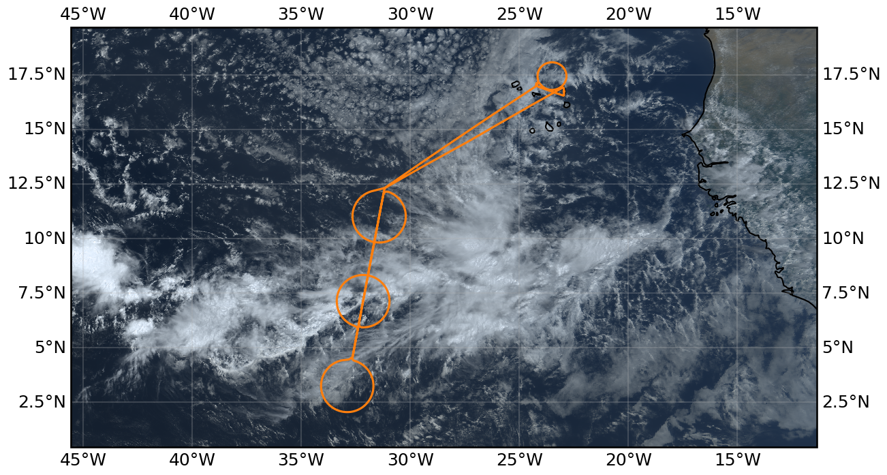
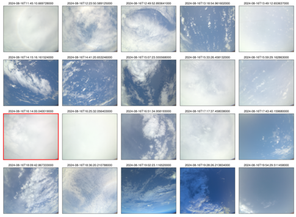

{logo}`PERCUSION`

# {front}`flight_id`

```{badges}
```

## Crew

```{crew-list}
```

## Track


## Conditions

Drizzle and very fine sprays of showers in the morning on SAL. 

The flight was in the far west of our domain, with the EC overpass near 33W.  The central ITCZ to our east was dominated by very cold cloud tops forming a large blob in the center of the moist region at around 25 W, which broke into a more edge intensivied region defined by our center and southern circles.  The northern line (in the center of the moist region) seemed to develop to the west out of the blob.  We could identify strong convective features through the troposphere along this line through the northern half of this middle circle.  To the south there was a clearing/gap, so that the southern edge of the northern feature has a very strong boundary and shelf-like appearance.  Cold-pool features were associated with the line, and with the gap/hole.  The southern line seemed less convectively active (despite nice OLR features).  As a whole the edge intensification out of the blob gave the system a lobster-claw like appearance.  Further to the west there were two large cellular features extending out of the northern line (that we crossed in the middle), which seemed to be moving SSE closing the gap ... perhaps eventually feeding the lobster.

There was an extensive region of boundary layer stratocumulus in the vicinity of the `c_atr`, with a sharp edge delineating a cloud free region to the SW.  The straocumulus had cells extending above and feeding into the layer, but these were widely spaced.

At the time of the EarthCARE overpass we were going over one of the deepest convective features, just having left the 'hole' to the south, between the 'pincers' of the lobster claw.

## Execution

Before takeoff the Flight management system indicated an error or failure with the emergency light battery.  This took sometime to sort out and led to a 1hr delay in the take off.  We adjusted the flight pattern by not flying through to the south, but rather adopting a keyhole pattern for `c_south` flying on to circle from the north and back on to the EarthCARE track from this point.  Both `c_south` and `c_north` seemed to cross into less convective regions. We met EarthCARE on the straight leg out of the keyhole to the north of the center circle.  We climbed to FL450 shortly before the underpass, also to get over a developing convective system.

At the end of the flight we came on to the NW `c_atr` for the fourth circle, which we flew at FL350 in a CW manner to deconflict with the ATR who was leaving the area as we entered.

### EarthCare Underpass

*HALO-20240816a underpass distance 37 m at 2024-08-16T16:13:56.2 s*

## Impressions

There was an extensive stratiform cloud shield with tops mostly below 14 km forming a sea of white, but with a convective mound here or there rounding out the snowscape. Cirrus were often evident well above us.  Later looking at EarthCARE which also saw them, they appeared to be at 16 km.  We all wondered about their origin, as they weren't immediately connected with convective towers.   Very nice stratocumulus layer with a sharp edge.

- 15:18 UTC Cells off to our right poking through the cirrus shield, growing cells to our left, and behnd us with less of a cirrus chield. Cirrus above us 'one wonders where that comes from'

- 15:25 UTC Cirrus at flight level, modestly thick

- 17:33 UTC in the north, there seemed to be a field of shallow cumulus, but with ragged bases and rather at 6 km than at 600m

- 19:25 UTC crossed the edge of stratocumulus.  Looking back it made for a nice boundary.

- 15:43 UTC dropped a sonde through a deep convective cell

- 16:14 UTC estimated time of EarthCARE overpass

- 19:52 Meteor reported 61 kg/m2 PW near the southern islands, much drier to the north ... we were wondering about our PW estimats from the uncalibrated HAMP-radiometers.

```{note}
Center circle sampled a very active convective line, also coincident with `ec_under`
```

````{card-carousel} 2
```{card}
:img-top: ../figures/HALO-20240816a/crew.jpeg
Scientific Crew
```

```{card}
:img-top: ../figures/HALO-20240816a/134118.jpeg

Developing convection (13:41:18 UTC)
```

```{card}
:img-top: ../figures/HALO-20240816a/150659.jpeg

Complex inner ITCZ landscape (15:06:59 UTC)
```

```{card}
:img-top: ../figures/HALO-20240816a/150756.jpeg

Overshooting top (15:07:56 UTC)
```

```{card}
:img-top: ../figures/HALO-20240816a/151213.jpeg

The convective wall (15:12:13 UTC)
```

```{card}
:img-top: ../figures/HALO-20240816a/160038.jpeg

Smattering of convection (16:00:38 UTC)
```

```{card}
:img-top: ../figures/HALO-20240816a/192956.jpeg

Stratocumulus edge (19:29:56 UTC)
```

````

## Instrument status & quicklooks

```{instrument-table}
```

````{card-carousel} 2
```{card}
:img-top: ../figures/HALO-20240816a/dropsonde_Level_2_20240816.png
Dropsondes
```

```{card}
:img-top: ../figures/HALO-20240816a/hamp_fullflight_HALO-20240816a.png
HAMP 
```

```{card}
:img-top: ../figures/HALO-20240816a/hamp_ec_under_HALO-20240816a.png
HAMP EC underpass
```

```{card}
:img-top: ../figures/HALO-20240816a/hamp_radar_ec_under_HALO-20240816a.png
Radar during EarthCARE underpass
```

```{card}
:img-top: ../figures/HALO-20240816a/HALO_20240816a_KT-19.png
KT-19
```

```{card}
:img-top: ../figures/HALO-20240816a/HALO_20240816a_SMART.png
SMART
```

```{card}
[](https://www.meteorologie.lmu.de/~quicklooks/specMACS/PERCUSION/quicklooks/polcams/quicklook_20240816_polb.png)
specMACS RGB snapshots from polb (lower right) with EarthCARE underpass marked in red. Find further quicklooks [here](https://www.meteorologie.lmu.de/~quicklooks/specMACS/PERCUSION/flight_HALO-0816.html).
```

```{card}
:img-top: ../figures/HALO-20240816a/0816-wales-3d.jpg
WALES (3D backscatter)
```

```{card}
:img-top: ../figures/HALO-20240816a/0816-wales-x.png
WALES (cross section)
```

```{card}
:img-top: ../figures/HALO-20240816a/QL_VELOX_HALO_20240816a.jpg
VELOX broadband channel with EC underpass
```

```{card}
:img-top: ../figures/HALO-20240816a/BACARDI_QL_20240816a.png
BACARDI
```

````

