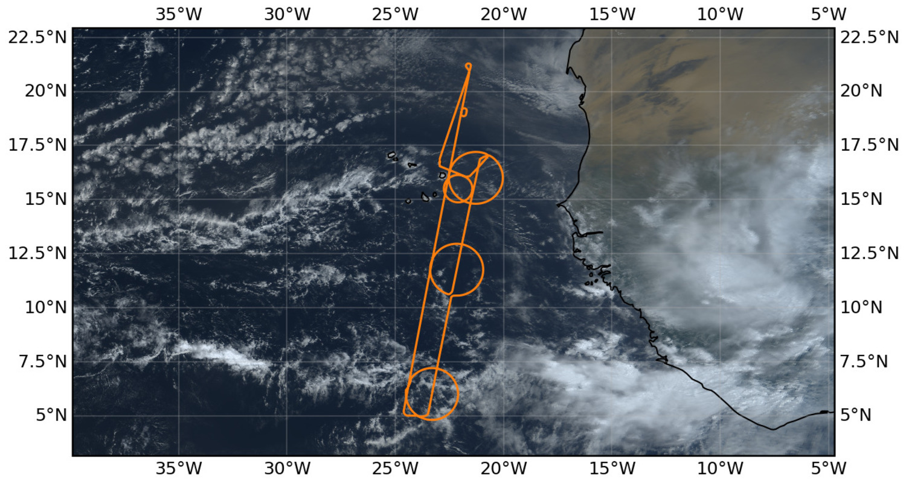

{logo}`PERCUSION`

# {front}`flight_id`

```{badges}
```

## Crew

```{crew-list}
```

## Track


## Conditions

Describe the meteorology

## Execution

Describe the flight execution

## Impressions

itemized list of things you saw 

```{note}
Co-location with ATR and EarthCARE over an aerosol layer near SAL. Spectacular line of convection on southern edge toward the west.
```

````{card-carousel} 2
```{card}
:img-top: ../figures/HALO-20240818a/0818a-crew.jpeg
Scientific Crew
```
````

## Instrument status & quicklooks

```{instrument-table}
```
````{card-carousel} 2
```{card}
:img-top: ../figures/HALO-20240813a/dropsonde_Level_2_20240813.png

Dropsondes
```


```{card}
:img-top: ../figures/HALO-20240813a/wales-x.png

WALES (cross section)
```

```{card}
:img-top: ../figures/HALO-20240813a/wales-3d.png
WALES (3d backscatter)
```

````
