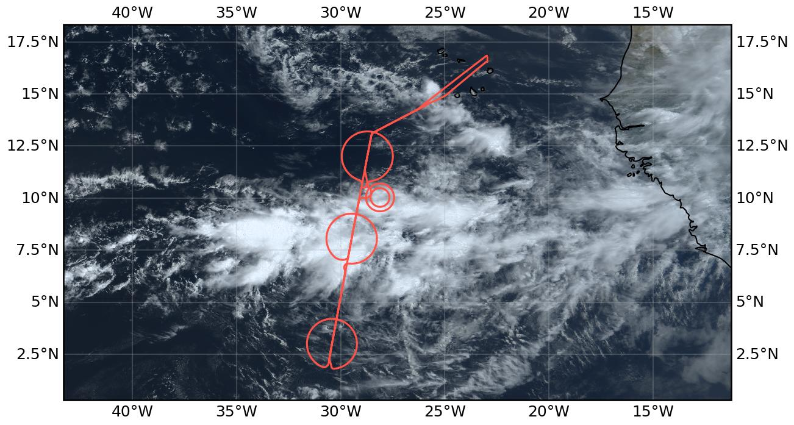
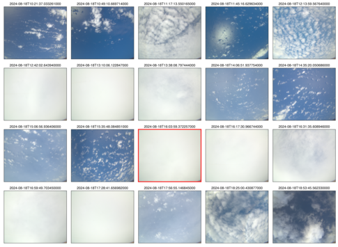

{logo}`PERCUSION`

# {front}`flight_id`

```{badges}
```

## Crew

```{crew-list}
```

## Track


## Conditions

Fair weather cumulus clouds in the morning on Sal.

The flight was in the west of the domain, with the EC overpass near 29W. Along the route to the EC track one could clearly see that we were flying along the edge of the ITCZ, with convective systems to the left (South) and shallow clouds to the right (North) of the aircraft. The ITCZ was characterised by low clouds in the North and South (mostly topped by thin cirrus) and a large system of deep convective clouds in the center — likely the strongest encountered so far during the campaign. The system extended to about 14km which could be easily seen when flying the center circle where HALO grazed the cloud top at FL450 (13700m) most of the time. Please note that the circles where flown from North to South, different from previous flights. The Northern circle covered cumulus, stratocumulus, and some cloudless patches. During the center circle we could identify only little structure. The view was dominated by the optically thick anvil cirrus, sometimes revealing some convective structures underneath. To the South of the convective feature we encountered low clouds again, mostly topped by optically thin cirrus which was hardly visible when looking straight down but clearly visible at an oblique viewing angle towards the horizon. After returning back to the North we had planned to circle around a convective tower which ideally should be identified along the flight. Since the featureless cirrus deck did not reveal any convective features underneath, we were guided to a convective cell at the edge of the large system, identified from geostationary satellite. Circling around it twice we could visually identify the system from the North while from the South it was hidden below the cirrus deck. 

At the time of the EarthCARE overpass (16:04 UTC) we were again above the deep convective system, with mostly clear sky overhead. The radar was probably be the happiest instrument at this point in time.

## Execution

Takeoff was on time and we went to the EC track as planned. Since the Northern edge of the ITCZ had shifted southward compared to the forecast, we decided to put the top of the circle where the center was planned. Communication with ATC turned out to be very difficult this time — for details please refer to the pilots. Permission to enter the first circle came right at the moment when we had already left it South after passing through the center. A narrow U-turn brought us back and we circled counter-clockwise. This pattern (going through the circle and starting it from the South) was repeated twice for the center and Southern circles which were done clockwise. On the way back, EarthCARE was met approximately halfway across the ITCZ. In the following, we were guided to a somehow separated convective system at the edge of the large convective ridge which was within the predefined 100 NM circle which was added to the flightplan beforehand, as an area for targeted observations. A first circle was flown with 27 NM radius which turned out to be too small to observe the system from outside the cirrus deck. For that reason, the radius was extended to 40 NM which allowed us to observe the convective system below the cloud deck. No ATR circle was flown because the ATR did not do an afternoon flight.

It can be summarized that all patterns including the targeted observation could be flown without any changes, despite the initial troubles with communication with ATC. Targeted observations of specific cloud features, probably identified from the plane, have been shown to be possible, if a proper operation area is defined in the flightplan beforehand. This could be used in future flights to circle more isolated convective towers (as visually identified in the early part of this flight and previous flights), or to study the evolution of lower cloud systems by circling them once or twice. 

The center circle at FL450 above the large convective system turned out to be at the limit of what HALO can do, according to the pilots. It was characterized by strong turbulence. One suggestion would be to involve the pilots more during the planning phase and discuss what can be done and what should be avoided. A small modification of the flight path wouldn’t have helped a lot since the East-West extension of the convective system was too large to avoid it. One possible solution would have been to fly below the anvil at a considerably lower flight level, but even then it would have been hard to avoid the convective cores. 

## Impressions

The large convective system in the center of the ITCZ did not reveal any structure since it was topped by a more or less homogeneous optically thick cirrus layer. North and South of this line we observed shallow clouds, covering everything from cloudless to stratocumulus. 

 - 10:06 Takeoff 
 - 10:34 Some cirrus above and at flight level
 - 10:36 Flying along the ITCZ; deep convection to the South, shallow clouds North
 - 10:48 Only few shallow clouds to the North, even cloudless patches
 - 10:58 Turning into EC track; decided to shift first circle Southward by one degree: center at N12° 00.00’, W28° 43.08’ 
 - 11:23 Entering Northern circle counterclockwise from the South; right at the edge of the convective system to the right; broken clouds, cloudless, stratocumulus in the circle
 - 11:31 Isolated white-dragon-like convective cloud to the right
 - 12:23 Leaving circle, entering anvil cirrus of deep convective system 
 - 12:30 gap in the clouds; ocean visible; approaching next anvil
 - 12:39 diving into cirrus 
 - 13:00 finally above cirrus again
 - 13:13 convective towers visible underneath
 - 13:27 another anvil edge
 - 14:02 Leaving deep convective region; shallow clouds below cirrus; flying mostly along top of cirrus layer
 - 14:18 leaving convective system and reaching area of South circle; entering Southern circle from the South, clockwise; mostly low clouds visible; optically thin cirrus layer above, only identified by looking towards the horizon; cirrus thickening to the East
 - 15:43 Distinct cloud lines 
 - 16:00 Entering deep convective region again
 - 16:04 EarthCARE overpass above deep convective system
 - 16:26 Some small overshooting tops to the right
 - 16:35 27 NM circle; some convective tops visible through/above cirrus
 - 16:57 Heading towards 2nd 40 NM circle; more convective structure visible; afterwards back to EC track and heading towards SAL
 - 19:10 Landing 

```{note}
Co-location with ATR and EarthCARE over an aerosol layer near SAL. Spectacular line of convection on southern edge toward the west.
```

````{card-carousel} 2
```{card}
:img-top: ../figures/HALO-20240818a/0818-crew.jpeg
Scientific Crew
```
````

## Instrument status & quicklooks

```{instrument-table}
```
````{card-carousel} 2
```{card}
:img-top: ../figures/HALO-20240818a/20240818_circle_profiles.png

Dropsondes
```

```{card}
:img-top: ../figures/HALO-20240818a/hamp_fullflight_HALO-20240818a.png
HAMP 
```

```{card}
:img-top: ../figures/HALO-20240818a/hamp_ec_under_HALO-20240818a.png
HAMP EC underpass
```

```{card}
:img-top: ../figures/HALO-20240818a/hamp_radar_ec_under_HALO-20240818a.png
Radar during EarthCARE underpass
```

```{card}
:img-top: ../figures/HALO-20240818a/HALO_20240818a_SMART.png
SMART
```

```{card}
[](https://www.meteorologie.lmu.de/~quicklooks/specMACS/PERCUSION/quicklooks/polcams/quicklook_20240818_polb.png)
specMACS RGB snapshots from polb (lower right) with EarthCARE underpass marked in red. Find further quicklooks [here](https://www.meteorologie.lmu.de/~quicklooks/specMACS/PERCUSION/flight_HALO-0818.html).
```

```{card}
:img-top: ../figures/HALO-20240818a/QL_VELOX_HALO_20240818a.jpg
VELOX broadband channel with EC underpass
```
```{card}
:img-top: ../figures/HALO-20240818a/HALO_20240818a_KT-19.png
KT-19 Timeseries of brigthness temmperature.
```

```{card}
:img-top: ../figures/HALO-20240818a/0818-wales-3d.jpg
WALES (3D backscatter)
```

```{card}
:img-top: ../figures/HALO-20240818a/0818-wales-x.png
WALES (cross section)
```

```{card}
:img-top: ../figures/HALO-20240818a/BACARDI_QL_20240818a.png
BACARDI
```

````
