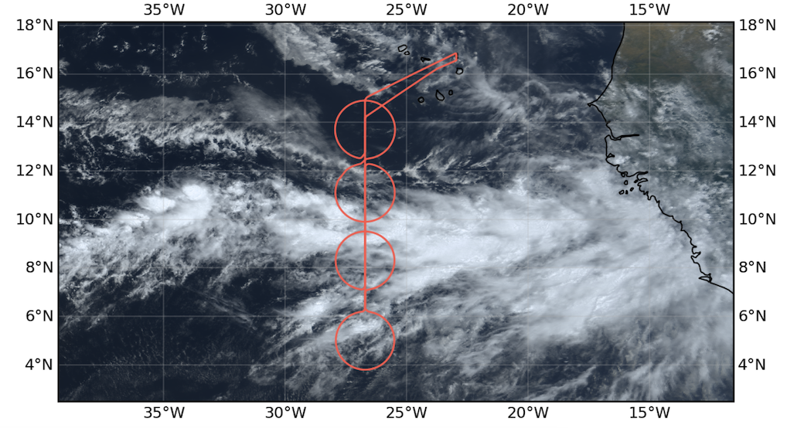
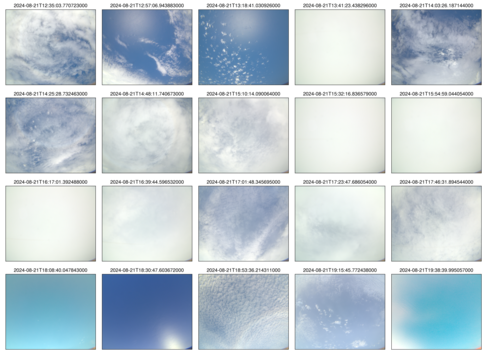

{logo}`PERCUSION`

# {front}`flight_id`

```{badges}
```

## Crew

```{crew-list}
```

## Track


## Conditions

Very clean air conditions over Sal with island-induced shallow clouds at departure. 

The flight was located on the 26.7W longitude. The ITCZ was narrow with a well defined northern band of deep convection and rain at around 9N. The northern edge in terms of deep convective clouds was in 'c_north', on its southern half, whereas there was a band of stratocumulus with an edge at its northern boundary. In terms of precipitable water, there was a second edge with a sharp gradient (from 65 to 30 mm) sampled by 'c_extra', whereas precipitable water only dropped to 50 mm in 'c_mid'. Yet there was no deep convective clouds in 'c_extra' but clear sky, and few isolated shallow cumuli. There was a secondary NE-SW oriented band of deep convection striking through the northern half of 'c_south'. Meteor was under this band while HALO sampled this band while flying around 'c_south' in its NW quadrant.  

On the leg between Sal and 26.7W we crossed regions/patches of clear sky and stratocumuli. Waves patterning on the clouds visible. On the way back, two layers of clouds with altocumulus/cirrus on top and stratocumuli/cumuli at the bottom.

## Execution

The replacement for the emergency light battery did not arrive in time so that the flight was restricted to daylight hours. With a take-off at 12:20 UTC because of runaway restriction, the original flight plan had to be shorten to ensure a landing in daytime hours. The legs to south_tp (including overpass over Meteor) and to Mindelo were abandonned. Also it turned out that choosing 26.7W as longitude for flying was a mistake as it was below the main route of airliners going to south America. We didn't get clearance to drop sondes on 'c_mid'. We circled 1 h around it and then got an estimate that it might be possible to drop sondes in 40 min, which we couldn't wait anymore. We waved to Meteor from 'c_south' while Meteor was in the circle. We did CCW circles where possible as this gave better sight for the SpecMacs camera.

## Impressions

Convection was not as deep as on Sunday, probably top around 12 km. While crossing the ITCZ and circling around 'c_mid2', we were in a soup of white. 

- Circles start time (in UTC, first sonde): 14:17 for 'c_south' (from N, CW), 15:20 for 'c_mid' (from S, CCW), 16:54 for 'c_north' (from N) and 17:55 for 'c_extra' (from S, CCW)
  
- HAMP measured 100 mm of precipitable water in 'c_mid'. This seems unrealistically high.


```{note}
South circle sampled an active convective line, also experienced by Meteor
```

````{card-carousel} 2
```{card}
:img-top: ../figures/HALO-20240821a/crew.jpg
Crew
```

```{card}
:img-top: ../figures/HALO-20240821a/20240821_1226UTC.jpeg

Island-induced clouds by take-off (12:26 UTC)
```

```{card}
:img-top: ../figures/HALO-20240821a/20240821_1412UTC.jpeg

In the ITCZ, entering 'c_south' (14:12 UTC)
```

```{card}
:img-top: ../figures/HALO-20240821a/20240821_1644UTC.jpeg

Hole in the ITCZ (16:44 UTC)
```

```{card}
:img-top: ../figures/HALO-20240821a/20240821_1756UTC.jpeg

Leaving the ITCZ, southern edge of 'c_north' (17:56 UTC)
```

```{card}
:img-top: ../figures/HALO-20240821a/20240821_1852UTC.jpeg

Stratocumulus edge, southern edge of 'c_north' (18:52 UTC)
```

```{card}
:img-top: ../figures/HALO-20240821a/TOCAN_15UTC.png

TOOCAN's segmented MCSs at 1500 UTC.
```

````

## Instrument status & quicklooks

```{instrument-table}
```

````{card-carousel} 2
```{card}
:img-top: ../figures/HALO-20240821a/BACARDI_QL_20240821a.png

BACARDI.
```

```{card}
:img-top: ../figures/HALO-20240821a/20240821_circle_profiles.png

Dropsondes. 
```

```{card}
:img-top: ../figures/HALO-20240821a/hamp_fullflight_HALO-20240821a.png
HAMP 
```

```{card}
:img-top: ../figures/HALO-20240821a/hamp_ec_under_HALO-20240821a.png
HAMP EC underpass
```

```{card}
:img-top: ../figures/HALO-20240821a/hamp_radar_ec_under_HALO-20240821a.png
Radar during EarthCARE underpass
```

```{card}
:img-top: ../figures/HALO-20240821a/HALO_20240821a_SMART.png

SMART.
```

```{card}
[](https://www.meteorologie.lmu.de/~quicklooks/specMACS/PERCUSION/quicklooks/polcams/quicklook_20240821_polb.png)
specMACS RGB snapshots from polb (lower right) with EarthCARE underpass marked in red. Find further quicklooks [here](https://www.meteorologie.lmu.de/~quicklooks/specMACS/PERCUSION/flight_HALO-0821.html).
```

```{card}
:img-top: ../figures/HALO-20240821a/HALO_20240821a_KT-19.png

Velox: brightness temperature and cloud flag from KT19.
```

```{card}
:img-top: ../figures/HALO-20240821a/QL_VELOX_HALO_20240821a.jpg

VELOX broadband channel.
```

```{card}
:img-top: ../figures/HALO-20240821a/0821-wales-3d.jpg
WALES (3D backscatter)
```

```{card}
:img-top: ../figures/HALO-20240821a/0821-wales-x.png
WALES (cross section)
```

```{card}
:img-top: ../figures/HALO-20240821a/BACARDI_QL_20240821a.png
BACARDI
```

````
