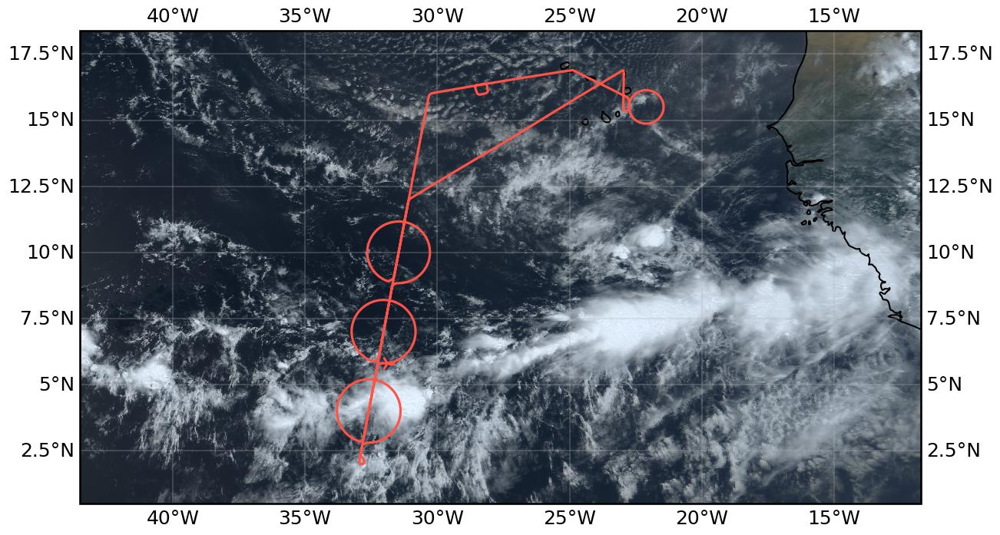
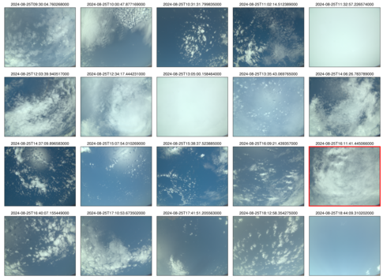

{logo}`PERCUSION`

# {front}`flight_id`

```{badges}
```

## Crew

```{crew-list}
```

## Track


Flight path superimposed on the natural color image from NOAA's Geostationary Operational Environmental Satellites (GOES) 16 satellite on August 25, 2024 at 13:20 UTC. The location of the aircraft at the time of the satellite image is highlighted.

## Conditions

Convection within the ITCZ was generally less deep than in previous days. Deep convective systems were confined to the southern edge of the ITCZ, while the northern edge of the ITCZ was characterized by a region of shallow convection in the morning and shallow and congestus convection later in the day. Regions of weak surface winds were observed near and south of the northern edge. While the column water vapor field was quite broad in the eastern part of the domain, it split into two longitudinal bands near our track. The ITCZ was confined to the southern column water vapor band, which was also considerably wider. In the region between the bands, the region of comparatively lower column water vapor was characterized by very low clouds. With the approach of a new African Easterly Wave in the eastern part of the tropical Atlantic, deeper convection formed near the African coast later in the day. During the easternmost part of our flight, we saw some precursors of the deeper convection east of Sal in the distance, but they remained out of reach.

## Execution

Our flight path followed the standard flight pattern with a south and north leg along the EarthCARE track and three circles of 12 dropsondes each. The circles were placed at the edges of the ITCZ based on the predicted latitude of the 48 mm column water vapor values. However, a shift in the latitude of the southern edge of the column water vapor field to the south in the predictions came too late to change the flight plan. In the end, we sampled a gradient of column water vapor within the southern circle that was not close to the 48 mm contour, but still marked the edge of deep convective clouds (including a mesoscale convective system) that we sampled with our southernmost circle. Despite the deep convection, no deviations from our flight track were necessary. While we also observed some deeper convection in the middle circle, only shallow and congestus clouds were sampled in the northern circle. After completing the three circles, the EarthCARE overpass occurred as planned north of the ITCZ with a pronounced aerosol layer below us. After leaving the EarthCARE track, we performed a calibration maneuver for our downward-pointing irradiance measurements. After overflying the ground station on Mindelo, a final circle (12 dropsondes) was flown east of Sal, which was crossed shortly afterwards by the ATR.

## Impressions

* After takeoff at Sal, cloud layers at various altitudes, including cirrus clouds.
* High column water vapor and cirrus clouds all the way to the EarthCARE track. 
* Sampled a clear dip in CWV with doldrum-like conditions (mirror-like ocean) near the location of the northern circle.
* Some higher clouds began to appear south of the center of the central circle.
* In the anvil of a mesoscale convective system as we entered the latitude of the southern circle.
* Sharp edge of the ITCZ clearly visible at and around the southern turning point.
* Numerous overshooting tops (5-10) visible during the southern and central circles. 
* Second circle, experienced some clear air turbulence; an extended cloud hole and anvils to the west of us with some deep convection forming along the circle, many line/circle-like features visible in the cloud field.
* Towards the northern circle, only shallow convection; cloud reflections and probably very low wind speeds at the surface (very narrow region of specular reflectance as seen by specMACS).
* Northern Circle, lots of ocean below us - change from doldrum-like conditions to trade wind conditions; transition marked by the presence of shallow and congestus; again saw a dip in CWV, though smaller and shifted to the southwest compared to the earlier transect. 
* EarthCARE overpass as planned and with a thick layer of aerosols below us (plus a thin layer of cirrus); an isolated deeper cloud was visible to the west.
* (Finally) saw a decrease in column water vapor on the way to north_ec_out (dropped below 48 mm at north_ec_out) with broken fields of shallow clouds below us.
* Continued rapid decrease in CWV on the way to Mindelo.
* Successful radiation square en route to Mindelo (as soon as communication allowed, around 17:00 UTC).
* Mindelo flyover (around 17:35 UTC).
* Increasing column water vapor east of Mindelo with what looked like an alto cumulus cloud deck at about 6 km.
* During the ATR circle east of Sal, some precursors of deeper convection east of Sal were visible but out of reach (rough estimate 200 nm).
* Aerosol layer covered by thin cloud layer as we approached Sal.

````{card-carousel} 2
```{card}
:img-top: ../figures/HALO-20240825a/crew_HALO-20240825a.jpeg
Crew (Credit: Tristan Vostry)
```

```{card}
:img-top: ../figures/HALO-20240825a/01_mirror_like_ocean_sm.jpg
Calm ocean reflecting clouds
```

```{card}
:img-top: ../figures/HALO-20240825a/02_southern_edge_sm.jpg
Southern turning point
```

```{card}
:img-top: ../figures/HALO-20240825a/03_overshooting_top_sm.jpg
Overshooting top
```

```{card}
:img-top: ../figures/HALO-20240825a/05_cloud_holes_sm.jpg
Cloud holes
```

```{card}
:img-top: ../figures/HALO-20240825a/06_clouds_and_aerosols_sm.jpg
Clouds and aerosols
```
````

## Instrument status & quicklooks

```{instrument-table}
```

````{card-carousel} 2

```{card}
:img-top: ../figures/HALO-20240825a/20240825_circle_profiles.png

Dropsonde: circle mean profiles. 
```

```{card}
:img-top: ../figures/HALO-20240825a/BACARDI_QL_20240825a.png

BACARDI: Time series. 
```

```{card}
:img-top: ../figures/HALO-20240825a/hamp_fullflight_HALO-20240825a.png

HAMP: Entire flight. 
```

```{card}
:img-top: ../figures/HALO-20240825a/hamp_southern_circle_HALO-20240825a.png
HAMP: Southern circle. 
```

```{card}
:img-top: ../figures/HALO-20240825a/HALO-20240825a_SMART_Quicklook.png

SMART time series.
```

```{card}
:img-top: ../figures/HALO-20240825a/hamp_ec_under_HALO-20240825a.png

HAMP: EarthCARE underflight. 
```

```{card}
[](https://www.meteorologie.lmu.de/~quicklooks/specMACS/PERCUSION/quicklooks/polcams/quicklook_20240825_polb.png)
specMACS RGB snapshots from polb (lower right) with EarthCARE underpass marked in red. Find further quicklooks [here](https://www.meteorologie.lmu.de/~quicklooks/specMACS/PERCUSION/flight_HALO-0825.html).
```


````
