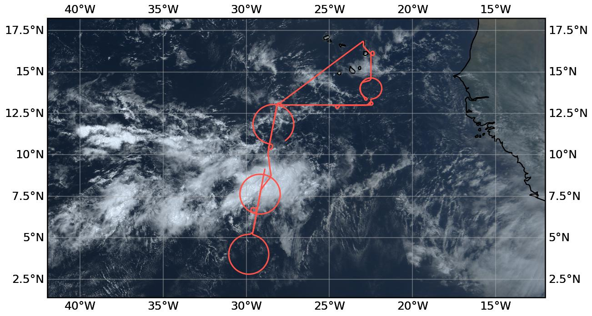
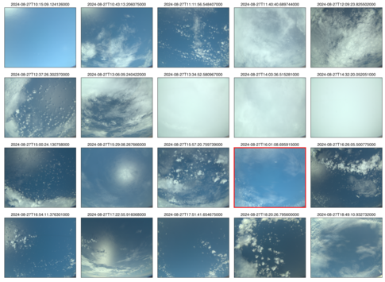

{logo}`PERCUSION`

# {front}`flight_id`

```{badges}
```

## Crew

```{crew-list}
```

## Track


## Conditions

A hazy take-off.  Surfed down the slope of an African Easterly Wave to cross the ITCZ in the middel of a moist patch and to meet EarthCARE just east of 22.5W.  The first deep cloud at the top of the ITCZ, a real white dragon, was a good one.  This was the first day that really reminded me of the NARVAL experience with deep convection floating up all over the place in what one might characterize as the central ITCZ, going up at different levels, detraining at different levels, something giving rise to Nicolas' characterization of a convective playground.  This was made more visible by the lack of a well developed stratiform layer from the convection as we passed through the center on our way south. On the way north the convection filled and we could see less of the playground but we did see towering cells, the deepest yet, rising well above the flight level.  Development of new convection seemed more favored on the north than on the south.  As we followed the EarthCARE track out to the north the pilots extended it by a few seconds to surf a developing convective cloud.

We had hoped to coordinate with the Meteor and the KingAir in clouds along a line at 13N south of Praia.  This did not have clouds with much of a radar signature, except on the west end of our shuttle near 24.5W, which we called out for sampling by the King Air.  After coordination with the ATR-42 we returned to SAL and were fascinated by the stratocumulus layers that seemed to live in a stair-step fashion, overflowing it seemed, that formed to the East of the southern Cape Verde islands and Boa Vista.  The EarthCARE coordinated measurements went very well, with not much of a radar signature at the exact time of overpass, but with deep convective clouds to the south and developing convection to the north.  At the end of our time on track, about 15 min after the overpass we went over an isolated and developing cumulus tower, from which the flight nickname is derived., 

## Execution

This was a coordinated flight among five platforms.   The coordination worked well logistically, but proved difficult from a meteorological and measurement point of view.  The sonde-rack failed in the ATR circle, causing us to backtrack and try to drop sondes we missed (or lost when avaps  went down), but the receiver was lost when avaps rebotted, so we did not have many successful sondes on this circle.  Sondes also failed along the southern circle, as did the first drop over the ship on the first leg of the shuttle.  BAHAMAS had difficulties until it was restart mid-way through the flight and data will need to be reconstructed, this is evident on the somewhat fragmentary flight plan on the track plot. 

## Impressions

 - 09:58 Hazy take-off
 - 10:04 Towering convective cell to the left, stratocumulus under
 - 10:XX ITCZ has a nice presentation, with deep convection spanning 12deg 30min to 10 deg, not overly obscured by stratiform clouds
 - 11:26 Echos at 8 km; nice line of cirrus above and to the right.
 - 11:31 Beautiful band of echos with complete attenuation and convective cells reaching to flight level, diverting around a larger cell at north of center circle.
 - 11:34 Preparing for first sondes, flying right along tops of convective echos with thin cirrus layer resolved by radar
 - 11:37 Passing over a band of convection -- a bit bumpy -- lots of corrugation in cloud top radar signature just below us.  Beautiful cluster in middle of circle.  Sonde dropped near 8 N (Nico's Sonde?) 
 - 11:52 Near mid point between c_mid and c_south.  Seems a bit hazity to the east.  Lidar shows a thin layer at 4 km
 - 11:55 Shallow cells ~ 2km but precipitating below us
 - 12:01 First c_south sonde, scattered convecive cells to the north reaching to ~8 km - 10 km
 - 12:12 Very little radar signature in c_south, but scattered cumulus clouds.  Cirrus in distance to north.
 - 12:14 Thin stratiform layers to east ~3km
 - 12:18 Thicker cirrus layer at flight level to the SSW
 - 12:21 N-S aligned cloud streets.  Cirrus is assoicated with anvil shields that don't have an apparent convective source == however it is much more anvil cirrus like (think) than isolated cirrus like, the isolated cirrus more apparent above us.
 - 12:24 IWV 45 kg/m2
 - 12:30 Flying over anvil cirrus layer ~ 4 km deep.  IWV ~ 41 km
 - 12:38 Clusters of shallow clouds to south, stratiform north still lots of persisting anvil cirus.
 - 12:47 Cirrus falls resolved in lidar and radar between 11 km and 9 km
 - 12:54 Wind aligned cloud streets to south
 - 13:17 Starting citrcel CCW from the south.  Convection filling in to the north, already subsantial echoes before entering cirtcle.
 - 13:28 A 2km cirrus layer below us, a very thin layer appears above it, just below flight level.  Covective voershooting tops easing their way out of circles to east
 - 13:49 Flylong the tops of convective cells.  Can see through the cirrus looking up, but pretty white right and left
 - 14:00 Towering cells to left, well above aircraft
 - 14:18 North circle with scattered deep convection, tops to flight level, also near north point of circle.
 - 15:32 Back behind the right wing a beauitful splattering of stratiform mid-level clouds
 - 16:00 Finished climated to FL450 on EC track 3 min behind schedule
 - 16:40 Nice convective cells, 4-6 km deep, aligned with track.
 - 18:40 North on ATR track, a big stagnant heap of clouds behind the island
 - 19:05 serial port write error, restarting, dropsonde receiver error
 - 19:10 Landing 

```{note}
Co-location with ATR and EarthCARE over an aerosol layer near SAL. Spectacular line of convection on southern edge toward the west.
```

````{card-carousel} 2
```{card}
:img-top: ../figures/HALO-20240827a/2024-08-27T0924.jpeg

Scientific Crew
```

```{card}
:img-top: ../figures/HALO-20240827a/2024-08-27T1018.jpeg

The white dragon.
```

```{card}
:img-top: ../figures/HALO-20240827a/2024-08-27T1358.jpeg

Overshoots reaching about 16 km as seen extending through overcast layer on our pass back to the north
```

```{card}
:img-top: ../figures/HALO-20240827a/2024-08-27T1443.jpeg

Deep convection developing on northern track
```

```{card}
:img-top: ../figures/HALO-20240827a/2024-08-27T1516.jpeg

Deep convection on northern track
```

```{card}
:img-top: ../figures/HALO-20240827a/2024-08-27T1610.jpeg

Developing convective cloud on north part of EarthCARE track, as we imagined the one we surfed a few minutes later.
```

```{card}
:img-top: ../figures/HALO-20240827a/2024-08-27T1820.jpeg

Small cold pools
```

```{card}
:img-top: ../figures/HALO-20240827a/2024-08-27T1824.jpeg

Looking back at ITCZ
```
````

## Instrument status & quicklooks

```{instrument-table}
```
````{card-carousel} 2


```{card}
#:img-top: ../figures/HALO-20240827a/BACARDI_QL_20240827a.png
BACARDI
```

```{card}
:img-top: ../figures/HALO-20240827a/20240827_circle_profiles.png

Dropsondes : Circle mean profiles
```

```{card}
%:img-top: ../figures/HALO-20240827a/hamp_fullflight_HALO-20240827a.png
HAMP 
```

```{card}
%:img-top: ../figures/HALO-20240827a/hamp_ec_under_HALO-20240827a.png
HAMP EC underpass
```

```{card}
%:img-top: ../figures/HALO-20240827a/hamp_radar_ec_under_HALO-20240827a.png
Radar during EarthCARE underpass
```

```{card}
:img-top: ../figures/HALO-20240827a/HALO_20240827a_KT-19.png
KT-19 Timeseries of brigthness temmperature.
```

```{card}
:img-top: ../figures/HALO-20240827a/HALO_20240827a_SMART.png
SMART
```

```{card}
[](https://www.meteorologie.lmu.de/~quicklooks/specMACS/PERCUSION/quicklooks/polcams/quicklook_20240827_polb.png)
specMACS RGB snapshots from polb (lower right) with EarthCARE underpass marked in red. Find further quicklooks [here](https://www.meteorologie.lmu.de/~quicklooks/specMACS/PERCUSION/flight_HALO-0827.html).
```

```{card}
%:img-top: ../figures/HALO-20240827a/QL_VELOX_HALO_20240827a.jpg
VELOX broadband channel with EC underpass
```

```{card}
:img-top: ../figures/HALO-20240827a/0827-wales-3d.jpg
WALES (3D backscatter)
```

```{card}
:img-top: ../figures/HALO-20240827a/0827-wales-x.png
WALES (cross section)
```

````
