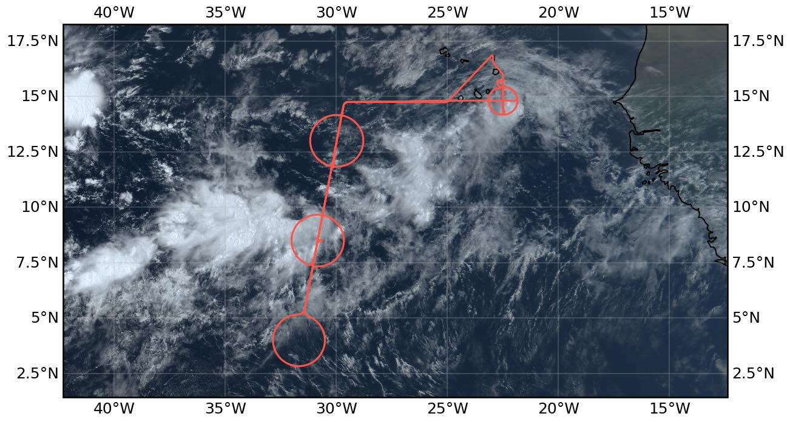
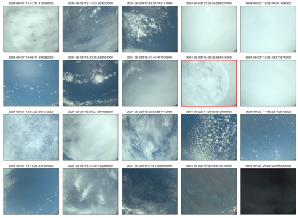

{logo}`PERCUSION`

# {front}`flight_id`

```{badges}
```

## Crew

```{crew-list}
```

## Track


## Conditions

The ITCZ was forecast to be very broad, which was reflected in the flight plan, and which verified in the flight data.  Acorss the entire transect we did not see values of integrated water vapor below 47 kg/m^2. Mostly the widening was evident on the northern edge, which moistened in this region relative to past days, with the southern edge also seeming to shift northward slightly over the forecast period. Convection concentrated in the center circle of the wide moist band, and most of the measurements in this region were slightly above a large expanse of very deep cirrus clouds.   This stratiform layer extended over a depth of approximately 8 km in the radar data, from flight level at about 14 km, down to the melting level at 4 km.  In the north there were scattered deeper developing clusters, but not to the extent initially anticipated.  Around the southern circle there was a mix of clouds, most notable were heas of wind aligned convective bands with tops estimated around 4 km extending to the SE along the SE side of the circle. Between the center and southern circle there were layers of very thin cirrus with virga, and throughout the ITCZ stratiform clouds, convection, and cirrus could be found at all conceivable levels.  

On the way to the EarthCARE track a large area of convection was developing south of the Cape Verde Islands, and this was visible through the window to the south along our SW transect. At the time one could observe a mountain of convective towers, but a cirrus shield was not evident. Later this appeared to be the system we sampled in the coordinated flights SE of Priaia before returning to SAL. Along the western end of the transect and the northern part of the EC track the lidar showed a very rich structure ot the aerosol with many (up to twelve) layers distinguishable and confined wave signatures  between thin layers. 

The flight distinguished itself through the complexity of its layering.  In several places convective clouds appeared to form in the mid tropopshere extending over kilometer scales to different heights and detraining.  One such layer topped near 8 km and was associated with a shallower, more typical, altocumulus layer.  This was seen in the radar within the ITCZ and again as wel sampled the convective complex in the coordinated measurements near the end of the flight.  Also cirrus sheets and wisps seemed to form at many levels above 8 km.  In the south of the domain kelvin-helmhotlz billows were evident in many of the cirrus, and as they were observed the flight also became a bit bumpier, suggesting substantial shear at upper levels. 

The convective complex seen at the beginning of the flight and sampled at the end of the flight had an impressive satellite presentation, but seemed to be decaying by the time we got there to sample it.  As far as we could tell the cirrus shied was completely decoupled from the lower layers and the only area of any active convection appeared to the north with congestus tops near 8 km, but apparently not being rooted in the boundary layer. 

## Execution

The flight plan was simple, but already before takeoff it became  enriched by a number of additional requests, including an earlier return to have more favorable sunangle conditions during the period of coordination, as well as fine-tuning of the coordinated flight plans in response to the developing situation.  Unanticipated work at the airport led to a late take off which the made it a bit of a scramble to meet EarthCARE outside of a circle.  We managed the latter by flying 330deg circles, and slighlty tightening the circles to a radius of 70 nm instead of the usual 72 nm.  The timing was fortuitous as EarthCARE passed over at about the same time as we passed over the METEOR which was stationed at the center of our central circle, this being our second overpass of the Metor, with the first being on the southbound leg.  As we met EarthCARE sooner we entered the northern circle from the south rather than from the north as originally planned, which allowed for less of a temporal gap between the circles. 

In flight we adjusted the flight plans to make coordinated measurements with the KingAir and the ATR-42 sout of the Cape Verde.  This led us to adjust our planned flight line roughly 4 nm to the north, and to reposition the planned ATR circle to the south at the end of this latitudingal line.   Following directions from the ground team we entered the ATR circle after bisecting it from the west, flew a quarter circle to the north, make 270 deg to get on a line to bisect the circle again from north to south, before starting the full sonding cirlce from the south in a CCW direction. As the convection appeared to reach up to the flight level on our approach we maintained our flight level at FL450 for this sequence of maneuvers.  However upon reaching the convective system the cirrus shield appeared to have become decoupled from active convection below and was dilating as the system dissipated.  Upon completion of the sounding circle we descended rapily to FL300 as we flew again through the circle, this time from south to north.  It was on this leg that we cut across active mid-level convection with convective tops at the new flight level (near 9km).   Once through the circle we descended further and began our approach to SAL. 

Altogether we coordinated with four platforms: EarthCARE, Meteor, the KingAir and the ATR-42.  

## Impressions

 - 11:33 stratocumulus ~ 800 m dusty.
 - 11:40 alto (strato) cumulus at 5500 m
 - ll:50 convective system to south also evident in IR imagery from goes about 140 nm to south
 - 11:57 approaching junciton with thin stratiform layer at 6 km on radar
 - 11:57 specMACS sees nice cloud bows
 - 11:57 new convective cells bubbling up on north side of convective system
 - 12:00 cirrus at flight-level 400
 - 12:33 on EC track with beautiful aerosol layering below 5 km (see screenshot)
 - 13:05 approaching cirrus shield, convective cells at flight level, turbulence
 - 13:25 flying over white ea, more embeded convective cells
 - 13:34 overshoogs to the rear and right -- cloud shield breaking up
 - 13:36 convetive complex seems to again fill up the sky around us, with rising/developing cirrus around us
 - 13:43 turning on to circle 
 - 13:48 overshooting convection to the north, cirrus shield 2 km deep. 
 - 14:05 near bottom of circle.  To the north and below smattering of cumulus humulis, with deeper systems visible near the top of the circle.  Thin cirres at and below flight level.  Thicker cirrus to the south, and more bands of deeper accumulations of cloud increasingly covered from view by growing cirrus.  Aerosol signal confined to the boundary layer with a depth of about 1.4 km.  Here in passing over very thin cirrus we were impressed by how strongly they showed up in lidar
 - 14:15 cirrus bubblinhg up.
 - 14:33 piles of developing convect seen at 5 O'Clock on the circle winds at 4 km at 190deg turning to 140deg to align with piles.   KH billows in stratiform clouds
 - 14:41 off circle, heading back to NNE over a sea of white.
 - 15:30 At northern point of center circle.  Starting about about 2 O'Clock we crossed a convective line where convection was active only to about 8 km with quite an interesting stratiform layer.   To the NNE at 1 O'Clock new convection seems to be developing.  Free form convection.  Cirrus shield 8 km deep.
 - 15:37 in cirrus chield, or skirting along the top.
 - 17:25 entered circle north from the south, differently than planned.  Generally clear with scattered stratiform clouds at many levels
 - 17:43 heading north along EC track after completing circel. Thin cirrus near circle center which appear to be associated with isolated cells that have been decaying as they drift to the west.   Some impressive cells developing to the south of northern circle.
 - 17:52 Seems dustier, thin stratiform layers at multiple levels. 
 - 18:06 convective top overshooting toward SE.
 - 18:38 growing radar echos.
 - 18:56 sign of congestus to north part of circle.
 - 19:20 flying over decaying cirrus shield which is fully detached from the layers below.
 - 19:53 hint of developing cumulus out right window.
 - 19:59 FL300 through cumulus in the middle of circle
 - 20:07 Descending to FL150, cloud tops at FL25, convection.

```{note}
Co-location with ATR and EarthCARE over an aerosol layer near SAL. Spectacular line of convection on southern edge toward the west.
```

````{card-carousel} 2

```{card}
:img-top: ../figures/HALO-20240903a/2024-09-03T1228.jpeg 

Rich aerosol layering near ec_north (B Stevens, 1228 UTC)
```

```{card}
:img-top: ../figures/HALO-20240903a/2024-09-03T1401.jpeg 

This cirrus with virga south of main convective region (B Stevens, 1401 UTC)
```

```{card}
:img-top: ../figures/HALO-20240903a/2024-09-03T1730.jpeg 

Towering convective system over shield of white (B Stevens, 1730 UTC)
```

```{card}
:img-top: ../figures/HALO-20240903a/2024-09-03T1732.jpeg 

Developping convective systems probably (B Stevens, 1732 UTC)
```

```{card}
:img-top: ../figures/HALO-20240903a/2024-09-03T1900.jpeg

Cirrus thinning from decaying convective system (B Stevens, 1900 UTC)
```

```{card}
:img-top: ../figures/HALO-20240903a/2024-09-03T1939.jpeg 

Signs of congestus to north of convective complex  (B Stevens, 1939 UTC)
```

```{card}
:img-top: ../figures/HALO-20240903a/2024-09-03T2000.jpeg 

Descending into altocumulus on way back north out of the ATR circle(B Stevens, 2000 UTC)
```

````

## Instrument status & quicklooks

```{instrument-table}
```
````{card-carousel} 2

```{card}
:img-top: ../figures/HALO-20240903a/BACARDI_QL_20240903a.png
BACARDI: Time series.
```

```{card}
:img-top: ../figures/HALO-20240903a/20240903_circle_profiles.png

Dropsondes
```

```{card}
%:img-top: ../figures/HALO-20240903a/hamp_fullflight_HALO-20240903a.png
HAMP 
```

```{card}
%:img-top: ../figures/HALO-20240903a/hamp_ec_under_HALO-20240903a.png
HAMP EC underpass
```

```{card}
%:img-top: ../figures/HALO-20240903a/hamp_radar_ec_under_HALO-20240903a.png
Radar during EarthCARE underpass
```

```{card}
:img-top: ../figures/HALO-20240903a/HALO_20240903a_KT-19.png
KT-19 Timeseries of brightness temperature.
```

```{card}
%:img-top: ../figures/HALO-20240903a/HALO-20240903a_SMART_Quicklook.png
SMART Timeseries
```

```{card}
[](https://www.meteorologie.lmu.de/~quicklooks/specMACS/PERCUSION/quicklooks/polcams/quicklook_20240818_polb.png)
specMACS RGB snapshots from polb (lower right) with EarthCARE underpass marked in red. Find further quicklooks [here](https://www.meteorologie.lmu.de/~quicklooks/specMACS/PERCUSION/flight_HALO-0818.html).
```

```{card}
%[](https://www.meteorologie.lmu.de/~quicklooks/specMACS/PERCUSION/quicklooks/polcams/quicklook_20240903_polb.png)
%specMACS RGB snapshots from polb (lower right) with EarthCARE underpass marked in red. Find further quicklooks [here](https://www.meteorologie.lmu.de/~quicklooks/specMACS/PERCUSION/flight_HALO-0903.html).
```

```{card}
:img-top: ../figures/HALO-20240903a/QL_VELOX_HALO_20240903a.jpg
VELOX broadband channel with EC underpass
```

```{card}
:img-top: ../figures/HALO-20240903a/0903-wales-3d.jpg
WALES (3D backscatter)
```

```{card}
:img-top: ../figures/HALO-20240903a/0903-wales-x.jpg
WALES (cross section)
```
````
