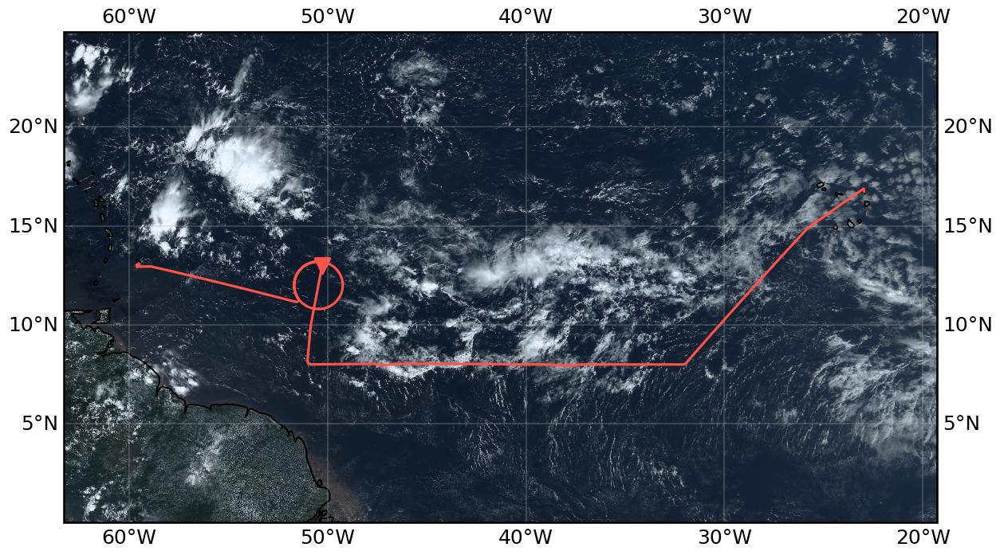

{logo}`PERCUSION`

# {front}`flight_id`

```{badges}
```

## Crew

```{crew-list}
```

## Track
 

Flight path superimposed on the natural color image from NOAA's Geostationary Operational Environmental Satellites (GOES) 16 satellite on September 6, 2024 at 15:20 UTC. The location of the aircraft at the time of the satellite image is highlighted.

```{note}
This flight was a replacement for the flight originally scheduled for September 5. The flight had to be postponed to September 6th due to technical problems.
```

## Conditions

Well defined, mostly zonally oriented ITCZ with an African Easterly Wave associated disturbance west of Sal (suppressed convection and column water vapor field shifted to the north, crossed by our flight path). In the morning, a relatively narrow band of deep convection was mainly located near the northern moist margin. The region of deep convection expanded during the day. While we did not expect significant deep convection from the forecast, especially along the southern edge of the ITCZ, we experienced the formation of about 14 to 15 km deep convection there. Low wind speeds within the moist margins in the western part of the domain combined with the presence of a large area of active but often isolated deep convection.

## Execution

The flight mostly followed the original flight path for September 5 as major changes were not possible due to ATC restrictions. As a result, we were not able to underfly EarthCARE as planned, and since we were not allowed to drop sondes for the East and Central Atlantic circles, we skipped those two circles altogether.

- 10:35 UTC Slightly delayed take off because of construction works
- 12:20 UTC Turning onto 8°N track
- 13:04 UTC METEOR overflight (with slightly adjusted coordinates for direct overpass south of 8°N)
- 13:05 UTC Lost satellite communication via PLANET to the ground
- 14:41 UTC Northward turn onto the EarthCARE track from September 5th
- 15:02 UTC Ascend to FL 450
- 15:03 UTC Entered straight leg through circle
- 15:20 UTC Enter circle from north
- 16:15 UTC Dropped last sonde
- 16:40 UTC Had to continue on the circle for more than 360° because of ATC
- 16:45 UTC Heading straight to Barbados

## Impressions

 - 10:55 UTC Multiple cloud layers below us - some stratiform clouds; some deeper convection towards the south east of us
- 11:17 UTC Convection bubbling up around us while overflying an area of shallow cumulus clouds
- 11:25 UTC After a marked increase in CWV after take-off — CWV values have levelled off at around 60 mm; see different layers of clouds and, while not overflying them, see some deep convective clouds towards the east and west of us (picture at 11:30 UTC)
- 11:30 UTC High column water vapour values with high humidity content up to around 6 km but relatively dry above
- 11:40 UTC See many (what looks like) cloud hole structures, some with a dense line of likely congestus clouds
- 11:45 UTC CWV is still around 60 mm: radar detects cloud below us which is around 12 km high
- 11:55 UTC Leaving the ITCZ towards the south-east while still looking at it towards the north-west
- 11:55 UTC Entered a region of very shallow clouds; can see a sharp line between the deeper convection and the shallow convection in front
- 12:00 UTC Radiometers show a rapid drop in CWV and WALES suggests that this might be due to a reduction in water vapour in the lowest 2 km
- 12:15 UTC CWV flattens out at around 49 mm; shallow clouds below us 
- 12:50 UTC CWV has started increasing again since 12:25 UTC; seems like we are approaching the southern edge of the ITCZ :), some anvils visible on the radar and some 5km deep clouds below
- 12:53 UTC Some clear air turbulence
- 12:55 UTC Congestus clouds below us 
- 12:58 UTC Column water vapour values keep increasing 
- 13:12 UTC Shallow convection south of us, deep convection to the north (with overshooting top and anvil) — estimated to be higher than current FL approx. 13.5 km); CWV has stabilised at around 60 mm
- 13:26 UTC „Cold pool heaven“ — Bjorn; cold pools, colliding cold pools, slowly repopulating cold pools around us; below us: convective clouds; thunderstorm with comparable height to our FL ahead of us (warning to pilots)
- 13:39 UTC Some torn off / separated anvils to the south of us
- 13:42 UTC Cold pool structures visible on both sides, convection substantially deeper north of us
- 14:22 UTC Leaving the deep convection region behind
- 14:27 UTC Only shallow clouds below but some turbulence
- 14:41 UTC Deeper convection and some thin cirrus clouds become visible in the north as soon as we turned northward
- 14:51 UTC Not very dense but isolated deep convection around us; thin cirrus clouds above
- 14:56 UTC Surface wind speeds appear to drop
- 15:01 UTC Very low wind speeds, LIDAR turned off because of too strong reflection from surface, specMACS sees very narrow point of specular reflectance; clear sky and very few clouds below us
- 15:12 UTC Halfway through the circle, still within the doldrums but increasing wind speeds
- 15:21 UTC At the northern edge of the circle, wind speeds have picked up; CWV has increased all the time since getting onto the earthCARE track
- 15:30 UTC Hardly any clouds below us (if at all they are very shallow)
- 15:35 UTC First quarter of circle outside the doldrums
- 15:39 UTC Wind speeds start decreasing
- 15:47 UTC Deeper clouds limited to the south of us (contrast between within and outside doldrums)
- 15:51 UTC Return to southern edge of the circle; still very low wind speeds at the surface
- 16:02 UTC Some cirrus clouds below us 12.5 km at top; wind speeds still low; mirror like ocean to the west
- 16:05 UTC Three quarters of circle, low but not quite as low wind speeds as at the southern edge of the circle
- 16:16 UTC Deeper clouds appeared around as soon as we left the low wind speed region  
- 16:55 UTC Numerous but mostly isolated deeper clouds towards the north of us; south of us the convection is generally less deep
- 17:45 UTC Playground of clouds all around us; many with multiple outflow levels


````{card-carousel} 2

```{card}
:img-top: ../figures/HALO-20240906a/crew_sm.jpg

Crew. (1009 UTC)
```

```{card}
:img-top: ../figures/HALO-20240906a/deepConvectionHorizon_sm.jpg

Deep convection on the horizon. (1130 UTC)
```

```{card}
:img-top: ../figures/HALO-20240906a/doldrumReflections2_sm.jpg

Doldrums mirror the clouds. (1518 UTC)
```

```{card}
:img-top: ../figures/HALO-20240906a/multiLayerCloud_sm.jpg
Multlayer cloud. (1714 UTC)
```

```{card}
:img-top: ../figures/HALO-20240906a/rainBow_sm.jpg

Rain bow. (1721 UTC)
```

````

## Instrument status & quicklooks

```{instrument-table}
```
````{card-carousel} 2

```{card}
:img-top: ../figures/HALO-20240906a/BACARDI_QL_20240906a.png
BACARDI
```
```{card}
:img-top: ../figures/HALO-20240906a/HALO-20240906a_SMART_Quicklook.png
SMART Time-series
```

````
