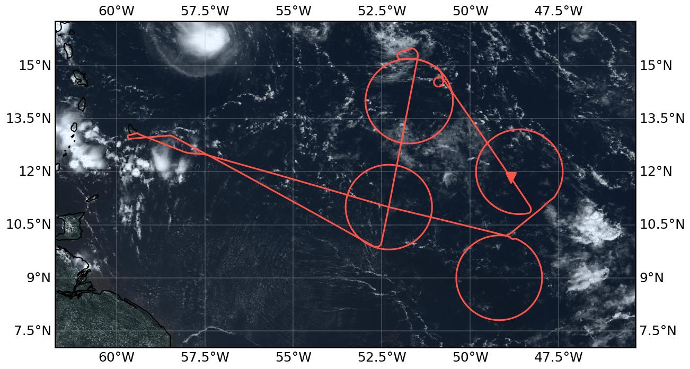

{logo}`PERCUSION`

# {front}`flight_id`

```{badges}
```

## Crew

```{crew-list}
```

## Track


## Conditions

The ITCZ was forecast to be very broad, with not well-defined edges for the circles to be placed as usual. This prompted us to take a step back and look into other potentially interesting parameters and phenomena to be probed. A wide area of low surface-windspeeds (doldrums) appeared to be one of the more interesting features. And it was decided to place circles inside and around this area in order to measure the doldrums, the trade winds south and north of it and potentially some increased moisture in the outflow of a convective system in the Northwest. 

On the day of the flight the forecast was confirmed with only slight changes. The broad ITCZ became evident from the very beginning as high values of IWV were measured close to its southern edge, along with a great variety of convective and stratiform clouds at low, mid and high levels. Cloud-free areas with very well-defined edges identified as cold pools were frequently seen. The conditions at the second circle were slightly different as we entered the doldrums. Cloudiness consisted mostly of high cirrus at and around flight Level, with virtually no convection even at lower levels. Clear indications of doldrums from dropsonde measurements. The third circle had some convection to the North with more clear indications of doldrums in the southern part, such as mirroring of clouds on the sea surface. On the EarthCARE underpass we exited the doldrum region and had stratiform mid-level cloud patches with the picture getting more convective to the south and the last circle, where we met again the southern trade winds. Well-defined cloud-free cold pools were frequently observed. Situation remained similar on the way back with deep convection including overshooting tops and anvils around Barbados.

## Execution

Take-off was a few minutes early as everything worked out well on the ground with no delays. Soon HALO was centered on track and climbed up to FL410. Just before entering the first circle (SE) all instruments were go, having resolved the trouble with the dropsondes. We entered the SE circle at its northern entry point and flew in a CW direction. After completing the circle, we transited to the second one creating a figure 8 and climbed up to FL430. On the entry to the NE circle the plane briefly adjusted its course until it was established on course. The circle was flown CCW. NE circle was completed with no problems. On the way to the 3rd circle (NW) we climbed to FL450. Due to traffic around us the clearance to drop sondes would be delayed and we were some minutes ahead of plan. To counteract we performed a short waiting circle in CCW direction. We then entered the NW circle, flew in CCW direction and soon after got clearance. In order to then complete the circle, we overshot our exit point by a few nm and then turned sharply onto the EarthCARE track. The EarthCARE underflight worked out well and after reaching the southernmost point of the track we immediately initiated the last circle (SW) in a CW direction. The circle was completed without problems. After completing the last circle, we came back to land.

## Impressions

 - 11:25 Takeoff and heading towards first waypoint
 - 11:35 Flying over a few fair cumuli; some congestus are visible; a few high convective clouds with outflow anvils to the south. No cirrus above us, but some patches of old outflow cirrus around us.
 - 11:43 Approaching high convective clouds with anvil south of HALO
 - 11:47 Turn to get back on planned track
 - 11:50 High IWV of about 60kg/m2 
 - 11:51 Cirrus shelf over us. HALO at 11 km
 - 11:54 Great variety of convective clouds – from shallow cumuli, up to some small stratocumulus patches, congestus, and some nimbus clouds reaching almost up to flight height; and anvil cirrus.
 - 11:59 Transition to much less cloudy Region.
 - 12:01 Reached FL410
 - 12:08 Troubleshooting with the dropsondes still ongoing.
 - 12:20 Shallow cumulus all around
 - 12:59 Dropsonde green lights
 - 13:04 Entry southeast circle 
 - 13:20 Flying over cold pool.  Only few shallow cumuli partly organized in short line
 - 13:32 Two convective cells with anvil to the south
 - 13:40 To the left: almost cloud free; to the right: inside the circle some patches of ice clouds (cirrus at lower levels), some shallow cumulus and a hand off higher reaching congestus
 - 13:49 Back into shallow low-level convective clouds
 - 13:52 Flying over some stratiform cirrus patches a midlevel ~5km height 
 - 14:01 Last sonde out. Turn to second circle climb to FL430.
 - 14:13 Into second circle (northeast). Plane adjusted itself briefly. Dropsonde operation start; cloud free within the circle; stratiform remnants of convection (old outflows at all levels) to the right. 
 - 14:19 much more stratiform cloud patches 
 - 14:25 Sargassum patch in wind direction
 - 14:35 Flying over a congestus system, and dropping a sonde! NE05
 - 14:43 Flying in Cirrus occasionally
 - 14:53 Thin cirrus right below us; huge cirrus decks to the left and right of HALO
 - 14:57 Old cirrus but almost no PBL or midlevel clouds
 - 15:00 Some very light turbulence
 - 15:10 Last sonde out. Leaving circle and flying through
 - 15:12 In cloud free air
 - 15:23 Sea surface very calm. Doldrums.
 - 15:25 Some shallow and congestus convection to the right of HALO. Huge stratiform Cirrus deck to the left.
 - 15:46 Waiting circle due to early Arrival for EC and delayed dropsonde clearance
 - 15:50 Deep convection to the NW
 - 16:02 Entering circle
 - 16:08 Clearance and first sonde
 - 16:12 Crossing boundary into cloud-free air
 - 16:15 Back over a great variety of convective clouds: some shallow cumulus, some decks of altostratus, a few taller congestus system, no cumulus nimbus through the full troposphere
 - 16:19 Patches of midlevel stratiform clouds
 - 16:30 more intense boundary layer convection; deep convection with anvil cirrus to the north
 - 16:34 Getting into a cirrus
 - 16:41 Doldrums. Clouds reflected on sea surface. 
 - 16:50 inside circle random shallow trade wind cumuli; a few clusters of more vigorous convection but all limited to lower troposphere
 - 17:03 Last sonde out and leaving circle a bit further west that planned
 - 17:06 Deep convection to the north
 - 17:11 Level wings on EarthCARE track
 - 17:30 boundary layer convection topped by a lot of stratiform outflows at inversion height. Taller system only to the Southwest 
 - 17:35 Earth Care Underpass – Halo flying over patch of stratocumulus like outflows of boundary layer convection. Deeper congestus like convection further to the South
 - 17:48 Cold pool
 - 17:53 leaving ec track starting circle; West of transect: infinite Zoo of trade wind shallow cumuli; east of transect: slightly more organized shallow convection with some cloud wholes.
 - 17:56 Shallow convection not topped by any outflows, rarely organized into clusters or line 
 - 18:25 top of convection is much more stratiform- inversion capped, larger patches of almost stratiform outflows; less boundary layer convection below.
 - 18:27 Reaching a high cirrus 
 - 18:34 Almost cloud free, just a few thin low cirrus
 - 18:45 Directly next to a tall convective tower to our right
 - 18:49 Cloud whole (cold pool generated)
 - 18:55 Last sonde out; heading back
 - 19:02 Nice stratiform clouds to the south
 - 19:11 flying home through again an ocean of scattered shallow trade wind cumuli partly overlayed by thin layers of midlevel cirrus; cloud cover is overall low
 - 19:37 band of deep convection to the south great overshooting tops
 - 19:43 Crossing South-North-Line of deep convection with tall nimbus towers
 - 20:06 Landing


````{card-carousel} 2

```{card}
:img-top: ../figures/HALO-20240912a/HALO-20240912_crew.jpg 

Our crew before the flight
```

```{card}
:img-top: ../figures/HALO-20240912a/DSC_8375.JPG 

High IWV and a great Variety of convective Clouds on our way to the first circle
```

```{card}
:img-top: ../figures/HALO-20240912a/DSC_8399.JPG 

Icy Patches inside the first circle with a vast Cloud free area outside
```

```{card}
:img-top: ../figures/HALO-20240912a/DSC_8462.JPG 

Calm sea-surface and Cloud mirroring on the way to the 3rd circle
```

```{card}
:img-top: ../figures/HALO-20240912a/DSC_8484.JPG

Deep convection North of the third circle 
```

```{card}
:img-top: ../figures/HALO-20240912a/DSC_8555.JPG

Fancy Johny Bravo anvil
```

```{card}
:img-top: ../figures/HALO-20240912a/20240912_134751.jpg 

Cloud hole with sharp edges under the almost-full moon
```

```{card}
:img-top: ../figures/HALO-20240912a/20240912_crew_inflight.jpg 

Crew in-flight
```

```{card}
:img-top: ../figures/HALO-20240912a/DSC_8618.JPG 

Another very clear Cloud hole
```

```{card}
:img-top: ../figures/HALO-20240912a/DSC_8660.JPG 

Happy Clouds on the way back
```

````

## Instrument status & quicklooks

```{instrument-table}
```
````{card-carousel} 2

```{card}
:img-top: ../figures/HALO-20240912a/HALO_20240912a_BACARDI_QL.png
BACARDI
```

```{card}
:img-top: ../figures/HALO-20240912a/HALO-20240912-wales-ec.png
WALES (backscatter, polarization and humidity) at EC overpass
```

```{card}
:img-top: ../figures/HALO-20240912a/0912-wales-3d.jpg
WALES (3D backscatter)
```

```{card}
:img-top: ../figures/HALO-20240912a/0912-wales-x.png
WALES (backscatter, depolarization, specific humidity cross sections)
```

```{card}
:img-top: ../figures/HALO-20240912a/HALO-20240912a-doldrum.png
SpecMACS Calm sea Surface indicative of Doldrum conditions
```

```{card}
:img-top: ../figures/HALO-20240912a/hamp_fullflight_HALO-20240912a.png
HAMP 
```

```{card}
:img-top: ../figures/HALO-20240912a/hamp_ec_under_HALO-20240912a.png
HAMP during EarthCARE underpass
```
```{card}
:img-top: ../figures/HALO-20240912a/HALO_20240912a_KT19_QL.png
KT19 Timeseries of brigthness temperature.
```


```{card}
:img-top: ../figures/HALO-20240912a/hamp_radar_ec_under_HALO-20240912a.png
Radar during EarthCARE underpass
```

```{card}
:img-top: ../figures/HALO-20240912a/HALO_20240912a_SMART_QL.png
SMART Time series of upward and downward spectral irradiadiance, and albedo.
```

```{card}
:img-top: ../figures/HALO-20240912a/QL_VELOX_HALO_20240912a.jpg
VELOX broadband channel with EC underpass
```

````
