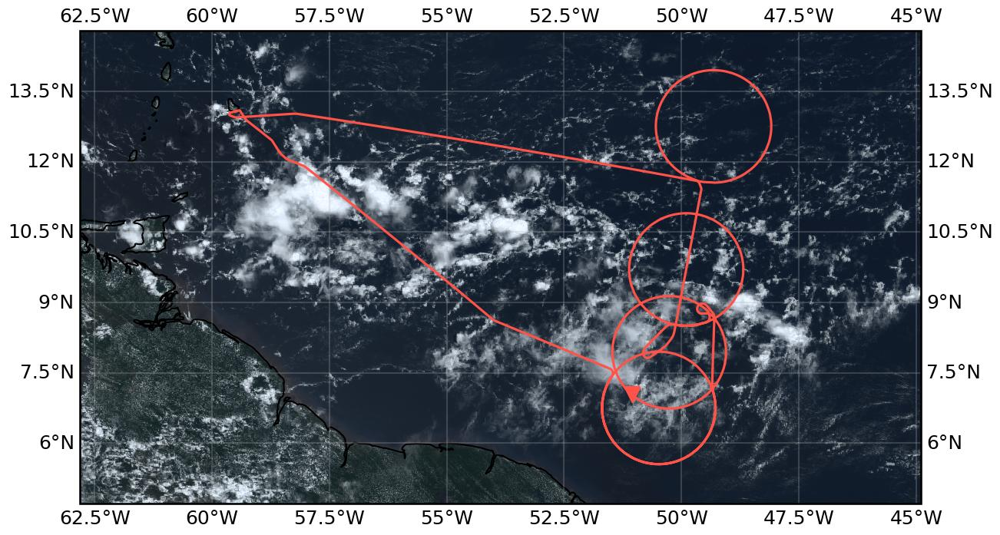
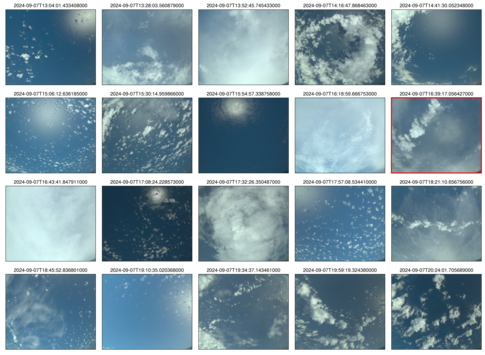

{logo}`PERCUSION`

# {front}`flight_id`

```{badges}
```

## Crew

```{crew-list}
```

## Track

 

Flight path superimposed on the natural color image from NOAA's Geostationary Operational Environmental Satellites (GOES) 16 satellite on September 14, 2024 at 15:20 UTC. The location of the aircraft at the time of the satellite image is highlighted.

## Conditions

Basically any kind of clouds could be observed during this flight. It started with shallow convection and midlevel clouds. Later on convective towers among shallow convection and small sugary cloud spots could be seen on the way towards the first circle. The southern most circle was marked by lowlevel cumulus and midlevel clouds in the south and a full mid-level cloud deck in the north. 
In the second circle, a very thick cirrus (~7km) was seen, that was later replaced by a thick layer of mid-level clouds with very few clear-spots. Towards the end we crossed a deep convective cloud.   
In the center circle many cloud conditions could be observed: starting with shallow convection and small towers with thin midlevel clouds, condition changed to thin cirrus, towers and sugary clouds in the distance. Later on small low-level clouds could be seen that the radar did not see and again many towers. Towards the end we entered a coldpool region.
The underpass started in deep clouds and fully white sky. Two minutes before meeting Earthcare those cleared up and gave way to nice lidar conditions with only few shallow clouds.
The Northern circle was marked by clear-sky and some singular shallow convection and thin cirrus. Windspeeds were very low, especially in the North-Western part of the circle. 
The way back started with convective towers again and a cirrus layer later on. 


## Execution

 - flew southern most circle twice because of problems with the dropsonde system. 
 - problems could not be solved; so no sounding data in the southern most circle.
 - skipped small waiting circle as a result 
 - entered second southern circle from the north-east to by some time for the dropsonde team
 - third circle directly after second (both with okay soundings)
 - some holding pattern to by some time before Earthcare, because we were early
 - perfectly timed underpass
 - fourth circle as planned
 - back home

## Impressions

 - 11:36 take-off, shallow clouds and small towers
 - 11:37 deep convection ahead; going over
 - 11:44 deep convective tower to the left
 - 11:47 second deep convective tower directly behind the first
 - 12:02 many cirrus
 - 12:04 complete whiteness
 - 12:06 thin cirrus, shallow clouds, ocean visible
 - 12:11 mid and high level clouds, cirrus until 12km
 - 12:20 many very small clouds (sugar?)
 - 12:25 shallow cumulus low clouds, towers in the distance, less sugar
 - 12:37 all white (thin cirrus)
 - 12:40 thick cirrus (all white in any direction)
 - 12:53 thick mid-level layer, thin cirrus above
 - 12:58 holes in mid-level allow view on shallow cumulus
 - 13:19 singular mid-level clouds, very small low-level clouds
 - 13:57 mid-level deck, high thin cirrus
 - 14:02 sugar again, mid-level deck in the distance
 - 14:19 mid-level clouds, some towers
 - 14:53 high cirrus, small towers below, mixed with cumulus
 - 15:00 mid-level deck (thin) , no shallow cumulus
 - 15:23 ~7km thick cirrus
 - 15:37 low clouds, very small; thin high clouds, high cirrus above plane
 - 15:52 right: clear-sky and some small shallow clouds, left mid-layer cloud deck
 - 16:08 high thin cirrus, shallow cumulus and towers
 - 16:12 everything completely white
 - 16:13 mid-level cumulus, some sugar in the distance, breakup of high level
 - 16:15 perfect anvil, next to us
 - 16:17 towers in the distance looking like dancers
 - 16:29 small bubble clouds - low level? (cannot be seen by radar), coldpools
 - 16:35  cloud towers and very thin mid-level clouds in between
 - 16:37 singular towers everywhere
 - 16:45  entering deeper convective clouds, still some mid-level as well
 - 16:48 very deep convective cloud right below us, high cirrus above
 - 16:55 back to mid level pop up
 - 17:08 clear-sky, left mid/high level clouds
 - 17:18 back in deep clouds, cirrus above 
 - 17:23 tower family to the left and clear-sky 
 - 17:28 towers become smaller
 - 17:33 coldpool region
 - 17:52 thin cirrus
 - 17:57 clear-sky 
 - 18:12 (few) shallow/ mid level clouds
 - 18:35 more towers
 - 19:27 tower pair to the right
 - 19:37 thin cirrus and small mid-level clouds

````{card-carousel} 2

```{card}
:img-top: ../figures/HALO-20240914a/crew.jpg

Exhausted crew upon arrival (20:32 UTC)
```

```{card}
:img-top: ../figures/HALO-20240914a/frog.jpg

Greetings from a frog (19:41 UTC)
```


```{card}
:img-top: ../figures/HALO-20240914a/sugary.jpg

sea of sugar and cumulus (12:23 UTC)
```

```{card}
:img-top: ../figures/HALO-20240914a/ambos.jpg

How I imagined anvil clouds as a kid (16:15 UTC)
```

```{card}
:img-top: ../figures/HALO-20240914a/mirror.jpg

Ocean mirror (17:38 UTC)
```

```{card}
:img-top: ../figures/HALO-20240914a/cloud_family.jpg

Cloud tower family (18:36 UTC)
```

````

## Instrument status & quicklooks

```{instrument-table}
```
````{card-carousel} 2

```{card}
:img-top: ../figures/HALO-20240914a/BACARDI_QL_20240914a.png
BACARDI
```

```{card}
%:img-top: ../figures/HALO-20240907a/20240907_circle_profiles.png

Dropsondes
```

```{card}
%:img-top: ../figures/HALO-20240914a/hamp_fullflight_HALO-20240914a.png
HAMP 
```

```{card}
%:img-top: ../figures/HALO-20240914a/hamp_ec_under_HALO-20240914a.png
HAMP during EarthCARE underpass
```

```{card}
%:img-top: ../figures/HALO-20240914a/hamp_radar_ec_under_HALO-20240914a.png
Radar during EarthCARE underpass
```

```{card}
:img-top: ../figures/HALO-20240914a/HALO_20240914a_KT19.png
KT-19 Timeseries of brigthness temmperature.
```

```{card}
:img-top: ../figures/HALO-20240914a/HALO-20240914a-SMART-Quicklook.png
SMART Timeseries
```

```{card}
%[](https://www.meteorologie.lmu.de/~quicklooks/specMACS/PERCUSION/quicklooks/polcams/quicklook_20240907_polb.png)
% specMACS RGB snapshots from polb (lower right) with EarthCARE underpass marked in red. Find further quicklooks [here](https://www.meteorologie.lmu.de/~quicklooks/specMACS/PERCUSION/flight_HALO-0907.html).
```

```{card}
%:img-top: ../figures/HALO-20240907a/QL_VELOX_HALO_20240907a.jpg
VELOX broadband channel with EC underpass
```
```{card}
:img-top: ../figures/HALO-20240914a/0914-wales-3d.jpg
WALES (3D backscatter)
```

```{card}
:img-top: ../figures/HALO-20240914a/0914-wales-x.png
WALES (cross section)
```
````
