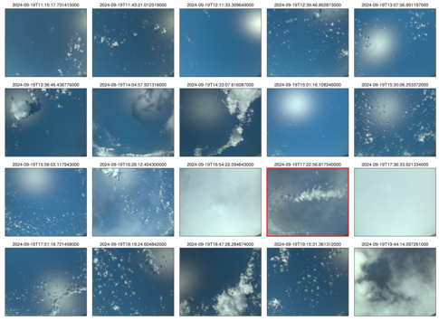

{logo}`PERCUSION`

# {front}`flight_id`

```{badges}
```

## Crew

```{crew-list}
```

## Track


Flight path superimposed on the natural color image from NOAA's Geostationary Operational Environmental Satellites (GOES) 16 satellite on 19th September 2024 at 17:40 UTC. The location of the aircraft at the time of the image is shown by the red arrow. The points of closest approach to the EarthCARE (green) and PACE (purple) satellite tracks are marked with red crosses. The points of closest approach to METEOR are marked with red dots. The segment of the path highlighted in orange indicates where the roll maneuver for the radar calibration took place. Dropsondes were dropped throughout the flight, including on the EarthCARE and PACE satellite tracks, inside the 2nd and 5th circles, and on the METEOR overpasses.

## Conditions

<center>
<video width="590" controls="" poster="https://swift.dkrz.de/v1/dkrz_948e7d4bbfbb445fbff5315fc433e36a/ORCESTRA/static/HALO-20240919a-thumb.png">
  <source src="https://swift.dkrz.de/v1/dkrz_948e7d4bbfbb445fbff5315fc433e36a/ORCESTRA/static/HALO-20240919a.mp4" type="video/mp4">
  Your browser does not support the video tag.
</video>
</center>

_Flight path superimposed on the "visible" image from NOAA's Geostationary Operational Environmental Satellites (GOES) 16 satellite on 19th September 2024. The green dots mark the live location of sucessfully launched dropsondes. Credit: Lukas Kluft._

The western tongue of the ITCZ and its doldrums had retreated eastwards and the "tropical distrurbance" called storm Gordon was venturing northwards, leaving us with compartively drier conditions than previous flights. To the north, a moist outflow from storm Gordon created an enlogated band of deep convection which developed throughout the day - a rainband associated with Gordon's extra-tropical transition.

Along the east-west axis we flew, the dominant observation was one of non-precipitating shallow cumuli cloud steets above an extremely calm "mirror-like" ocean surface. Sometimes the streets were sparsely populated and well separated from one another; at others times much denser with occasional instances of narrow deep convective cells overshooting the melting level. The streets preffered to orientate N-S, but the degree to which they aligned along that direction varied considerably. Often they looked like terrace houses on side-streets perpendicular to main roads, at other times they looked more like trees in a park viewed from above. As we flew east, the IWV and wind speeds increased gradually, from roughly 45 Kg/m^2 and 5 m/s at 11:45 UTC to a peak of 60 Kg/m^2 and 10 m/s at 13:00 UTC, and this went hand in hand with more abundant shallow cumuli and deeper convective cells reaching about 8 km. Further east we could occasionally identify cold pools too, almost always appearing as the origin of cloud streets. Wind speeds were a little too high to call this region the doldrums, but perhaps it's appropriate to call it a slighly more dynamic variant of that theme.

The northern segment of our flight was a whole different kettle of fish. During the satellite underpasses and the 4th circle in between them, streets and parks where replaced by two gigantic tower blocks - two deep convective cells neighbouring each other (some may interpret them as one). The first appeared in full bloom; the tower itself was about 95 km wide and easily reached 14.5 km (see detailed description in "Impressions" at 16:09 UTC); its anvil was several kilometers thick and we transected it for roughly 165 km. We arrived at the second cell about 20 minutes later and witnessed a much more delapidated tower, about 82 km wide but still reaching above 14 km (see detailed description in "Impressions" at 16:37 UTC). It's edges were more ragged, the radar reflectivity signal was not so strong above 8 km, and mid-level outflows around the melting level could be seen on the radar. Neverthess the cirrus anvil prevailed for about 220 km. Yet just as abruptly as the towers had become visible, when the IWV plumeted the shallow cumuli neighbourhoods reappeared as if the towers had never existed.


## Execution

This was an exceptionally busy and sucessful flight! In total, we underwent 5 scientific circles, droped over 70 dropsondes, performed 2 METEOR overpasses and 2 satellite underpasses (1 of PACE and 1 of EarthCARE) and we did a sucessful radar calibration.

- Intentionally delayed take-off until 11:00 UTC (to try to prevent requiring a waiting maneuver before the satellite underpasses. In hindsight this was a slight error of judgement, see below).
- 1st meteor overpass at 12:20 UTC (10.84N, 50.20W).
- 1st circle at eastmost point (with minor detour to avoid strong convection) from 12:33 - 13:31 UTC.
- 2nd meteor overpass at 13:47 UTC (10.86N, 50.31W).
- 2nd circle from 13:56 - 14:56 UTC.
- 3rd circle at start of PACE track was reduced from radius=72 nm to radius=39 nm because otherwise we would've been about 10 minutes too late for the satellite underpasses.
- 3rd circle from 15:03 - 15:33 UTC.
- Waiting maneuver from 15:33 - 15:44 UTC. Maneuver added because the small circle made us too early for the satellite underpasses.
- PACE track from 15:44 - 16:29 UTC. Closest point to PACE at 16:23 UTC (16.16N, 53.37W) with 64m error.
- 4th circle from 16:29 - 17:26 UTC.
- EarthCARE track from 17:26 - 18:04 UTC. Miscommunication meant we initially followed the previous day's EarthCARE track forecast and so were 400m east of EarthCARE. We corrected this by 17:37 UTC. Closest point to EarthCARE at 17:44 UTC (14.53N, 53.88W) with 4m error.
- Radar calibration (roll maneuver) at end of the EarthCARE track from 17:59 - 18:01 UTC
- 5th circle center moved eastwards to start at end of EarthCARE track and thereby be closer to the smaller-than-anticipated 3rd circle.
- 5th circle from 18:04 - 19:04 UTC.
- Landing descent started at 19:24 UTC; landed at 20:00 UTC.

## Impressions

- 11:05 UTC takeoff complete, lots of overshooting cloud tops from cumuli reaching upto 8km with some textbook like anvils detraining
- 11:24 UTC some very deep convective clouds reaching well past 11km amongst very many scattered shallow cumuli seeming to align in rows along a north-south direction (parallel to surface winds from windy; see photo below).
- 11:54 UTC completely clear skies beneath us except for some scattered shallow cumuli. Looking northwards into the distance there are deep anvils around where we expect to meet PACE later on.
- 12:00 UTC very very clear and clean conditions. Some shallow cumuli organised in cloud streets. Very low surfacee wind speeds. Possible doldrums?
- 12:20 UTC FIRST METEOR OVERPASS (dropsonde within 0.5nm of the ship!). Some developing cumuli and a large anvil northwards from us.
- 12:25 UTC radar sees three consecutive towers upto about 8km overshooting the melting level. Ragged cirrus layer about 500m thick with gaps and some tails reaching lower (remnant of earlier convection?).
- 12:38 UTC abundant cumuli reaching upto 8km forming arcs along a north-south axis
- 12:46 UTC very typical scenes keep repeating: exceptionally calm blue ocean surface acting like a mirror, abundant scattering of very shallow cumuli somewhat organised along arcs/rows but not strictly so.
- 12:50 UTC hazy, very grey and very thin layer of altocumulus lidar shows they're at about 5km and are 200m thick (see photo below). Re-appears at 13:47 and 14:27 UTC.
- 13:31 UTC END OF FIRST CIRCLE. Sabrina reports there was an elevated marine aerosol layer not connected to the ground from about 13:00 until 13:35 UTC. Layer is between 500m to 1km (possibly caused by the low wind speeds of doldrums?) Also occured from about 12:10 until 12:15 UTC. Not related to drops in water vapour as water vapour remains constant.
- 13:47 UTC SECOND METEOR OVERPASS and typical scenes with mirror-like ocean surface and some scattered shallow cumuli possibly following arcs but also randomly placed, like looking at trees in a park from above (see photo below). Meteor report very low wind speeds circa 0.5m/s.
- 15:03 UTC START OF THIRD CIRCLE. Typical scenes as earlier except that cumuli appear to follow more organised arcs/rows with a roughly north-south axis.
- 15:33 UTC END OF THIRD CIRCLE. Clearer skies than earlier, some scattered convention and disorganised lines of shallow clouds. A couple of instances of midlevel cumuli in the surroundings nearby up to about 6-8km. Deep convective towers with far reaching anvils are visible both east and west in the distance, similar to scenes around 11:24 UTC.
- 16:04 UTC Reduction in abundance of scattered cumuli goes hand in hand with decreasing IWV shown by KV radiometer retrieval.
- 16:06 UTC Minor turbulence as we overpass an anvil top seen on radar as 12.5km, circa 1km thick.
- 16:09 UTC Absolute monster! We enter a thick expanse of cirrus at 14.5km; turbulence. Tower from deep convective cell emerges at 16:12 UTC with a very pronounced melting level at 4.5km. Multiple scattering events on radar are abundant because the below ground retrieval is very strong. Nevertheless the radar is not completely attenuation. At 16:19 UTC the tower seems to be thining and we see a big cloud hole O(1km) thick and about 22km wide. Deep convective tower ends abruptly at 16:21 UTC but the cirrus anvil keeps prevailing, just over 2km thick (-65celcius outside temperature). Cirrus thins out and finally ends with top at 12.5km and 250m thick at 16:27 UTC. Tiny scattered shallow cumuli resume as if deep convection never existed. Fleeting cirrus 250m thick at 12.5km seen (perhaps a leftover piece of monster?)
- 16:37 UTC Cirrus on radar thickens to 1.5km as well enter second convective cell; at 16:40 UTC the tower reaching the ground emerges. Unlike previous cell, this on is much more ragged and large echos only prevailing upto circa. 8km rather than higher (signs of older cell?). Tower ends at 16:46 UTC but extremely thick cirrus (about 5km on radar with base at about 8.5km) still prevailing until 16:53 UTC. As cirrus starts to thin, classic cloud streets of shallow cumuli with very clear north-south alignment become visible in clearer, less optically-thick, pockets. Cirrus remains very broken and scattered throughout 6km and 14km beyond 16:56 UTC.
- 17:52 UTC textbook cold pool seen on SpecMACS and Chelsea notices sharp gradient in IWV decreasing from 62Kg/m^2 to 46Kg/m^2 from 17:40 to 18:00 UTC (approx. 276km). (Signs of the extra-tropical transition of storm Gordon?)
- 18:19 UTC cloud streets very clearly aligned east-west, which is unusual compared to north-south alignment throughout rest of flight.
- 18:28 UTC Scattered shallow cumuli everywhere with no clear orientation yet two prominent cloud streets in directions N-S and NE-SW appear to meet at a point in the distance SW.
- 18:31 UTC "terrace house streets": a multitude of N-S cloud streets ("side streets") with perpendicular streets at regular intervals along E-W direction ("main-roads"). Yet ocean surface appears ultra-calm like a mirror underneath. (See scene at 18:31 UTC below.)
- 18:38 UTC Huge empty E-W channel beyond which there lies a very clear row of very deep convective towers (circa. 10km high), "a busy main road", with anvils connecting all of them. (See scene at 18:31 UTC below.)
- 19:17 UTC Last dropsonde released! Continuous sonde dropping occurred from 12:20 until now resulting in 74 sucessfully dropped sondes!

```{note}
Highlights: Elevated marine aerosol layer circa. 13:00 UTC; sampling of two very deep convective towers at circa. 16:09 UTC and 16:37 UTC; scattered cumuli throughout, often organised in N-S aligned cloud streets.
```


````{card-carousel} 2

```{card}
:img-top: ../figures/HALO-20240919a/DSC_8952_preflight_allfemalecrew_photo.jpg
All female scientific crew (10:22 UTC).
```

```{card}
:img-top: ../figures/HALO-20240919a/DSC_9009_crew1.jpg
All female scientific crew aboard HALO.
```

```{card}
:img-top: ../figures/HALO-20240919a/DSC_8995_crew3.jpg
All female scientific crew in discussion.
```

```{card}
:img-top: ../figures/HALO-20240919a/DSC_9076_crew2_cropped.jpg
All female scientific crew dropping dropsondes.
```

```{card}
:img-top: ../figures/HALO-20240919a/IMG_20240919_052144_remarkable_scenes_before_takeoff.jpg
A row of convective towers before takeoff, similar to what we saw during the flight (09:21 UTC).
```

````


````{card-carousel} 2

```{card}
:img-top: ../figures/HALO-20240919a/DSC_8992_hazy_grey_altocumulus.jpg
Example of thin, grey layer of altocumulus seen on lidar circa. 12:50 UTC.
```

```{card}
:img-top: ../figures/HALO-20240919a/IMG_20240919_072318_typical_scene_rows_towers_anvils.jpg
Typical N-S aligned shallow cumuli cloud streets with deeper convection and anvils further North (11:23 UTC).
```

```{card}
:img-top: ../figures/HALO-20240919a/IMG_20240919_083342_mirror_ocean.jpg
An example of the mirror like ocean surface and less well-orientated shallow cumuli at 19:16 UTC. (The rainbow in the bottom corner is an artifact.)
```

```{card}
:img-top: ../figures/HALO-20240919a/IMG_20240919_143322_terrace_houses.jpg
"Terrace house streets" scene at 18:33 UTC. Shallow cumuli aligned along N-S cloud streets meet with a "main road" of slighly deeper convection aligned E-W. A channel of very clear sky lies beyond that until a E-W aligned row of much deeper convection with connecting anvils aloft.
```

````

## Instrument status & quicklooks

```{instrument-table}
```
````{card-carousel} 2

```{card}
:img-top: ../figures/HALO-20240919a/BACARDI_QL_20240919a.png
BACARDI
```

```{card}
%:img-top: ../figures/HALO-20240919a/20240919_circle_profiles.png
Dropsondes
```

```{card}
%:img-top: ../figures/HALO-20240919a/hamp_fullflight_HALO-20240919a.png
HAMP
```

```{card}
%:img-top: ../figures/HALO-20240919a/hamp_ec_under_HALO-20240919a.png
HAMP during EarthCARE underpass
```

```{card}
%:img-top: ../figures/HALO-20240919a/hamp_radar_ec_under_HALO-20240919a.png
Radar during EarthCARE underpass
```

```{card}
:img-top: ../figures/HALO-20240919a/HALO_20240919a_KT19.png
KT19 Timeseries of brigthness temperature.
```

```{card}
:img-top: ../figures/HALO-20240919a/HALO-20240919a_SMART_Quicklook.png
SMART Time series.
```

```{card}
%[](https://www.meteorologie.lmu.de/~quicklooks/specMACS/PERCUSION/quicklooks/polcams/quicklook_20240919_polb.png)
% specMACS RGB snapshots from polb (lower right) with EarthCARE underpass marked in red. Find further quicklooks [here](https://www.meteorologie.lmu.de/~quicklooks/specMACS/PERCUSION/flight_HALO-0919.html).
```

```{card}
%:img-top: ../figures/HALO-20240919a/QL_VELOX_HALO_20240919a.jpg
VELOX broadband channel with EarthCARE underpass
```

```{card}
:img-top: ../figures/HALO-20240919a/0919-wales-3d.jpg
WALES (3D backscatter)
```

```{card}
:img-top: ../figures/HALO-20240919a/0919-wales-x.png
WALES (cross section)
```

````
