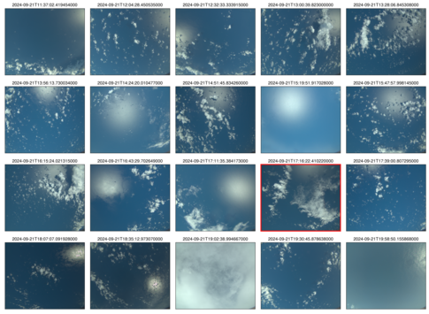

{logo}`PERCUSION`

# {front}`flight_id`

```{badges}
```

## Crew

```{crew-list}
```

## Track


Flight path superimposed on the visible image from NOAA’s Geostationary Operational Environmental Satellites (GOES) 16 satellite at 19:58 UTC.

## Conditions

```{track-animation}
:flight_id: HALO-20240921a
```

No significant deep convection was expected for this flight and for a large part the clouds resembled the ‘gravel’ type of shallow cumulus organization, with frequent arc-like cloud structures surrounding broad clear-sky areas. The eastern circle, the middle circle and the second Meteor-circle on the return leg nevertheless featured multiple isolated deep convective towers with spreading anvils. The eastern circle also featured frequent mid-level outflow. Cirrus was mostly found in the westernpart of the flight area.
The circles were mostly inside the moist margin, with the Meteor circle partly located on the edge of a moist tongue. Wind speeds were very low throughout most of the flight, as correctly forecasted by IFS. 

## Execution

The flight could be executed as planned. Take-off was a few minutes earlier at 11:22 UTC. We started the first circle around Meteor at 12.5km altitude, as the distance was too short to reach FL410 before entering the circle. In the eastern circle, we had to slightly deviate from the circle path both times to fly around a deep convective system (deviation inside the circle). The timing of the EC underflight was met with 2s precision without the need for a waiting circle. Before entering the second  Meteor circle, we flew a small roll manoeuvre for radar calibration. Successful coordination with Meteor for the first and fifth circle. We received dropsonde clearance well before entering the circles and could launch all sondes as planned. Landing as planned at 20:15 UTC.

## Impressions

- 11:22 UTC take-off, climbing circle close to the island, cumulus humilis around Barbados, some cirrus overhead
- 11:31 UTC straight-leg to the entry point of the Meteor circle with mostly shallow convection and broad clear-sky areas. Some deeper convection to the north. 
- 11:48-12:47 UTC Circle 1 (Meteor circle): some raining clouds inside the circle, with midlevel outflows and topped by a cirrus layer. The southern part of the circle featured very shallow convection (‘sugar pattern’), with well organized cloud streets and some cirrus as evident in the GOES animation. Eastern exit of Meteor transect had about 14 mm more IWV then Western entry
- 11:59 UTC altostratus and cirrus layers, some rain from midlevel clouds, followed by 1km thin cirrus in the south of the circle.
- 12:11 UTC some altocumulus in the circle close to HALO. Nice deep convective cloud right outside the circle
- 12:38 UTC 2km thick cirrus again right below aircraft. Some 3-4km deep clouds in the circle near 11-12 o’clock
- 13:00 UTC Meteor transect: Launched a sonde with the goal of catching a cold pool close to the end of the transect
- 13:12 UTC Amazing deep clouds to the south. Only the anvil left, no core anymore. Looks like an inverted jelly fish.
- 13:33 UTC Completely clear-sky, specMACS sees nothing, WALES neither. Despite IWV ~55mm
- 13:55-14:54 UTC First Eastern circle. At least ~20 raining clouds in sight, most of them just 4-5km deep, in the back some clouds reach depths of 8-10km. Overall very convective, clouds in all layers, but mostly confined to below 5-6km. A lot of raining clouds inside the circle, feeding their own cloud holes but with very limited arc clouds. Had to slightly deviate from circle track to get around a ~15km deep system at 5 o’clock. Sampled its edges. 
- 14:15 UTC Two ~6km deep congestus clouds announce a 15km deep system. Need to deviate into the circle to get around it. The deep cloud seems very young, no anvil yet. Nice pileus cloud around its overshooting top. Trailing altocumulus behind the deep system.
- 14:48 UTC At least 5-8 slightly sheared raining clouds that seem to strongly suppress cloudiness, but the cloud arcs surrounding the clear-sky areas are very shallow, so the gust fronts seem to be too weak to trigger deeper convection. A lot of very thin detrainment layers near the melting level 
14:54-15:55 UTC Second Eastern circle. Broad altocumulus fields in the lower left quarter of the circle, nicely captured by SpecMACS. Everywhere surprisingly strong mid-level outflow. Again had to deviate inside the circle to omit the deep convective cloud in the south of the circle. Northern half of the circle again with abundant rain clouds and frequent cloud arcs. Our impression was that the second circle tended to have slightly more and deeper clouds than the first one (GOES animation seems to confirm this).
- 16:17-17:15 UTC EC circle. Upper left quadrant of the EC circle quite cloudy. Lower half less cloudy, but a few deeper systems.
- 16:25 UTC Nice cloud hole with feeding rain cloud inside the circle – sonde might have captured the cold pool
- 16:33 UTC Growing Cb just inside the circle. Four other towers outside
- 17:25 UTC On the EC track: Three deep convective towers to our left, one to our right
- 17:33:39 UTC EC_under point reached with a precision of 2s
- 17:39 UTC nice cloud mirrors due to very low wind speeds
- 17:52 UTC Track to Meteor seems all gravel like, a lot of clear sky, arc clouds and few deeper ones
- 18:17 UTC Roll manoeuvre for radar calibration, conditions likely good, just a few shallow cumulus clouds
- 18:25-19:24 UTC Second Meteor circle. Northern half gravel-like structures, with SEA-POL detected rain cells nicely placed in the middle of cloud arcs shown by the GOES satellite images. The southern portion of the circle is coverd by sugar-like shallow clouds. 
- 18:29 UTC Deeper clouds in the back, remnants of deep clouds lingering near 13km..
- 18:57 UTC Nice Cb cells at 120deg of the circle, called ‘the Snake’ by the Meteor crew. Crossing a 12km deep Cb core 8 minutes afterwards.
- 19:09 UTC A lot of narrow deep convective towers now, but not really much cloud arcs / holes apparent
- 19:37 UTC Thin cirrus on descent
- 19:42 UTC Really clear and dry (41mm) on the approach to Barbados, followed by nice shallow cumuli right upstream Barbados


````{card-carousel} 2

```{card}
:img-top: ../figures/HALO-20240921a/Crew.jpeg
Crew before take-off.
```

```{card}
:img-top: ../figures/HALO-20240921a/IMG_5077_jellyfishanvil_1312UTC.jpeg
Inverted jellyfish like anvil remnants at 13:12 UTC.
```

```{card}
:img-top: ../figures/HALO-20240921a/IMG_5084_turtleinCu_1339UTC.jpeg
Shallow cumulus cloud fields at 13:39 UTC, with the larger aggregate in the center resembling a turtle.
```

```{card}
:img-top: ../figures/HALO-20240921a/DSC_9230_Cbwithpileus_circeast_1413UTC.jpeg
Approx. 15 km deep Cb tower with pileus cloud shot out of the cockpit during our deviation into the eastern circle  (14:13 UTC).
```

````


````{card-carousel} 2

```{card}
:img-top: ../figures/HALO-20240921a/IMG_5125_thincloudarcs_circeast_1446UTC.jpeg
Sheared raining clouds feeding several cloud holes, but apparently producing very weak gust fronts that trigger only very shallow cloud arcs. A lot of mid-level outflow and a deep convective system in the background (14:46 UTC).
```

```{card}
:img-top: ../figures/HALO-20240921a/IMG_5135_mixCbaltocu_circeast_1505UTC.jpeg
Mix of altocumulus, congestus and cumulonimbus clouds in the second round of the eastern circle (15:05 UTC).
```

```{card}
:img-top: ../figures/HALO-20240921a/DSC_9394_cloudmirrors_ECtrack_1750UTC.jpeg
Clouds mirrored in the ocean after the EC underpass at 17:50 UTC.
```

```{card}
:img-top: ../figures/HALO-20240921a/IMG_5254_cumulustowers_circmeteor2_1929UTC.jpeg
Five cumulus towers after leaving the second Meteor circle (19:29 UTC).
```

````

## Instrument status & quicklooks

```{instrument-table}
```
````{card-carousel} 2

```{card}
:img-top: ../figures/HALO-20240921a/HALO_20240921a_BACARDI_QL.png
BACARDI
```

```{card}
:img-top: ../figures/HALO-20240921a/20240921_circle_profiles.png
Dropsondes
```

```{card}
:img-top: ../figures/HALO-20240921a/hamp_fullflight_HALO-20240921a.png
HAMP
```

```{card}
:img-top: ../figures/HALO-20240921a/hamp_ec_under_HALO-20240921a.png
HAMP during EarthCARE underpass
```
```{card}
:img-top: ../figures/HALO-20240921a/HALO_20240921a_KT19_QL.png
KT19 Timeseries of brigthness temperature.
```

```{card}
:img-top: ../figures/HALO-20240921a/hamp_radar_ec_under_HALO-20240921a.png
Radar during EarthCARE underpass
```

```{card}
:img-top: ../figures/HALO-20240921a/HALO_20240921a_SMART_QL.png
SMART Time series of upward and downward spectral irradiadiance, and albedo.
```

```{card}
[](https://www.meteorologie.lmu.de/~quicklooks/specMACS/PERCUSION/quicklooks/polcams/quicklook_20240921_polb.png)
specMACS RGB snapshots from polb (lower right) with EarthCARE underpass marked in red. Find further quicklooks [here](https://www.meteorologie.lmu.de/~quicklooks/specMACS/PERCUSION/flight_HALO-0921.html).
```

```{card}
:img-top: ../figures/HALO-20240921a/specmacs.jpeg
SpecMACS.
```

```{card}
%:img-top: ../figures/HALO-20240921a/QL_VELOX_HALO_20240921a.jpg
VELOX broadband channel with EarthCARE underpass
```

```{card}
:img-top: ../figures/HALO-20240921a/HALO-20240921-wales-3d.jpg
WALES (3D backscatter, unpolarized)
```

```{card}
:img-top: ../figures/HALO-20240921a/HALO-20240921-wales-x.png
WALES (backscatter, polarization and humidity) at EC overpass
```
````
