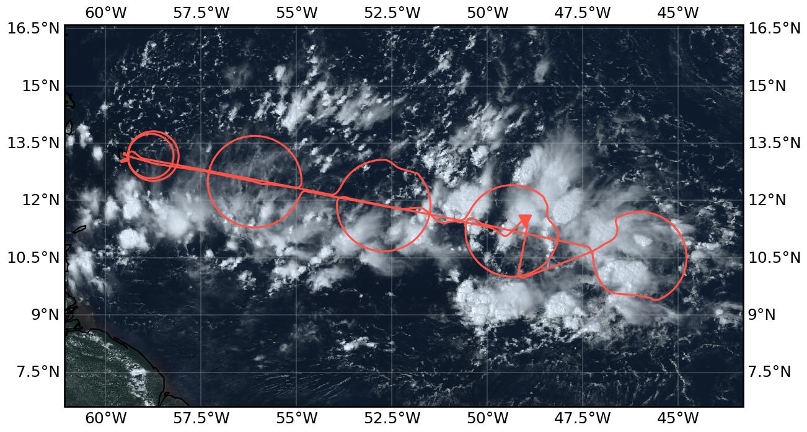
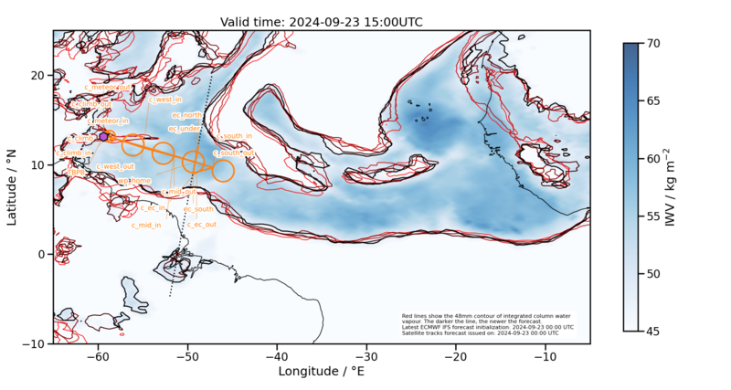
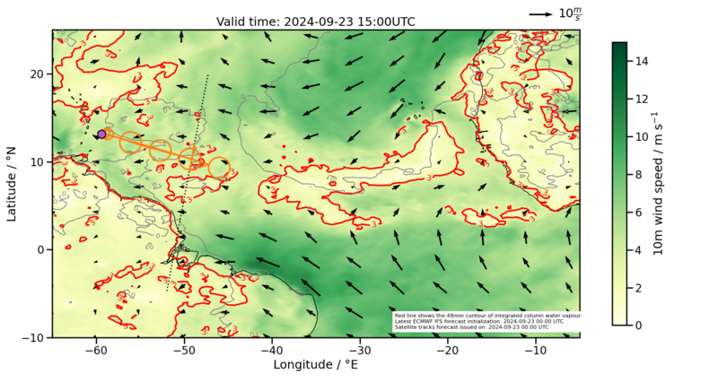
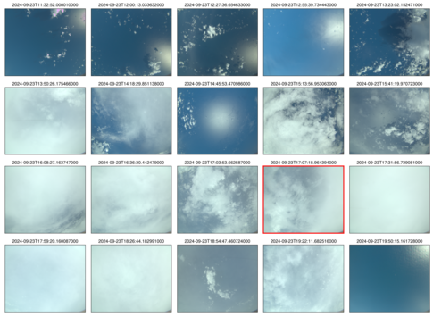

{logo}`PERCUSION`

# {front}`flight_id`

```{badges}
```

## Crew

```{crew-list}
```

## Track

 

Flight path superimposed on the natural color image from NOAA's Geostationary Operational Environmental Satellites (GOES) 16 satellite on September 23, 2024, at 17:25:07 UTC, which is the closes image to the EarthCARE overpass. The location of the aircraft at the time of the satellite image is highlighted by the orange triangle.

```{note}
* All times in this report are given in UTC.
* The number of sondes stated are those with a launch detect, but no further QC applied.
```

## Conditions

```{track-animation}
:flight_id: HALO-20240923a
```

The CWV field defining the moist margins of the ITCZ bends to the north before reaching Barbados.
The surface winds on the other hand show a nice confluence line along the axis of our operations and E-S-E of Barbados leading us into the moistest (reachable) spots within the ITCZ.
In the course of the day, convection along this confluence line actively developed and the line together with frequent and strongly growing Mesoscale Convective Systems (MCS) moved northward.
In the morning and rather in the west we found shallow clouds mostly clustered in blobs or along lines and cold pools, with frequent towers reaching further up, but no extensive anvils.
Starting with `c_mid` and about two hours into the flight, the southern half of the circles was typically covered by deep cumulunimbus clouds with extended anvil shields and increasing convective activity. The further south-east we flew, the more often we had to deviate from the planned flight track due to deep convective cells that we could not fly through, nor go above them.
The preliminary HAMP IWV retrieval suggested about 60kg/m2 throughout most of the flight. The conditions on the EarthCARE track were dominated by deep clouds.




## Execution
- take-off followed by a 35nm sized circle to climb up to FL410
- measurement circle `c_meteor` (39nm radius) from 11:54 - 12:40 with 11 dropsondes in coordination with METEOR's SEA-POL scans. The METEOR research ship was sitting 0.075°E of the BCO.
- flying out east we did three circles `c_mid` (13:12 - 14:07), `c_ec` (14:37 - 15:32), and `c_south` (16:00 - 16:55) with frequent deviations on the circle tracks (the "Pacman mouths") due to deep clouds and 12 dropsondes dropped each
- we further headed towards the EC track entering it from the south. EC meeting point was slightly further north than anticipated, but before the next major MCS that we had to shy away from. We were able to stay on te EC track between 17:15:25 and 17:23:46.
- afterwards, we manouvered our way west in wiggles avoiding the deepest convective clusters that we could not fly above.
- last circle `c_west` from (18:15 - 19:10)
- radar calibration wiggle on the straight leg crossing `c_west` and heading west at about 19:17
- before landing, we passed by METEOR and BCO again

**METEOR and BCO overpass times (UTC) and distances:**
* passing by BCO with 1225m distance at 2024-09-23 11:18:31
* Meteor overpass 1 with 386m distance at 2024-09-23 11:18:36
* Meteor overpass 2 with 440m distance at 2024-09-23 11:54:01
* Meteor overpass 3 with 936m distance at 2024-09-23 12:26:11
* Meteor overpass 4 with 380m distance at 2024-09-23 19:52:13
* BCO overpass with 363m distance at 2024-09-23 19:56:59

## Impressions
### Area of METEOR coordination
A deep and raining cloud on top of METEOR prevented us from passing directly over the ship upon entering the METEOR coordination circle.
The northern part of the circle was dominated by shallow cumulus clouds.
In the southern half HALO flew over a thin stratus layer continued by anvil clouds.
Crossing the circle and heading east we flew right above a thin cirrus layer. Looking through by eye we could see shallow clustered clouds with towers here and there.

### Circle mid `c_mid`
Again, the northern part of the circle was covered by few and shallow cumulus clouds.
Starting in the eastern part HALO flew mostly above thick cirrus anvils, sometimes entering the deeper parts.
Being in the south of the circle the cirrus cloud top lookes flat inside the circle while frequent overshooting tops are visible looking outside of the circle.
Also when crossing the circle, HALO flew mostly over thick cirrus clouds.

### Circle on the EarthCARE track `c_ec`
While flying through the cloud tops we entered the next circle and continued climbing for a few minutes to the highest possible altitude at that time (FL450) before starting to drop sondes.
In the north we were passing by isolated towers that reach up to HALO but don't have an anvil yet. Cloud tops can be found at various heights and with a plethora of cloud top shapes. Several towers align in a row in S-N direction.
After roughly a quarter of the circle we are approaching anvils with overshooting tops again and soon after have to deviate from the circle track due to a deep convective system.
In the last quarter of the circle the anvils were clearing up again and gave way to some nice cold pools below anvils when looking outwards of the circle.
On the leg crossing the circle and while heading to the next circle we were mostly floating over white anvils again and passing by overshooting tops.

### Circle south `c_south`
This circle was marked by an almost closed cloud top, overshooting tops, and major deviations from the circle track to circumvent deep cumulunimbus clouds in the south and in the northwest of the circle.

### EarthCARE track `ec_track`
Our planned EC leg was blocked in the south and north by MCS such that we had to shorten it substantially to about 8.5 minutes mostly south of the meeting point with EarthCARE. The conditions were all cloudy and dominated by deep convection reaching it's highest intensity when we were approaching the MCS in the north and meeting EarthCARE right before shying away from the threatening radar echo on the pilot's screens.
Our following way back east was an exciting slalom around deep convective cells with a boring view over a white sea of anvil clouds with some overshooting tops to the north and a sudden break up in clouds revealing the shear line in the south (see photo).

### Circle west `c_west`
As usual, the south of the circle is dominated by white anvils. However, no deviations from the circle track this time possibly due to a combination of HALO flying at even higher altitudes (FL470) and potentially less active clouds that generate the anvils. Only in the last quarter of the circle we start to see cloud structures below us again and shallow clouds become visible below the anvils when looking into the circle.
While crossing the circle we could perform a radar calibration pattern and started our descent towards the METEOR ship.

### An excursion to METEOR and BCO
Before landing the pilots managed to fly over METEOR and subsequently also the BCO at about 1900m and 900m respectively with passive instruments still running. Small and shallow cumulus clouds had guided us out in the morning and small and shallow clouds accompanied us back home.


````{card-carousel} 2

```{card}
:img-top: ../figures/HALO-20240923a/20190923_103248_DSC_9475.JPG_small.JPG

Maybe the youngest scientific crew of the campaign before take-off (10:32:48 UTC).
```

```{card}
:img-top: ../figures/HALO-20240923a/20240923_071430_IMG_2368.jpeg_small.JPG
Spotting the Meteor about 2km east of BCO. We are heading there...(11:14:30 UTC)
```

```{card}
:img-top: ../figures/HALO-20240923a/20190923_112358_DSC_9486.JPG_small.JPG
Our cloud observations start with a beautiful raining cloud over a flat and calm ocean surface (11:23:58 UTC).
```

```{card}
:img-top: ../figures/HALO-20240923a/20190923_113410_DSC_9489.JPG_small.JPG
Cold pool image (11:34:10)
```

```{card}
:img-top: ../figures/HALO-20240923a/20190923_125244_DSC_9503.JPG_small.JPG
Looking below the anvils (12:52:44).
```

```{card}
:img-top: ../figures/HALO-20240923a/20240923_095127_IMG_2380.jpeg_small.JPG
Surfing the anvils (13:51:27)
```

```{card}
:img-top: ../figures/HALO-20240923a/20240923_103201_IMG_2383.jpeg_small.JPG
Cloud chaos (14:32:01)
```

```{card}
:img-top: ../figures/HALO-20240923a/20240923_114308_IMG_2388.jpeg_small.JPG
A look into an overshooting top (15:43:08)
```

```{card}
:img-top: ../figures/HALO-20240923a/20240923_134039_IMG_2393.jpeg_small.JPG
The shear line in the south (17:40:39)
```

```{card}
:img-top: ../figures/HALO-20240923a/20190923_195056_DSC_9598.JPG_small.JPG
A beauty (19:50:56)
```
````

## Instrument status & quicklooks

```{instrument-table}
```
````{card-carousel} 2

```{card}
%:img-top: ../figures/HALO-20240923a/
BACARDI
```

```{card}
%:img-top: ../figures/HALO-20240923a/
Dropsondes
```

```{card}
%:img-top: ../figures/HALO-20240923a/
HAMP 
```

```{card}
%:img-top: ../figures/HALO-20240923a/
HAMP during EarthCARE underpass
```

```{card}
%:img-top: ../figures/HALO-20240923a/
Radar during EarthCARE underpass
```

```{card}
%:img-top: ../figures/HALO-20240923a/
KT19 Timeseries of brigthness temperature.
```

```{card}
%:img-top: ../figures/HALO-20240923a/
SMART Time series of upward and downward spectral irradiadiance, and albedo.
```

```{card}
[](https://www.meteorologie.lmu.de/~quicklooks/specMACS/PERCUSION/quicklooks/polcams/quicklook_20240923_polb.png)
specMACS RGB snapshots from polb (lower right) with EarthCARE underpass marked in red. Find further quicklooks [here](https://www.meteorologie.lmu.de/~quicklooks/specMACS/PERCUSION/flight_HALO-0923.html).
```

```{card}
%:img-top: ../figures/HALO-20240907a/
VELOX broadband channel with EC underpass
```
```{card}
:img-top: ../figures/HALO-20240923a/HALO-20240923-wales-3d.jpg
WALES (3D backscatter, unpolarized)
```

```{card}
:img-top: ../figures/HALO-20240923a/HALO-20240923-wales-x.png
WALES (cross section)
```

````
