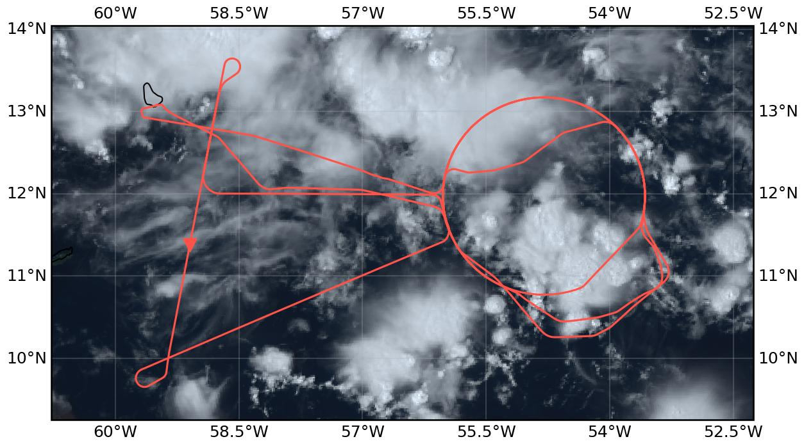

{logo}`PERCUSION`

# {front}`flight_id`

```{badges}
```

## Crew

```{crew-list}
```

## Track

 

Flight path superimposed on the natural color image from NOAA's Geostationary Operational Environmental Satellites (GOES) 16 satellite on September 24, 2024 at 15:20 UTC. The location of the aircraft at the time of the satellite image is highlighted.

## Conditions

```{track-animation}
:flight_id: HALO-20240924a
```

Two tropical waves and a well defined ITCZ defined the synoptic situation over the tropical Atlantic for the day of the flight. The ITCZ was located to the east of the Atlantic, displaying a tilt, and roughly resembling its climatological position for the month of September. It spanned from about 40°W and 2°N, to about 7°N off the coast of Africa. At a longitude of about 25°W was the first of the tropical waves, propagating westward. East of Barbados, at a longitude of about 50°W was the second tropical wave, also propagating west. This last wave was a determinant one for the flight, destabilizing the atmosphere over the region spanned by the original flight plan, and leading to the development of multiple mesoscale convective systems that occurred around the flight area.

Notably, the flight took place after a persistent downwelling signal associated with the MJO, as observed in the 200 hPa velocity potential, had transitioned to neutrality over the Atlantic. This transition could have lead to the more active state of the Atlantic observed for the flight. 

## Execution

Originally circles were planned at two different locations oriented horizontally east of Barbados. We would have done the western circle once, then flown the eastern circle twice in a row, the western circle again followed by the EarthCare track in north-south direction with an underpass location a bit north of Barbados and would have returned to the western circle for a third time before landing. The idea was to study the time evolution of the convective systems, clouds and moisture by doing the circles repeatedly with one hour time difference in the eastern circle and with around three and six hours difference for the western circle. 
Unfortunately HALO could not depart as planned due to fueling issues what in the end caused the take off to be delayed by four hours. Because of that and additional problems with severe weather and very deep convective systems especially north of Barbados at the location of the originally planned EarthCare track, the flight had to be replanned in the morning. The EarthCare track and meeting point were shifted south and flown south-north. The eastern circle was skipped completely. 

Take Off took finally place at 15:37 UTC going east towards the entry point of the (originally western) circle. On the way there, we already had to fly a big curve to the south to avoid a big convective system. We entered the circle at 16:15 UTC and flew it counter-clockwise. From the beginning of the circle, dropsondes were dropped continuously every five minutes. In the southern half of the circle we had to deviate a little bit to avoid convection, in the northern half of the circle we had to shortcut significantly into the direction of the center due to another big convective system. After finishing the circle at 17:11 UTC, we headed southwest to the new start of the EarthCARE track. We started the track at 17:48 UTC following it northwards until 18:19 UTC and meeting EarthCARE at 18:03 UTC. Due to the big convective system in the north, we followed the EarthCARE track back south until the meeting point and went then east again to the circle. At 18:56 UTC the second circle was started in counter-clockwise direction at the same position as the first circle. In the meantime another convective system developed in the southern part of the circle which we avoided by going further south to sample this system inside the circle. The convection in the northern half of the circle had decayed by then such that we could fly this part along the planned circle track. The same circle was repeated starting at 20:02 UTC and we again deviated to the south in the southern half to avoid convection sampling the same system inside the circle as before. Due to air traffic below, we had to stop dropping sondes at 20:42 UTC. The third circle was finished at 21:06 UTC. After finishing the circle we did a radar calibration maneuver on the way back towards Barbados at 21:11 UTC. Landing was at 21:47 UTC.
 
## Impressions

- 15:40 | Completely under cirrus, strongly developed convection, complex mixture of stratiform and convective clouds 
- 15:50 | Completely in cloud / cirrus 
- 15:58 | On track to east to circle 
- 16:14 | Diretly at cloud top 
- 16:15 | Starting 1st circle at FL410, counter clockwise, above clouds 
- 16:15 | Stratiform clouds on flight level, i.e., cirrus, some with overshooting tops (LHS) and anvil cirrus (RHS) 
- 16:29 | Convective towers with outflow, cirrus at flight level 
- 16:32 | In cloud with turbulence 
- 16:32 | Circle short cut at 4 o'clock towards the north to avoid convection
- 16:39 | Back on circle track
- 16:42 | Cirrus above gets thinner but remains, altocumulus below 
- 16:44 | Out of cirrus, which remains at cloud level, RHS there are overshooting tops, altostratus below 
- 16:49 | Under slight cirrus 
- 16:50 | 1st circle stopped at 2 o'clock, turned towards center of circle to avoid convection
- 15:52 | Inside of cirrus 
- 17:07 | Back on 1st circle at around 9 o'clock, mostly out of cloud 
- 17:11 | 1st circle end, outside of clouds, heading southwest to EarthCare track
- 17:17 | Climbing to FL430
- 17:21 | Out of clouds, can see surface 
- 17:26 | LHS patches of low level and mid level clouds, cumulus with overshooting top 
- 17:29 | Now everything white below aircraft
- 17:37 | Stop dropping sondes due to air traffic below
- 17:40 | Less cloud cover, sea surface becomes visible 
- 17:43 | Procedure turn on to EarthCare track
- 17:48 | Start EarthCare track heading northwards, start dropping sondes again
- 17:56 | Shortly in / under cirrus, all white below
- 18:03 | Meeting EarthCare
- 18:19 | Turn at the northern end of EarthCare track, now following EarthCare back to the south, all white below, no cirrus above
- 18:28 | Stop dropping sondes again due to traffic below
- 18:31 | Turn eastward to go to 2nd circle 
- 18:35 | In cirrus most of the time
- 18:36 | Restart dropping sondes
- 18:56 | Turning into 2nd circle, flying it counter-clockwise
- 18:57 | Altostratus cloud deck RHS
- 18:58 | Climbing to FL450
- 19:01 | Cirrus at flight level, we stay slightly above 
- 19:06 | Left circle to fly around deep convective system, large deviation to the south to avoid large convective system in the southern part of the circle
- 19:08 | Overshooting top RHS 
- 19:11 | Nice Cumulonimbus at RHS 
- 19:14 | Cloud situation inside the circle completely different to the RHS. LHS, clouds on all levels. RHS low level TWC and some cirrus, for a long time
- 19:31 | Back on the planned circle track 
- 19:48 | All white below 
- 20:02 | Finished 2nd circle and started 3rd circle 
- 20:08 | Cirrus above 
- 20:17 | In cirrus 
- 20:20 | Above cirrus
- 20:42 | Stop dropping sondes due to air traffic
- 20:43 | Little bit in cirrus, closed altostratus below 
- 21:06 | End of third circle, head back to BGI 
- 21:11 | Radar calibration maneuver with one last sonde 
- 21:14 | End manouver 
- 21:14 | Start descent 

````{card-carousel} 2

```{card}
:img-top: ../figures/HALO-20240924a/crew.JPG

Crew upon arrival (22:15 UTC)
```

```{card}
:img-top: ../figures/HALO-20240924a/convection.JPG

Convective towers with outflow (16:29 UTC)
```

```{card}
:img-top: ../figures/HALO-20240924a/cirrus.JPG

Cirrus all around (17:35 UTC)
```

```{card}
:img-top: ../figures/HALO-20240924a/overshooting_top.JPG

Overshooting cloud top (19:13 UTC)
```

````

## Instrument status & quicklooks

```{instrument-table}
```
````{card-carousel} 2

```{card}
:img-top: ../figures/HALO-20240924a/HALO_20240924a_BACARDI_QL.png
BACARDI
```

```{card}
:img-top: ../figures/HALO-20240924a/HALO_20240924a_KT19_QL.png
KT19 Timeseries of brigthness temperature.
```

```{card}
:img-top: ../figures/HALO-20240924a/HALO_20240924a_SMART_QL.png
SMART Time series of upward and downward spectral irradiadiance, and albedo.
```

```{card}
%:img-top: ../figures/HALO-20240924a/QL_VELOX_HALO_20240925a.jpg
VELOX broadband channel with EarthCARE underpass
```

````
