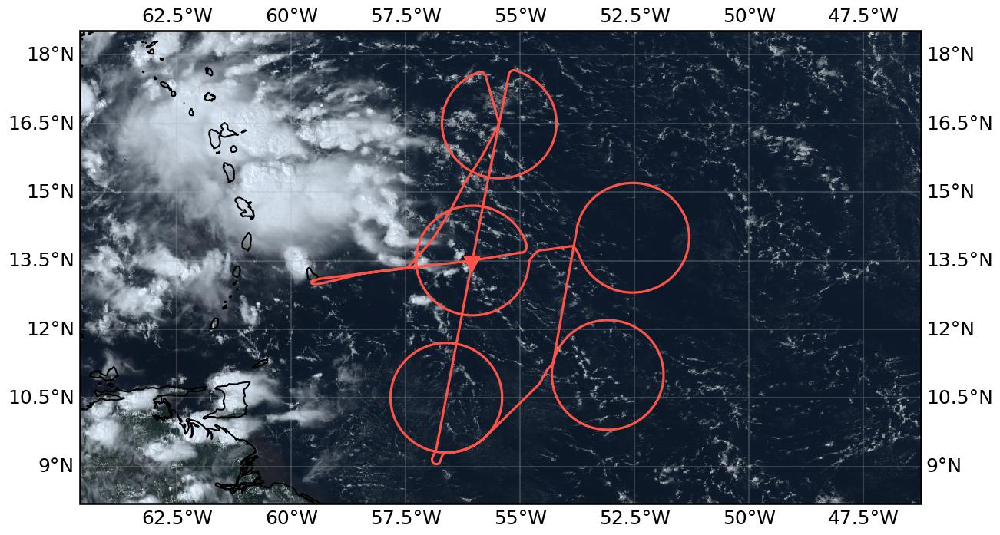
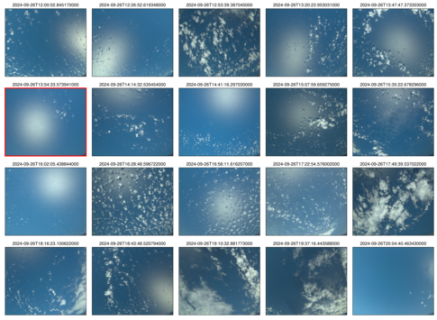

{logo}`PERCUSION`

# {front}`flight_id`

```{badges}
```

## Crew

```{crew-list}
```

## Track

 

Flight path superimposed on the natural color image from NOAA's Geostationary Operational Environmental Satellites (GOES) 16 satellite on September 26, 2024 at 17:51 UTC. The location of the aircraft at the time of the satellite image is highlighted.

## Conditions

```{track-animation}
:flight_id: HALO-20240926a
```

 The ITCZ was influenced by a strong african easterly wave sitting at approx. 37°W and 15°N that advected dry air towards lower latitudes to the west of it. This led to a narrow moist region with a minimum witdh of about 2° around 52°W. Towards Barbados the moist region widened again and deep convection with heavy thunderstorms prevailed throughout the day. The flight area was mainly characterised by shallow convection and few congestus with seemingly old anvil and cirrus clouds above. The vast majority of anvil clouds encountered during this flight was not connected to deep convection and hence most likely generated by convective cells occuring before the flight. The amount of ice clouds encountered throughout the flight was remarkable. Especially thin cirrus with optical depth below one were frequently observed, either directly below the plane or above.  

## Execution
- Flew through first circle to reach flight level 410 rather tahn entering it from the west. All instruments were running when we entered the circle. 
- First three cicles were flown without any issues.
- In circle 4 (c_south) air traffic control revoced permission to drop sondes after six sondes were dropped due to traffic. Therefore, the northern part of c_south was not sampled. To compensate for this, we dropped four sondes on the EarthCARE track through the circle. 
- We dropped an extra sonde at ec_under. 
- The last circle (c_north) was flown clockwise rather and counter-clockwise to have the less frozen window of SpecMACS facing the inside of the circle. 
- We flew back to the center of c_north after completing it of drop our two leftover sondes, one on half of the radius and one in the center. 
- On our way back to Barbados we flew further east than planned to avoid the thunderstorms. 


## Impressions
Ferry to c_mid
- 11:45: Take-off, a lot of congestuts with cirrus above.
- 11:55: Deep convection is not reaching the top; Cirrus seems to be old and is partly very thin.
- 12:02: Congestus becomes more shallow on our way to c_mid.
- 12:16: Rain cloud in the middle of the cirle, about 1.6 km high. Some anvils lingering around, other than that only shallow clouds. 

C_mid
- 12:25: We enter c_mid. No deep convection in sight. Signal in IR image from cirrus that moved on? 
- 12:29: Convection seems shallow and largely unorganized.
- 12:37: Old anvils in the middle of c_mid.
- 12:42: Deep convection to our right with anvils reaching c_mid, cloud streets within the circle. 
- 13:01: Very little aerosol in lidar, only shallow convection. 
- 13:04: Thin cirrus above us on the right. Visible in specmacs.
- 13:17: Coming to the end of c_mid, clouds haven’t changed much. 

C_northeast
- 13:30: Turning into c_northeast. The congestus seems to be a bit higher than in c_mid. 
- 13:34: Flying into a very thick layer of cirrus.
- 13:50: We leave the cumuli behind, clear skies ahead. Drop in IWV going down to 39 on eastern side of c_northeast now. 
- 13:59: Very clear skies.
- 14:04: Lines of shallow cumulus coming up. 
- 14:20: Shallow cumulus still here, lidar sees a layered humidity structure.

C_southeast
- 14:39: Cirrus on three different levels, lowest one at 8km showed some blobs of convection and seemed to contain liquid according to specmacs and wales.   
- 14:47: Thin cirrus right above us, below only shallow convection. The Cirrus layer started to appear above us and then grew deeper, getting visible on the radar. 
- 15:08: Congestus on the outside of the c_southeast. 
- 15:08: CWV is surprisingly high, only went down to 48 on the southern edge of the c_southeast. 
- 15:25: We start to see raining clouds about 2 km. No cold pools visible, shallow convection seems unorganized. 

C_south
- 15:53: Radar calibration done, climbing to 450. We seem to get above the cirrus. Convection below became even more shallow and we are going into clearsky again. 
- 16:03: Approaching c_south, cirrus seems to be below us now. Convection still very shallow. 
- 16:09: Shallow clouds become more closely spaced, Cirrus now constantly on the radar. Between 1 km and 100 m thick. 
- 16:16: Cirrus becomes thicker. Reaches 2 km now and starts to reach optical depth of 1. 
- 16:37: Convection starts to get deeper. Cirrus still here. 
- 16:42: Thin cirrus starts to appear above us again. The layer directly below disappears on the radar but remains on lidar. Deeper convection ahead. 
- 17:06: No strong IWV gradient on c_south. IWV stays at around 48. 

EarthCARE underpass
- 17:19: Passed ec_south, the radar sees only very little cirrus, lidar sees more. 
- 17:29: Shallow convection now spaced very equaly, thin cirrus gets less. 
- 17:35: Deep convection coming up to the left of us. 
- 17:49: Deep towers come closer. Radar starts seeing some deep raining clouds with cloud tops of 5 km.
- 17:51: Meeting EarthCARE. Deep convection around us, but not below. 
- 18:17: Clear skies dominated the ec track but every now and then we got a raining cloud with cloud tops at 5-6 km.

C_north
- 18:22: Congestus up to 7 km right below us. 
- 18:39: Several congestus and cirrus within c_north. 
- 18:47: Widespread detrainment of mid-level stratiform clouds from the congestus. Congestus tops are overshooting the stratiform part. 
- 18:55: Congestus start popping up left and right of us, not below us so far though. Cirrus above us again.
- 19:00: One congestus on the radar. CTH of 7 km. 
- 19:22: Congestus and stratocumulus clouds inside the c_north. Cirrus still above us. Stratocumulus with cloud tops of 1 km. 

Ferry back to Barbados
- 19:32: More deep towers on our way out of c_north. 
- 19:39: Crossing a convective tower that is reaching up to 14 km. Low-level wind-shear is tilting the tower in the mid-atmosphere. 
- 19:50: We start to see the anvils of the convective system in the west. 
- 19:58: Out of the anvil, clear skies below. 
- 20:01: Second radar calibration through 0 pitch 
- 20:04: Radar calibration ended, did three cycles. 

````{card-carousel} 2

```{card}
:img-top: ../figures/HALO-20240926a/crew_picture.jpg

Flight crew with pilots. Even managed to convince Tristan to not take the picture for once (Andre Ehrlich, 11:30 UTC)
```

```{card}
:img-top: ../figures/HALO-20240926a/photographer.jpg

Our flight documentation being documented (J. Deutloff, 14:13 UTC)
```

```{card}
:img-top: ../figures/HALO-20240926a/cirrus_c_se.jpg

Cirrus clouds above HALO on c_southeast (J. Deutloff, 14:49 UTC)
```

```{card}
:img-top: ../figures/HALO-20240926a/layered_c_south.jpg 

Layered clouds outside of c_southeast (J. Deutloff, 15:36 UTC)
```

```{card}
:img-top: ../figures/HALO-20240926a/deep_conv_ec_under.jpg

Deep convection popping up on our side during ec_under (J. Deutloff, 17:49 UTC)
```

````

## Instrument status & quicklooks

```{instrument-table}
```
````{card-carousel} 2

```{card}
:img-top: ../figures/HALO-20240926a/HALO_20240926a_BACARDI_QL.png
BACARDI
```

```{card}
%:img-top: ../figures/HALO-20240926a/20240926_circle_profiles.png

Dropsondes
```

```{card}
:img-top: ../figures/HALO-20240926a/hamp_fullflight_HALO-20240926a.png
HAMP 
```

```{card}
:img-top: ../figures/HALO-20240926a/hamp_ec_under_HALO-20240926a.png
HAMP during EarthCARE underpass
```

```{card}
:img-top: ../figures/HALO-20240926a/hamp_radar_ec_under_HALO-20240926a.png
Radar during EarthCARE underpass
```

```{card}
:img-top: ../figures/HALO-20240926a/HALO_20240926a_SMART_QL.png
SMART Time series of upward and downward spectral irradiadiance, and albedo.
```

```{card}
[](https://www.meteorologie.lmu.de/~quicklooks/specMACS/PERCUSION/quicklooks/polcams/quicklook_20240926_polb.png)
specMACS RGB snapshots from polb (lower right) with EarthCARE underpass marked in red. Find further quicklooks [here](https://www.meteorologie.lmu.de/~quicklooks/specMACS/PERCUSION/flight_HALO-0926.html).
```

```{card}
% :img-top: ../figures/HALO-20240926a/QL_VELOX_HALO_20240926a.jpg
VELOX broadband channel with EC underpass
```

```{card}
% :img-top: ../figures/HALO-20240926a/0926-wales-3d.jpg
WALES (3D backscatter)
```

```{card}
% :img-top: ../figures/HALO-20240926a/0926-wales-x.png
WALES (cross section)
```
````
