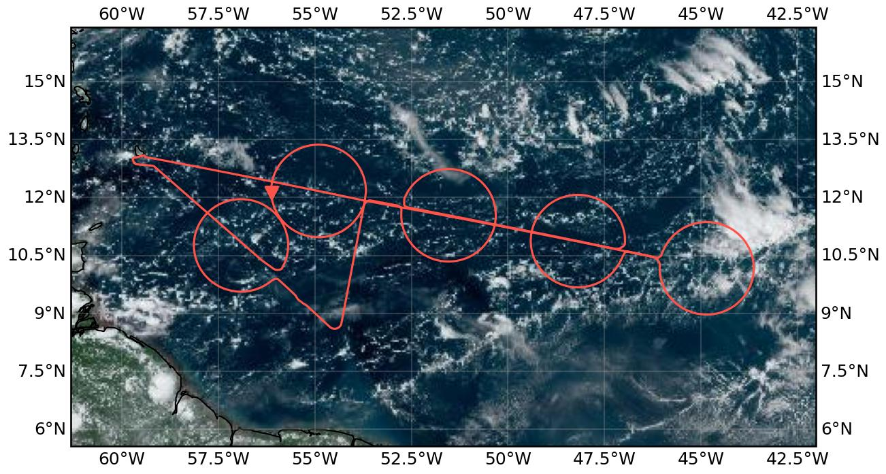
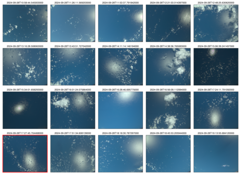

{logo}`PERCUSION`

# {front}`flight_id`

```{badges}
```

## Crew

```{crew-list}
```

## Track



Flight path superimposed on the natural color image from NOAA's Geostationary Operational Environmental Satellites (GOES) 16 satellite on 28th September 2024 at 17:40 UTC. The location of the aircraft at the time of the image is shown by the red arrow.

## Conditions

During the flight, the west Atlantic was dominated by the influence of Tropical Storm Joyce to the north. The flight track intersected the boundary between the northward inflow region and the southward outflow region, with the ITCZ situated in between. Convergence lines were observed north and south of the track, with a shallow third line in the middle. Deep convection was limited to these convergence lines and the tropical wave to the east. The doldrums were observed in the region between the ITCZ and the convergence lines. On a larger scale, the MJO was active, enhancing convection over the Atlantic, while La Niña-related anomalies were beginning to emerge in the Pacific.


## Execution

- 10:47 UTC take off (slightly delayed due to problems with BAHAMAS)
- 12:34 UTC Entered circle west
- 13:40 UTC Entered cirle mid east
- 14:48 UTC - 15:16 UTC Dropped five additional sondes in / close to the doldrums
- 15:54 UTC Entered circle mid west
- 16:32 UTC Entered circle west
- 17:31 UTC Entered EarthCARE track
- 17:41 UTC EarthCARE underpass
- 17:54 UTC Left EarthCARE track
- 18:05 UTC Radar callibration wiggle
- 18:13 UTC Entered last circle
- 19:41 UTC Radar callibration dive

```{note}
PACE: We were in the PACE swath shortly after the overflight.
```

## Impressions

- 11:06 UTC Since take off: shallow clouds, sometimes organised along some lines; intersperesed by some stratiform layers; cirrus clouds above us
- 11:15 UTC Increasing number of the shallow clouds have hats
- 11:20 UTC Numerous cirrus layers around us (sometimes in it)
- 11:00 - 11:20 UTC passed through a region of increased CWV (40 mm to 50 mm to 40 mm)
- 11:33 UTC Deeper convection with tilted anvils to the north of us
- 11:43 UTC Some cloud reflections (and so likely low wind speeds) below us
- 11:44 UTC The deep convective clouds towards the north of us appear to be partly isolated and partly clumped into a bigger system
- 11:55 UTC Deep convection about 100 nm away; mirror like ocean below us
- 12:00 UTC CWV has been rising slowly since 11:25 UTC
- 12:00 UTC Some deeper convection appearing towards the south of us
- 12:05 UTC Very low wind speeds below us; very narrow regiono of specular reflectance visible on specMACs
- 12:10 UTC Sudden increase in upper level humidity (around 10 km)
- 12:15 UTC Weak clear air turbulence
- 12:20 UTC Wind speeds have increased (based on specMACS)
- 12:26 UTC Only very small clouds below us; aerosols and humdity hint at subsiding motion in lower levels
- 12:33 UTC turning onto first circle
- 12:35 UTC CWV values of around 60mm (maximum so far)
- 12:38 UTC Multiple layers of cirrus clouds around us
- 12:43 UTC Some midlevel clouds at 8 km
- 12:46 UTC Can see some anvils of the deeper system towards to east of us
- 12:50 UTC Seeing an overshooting top peaking out of the anvil
- 12:53 UTC Flying along the edge of a cloud system
- 13:06 UTC Weak clear air turbulence
- 13:09 UTC Flying in cirrus
- 13:10 UTC Increase in aerosol load
- 13:15 UTC Reached southern tip of the circle, very small clouds below us and nothing to see toward the south; inside cirrus cloud
- 13:39 UTC Shallow clouds organised along circles
- 13:59 UTC Some deeper convection as we cross the southern convergence line
- 14:14 UTC Very low wind speeds below us with some deep convection forming along the middle converge line (Silke's picture!)
- 14:22 UTC Higher wind speeds compared to south of the convergence line
- 15:14 UTC Deep convection towards the north of us; shallow convection bellow us; many strongly sheared clouds are visible
- 15:24 UTC Cold pool structures visible to the south of us (sometimes with a remaining cloud hat in the center)
- 15:30 UTC Heading straight towards the deep convective cloud system; mostly shallow clouds to the south; anvil is whirled around
- 15:41 UTC Flying through the outermost part of the anvil
- 15:53 UTC Crossing the central convergence line; looks like cold pools with convection only triggered on one side
- 16:18 UTC Crossing the central convergence line again
- 16:56 UTC Fields of shallow clouds below us; inside cirrus cloud
- 17:07 UTC Shallow cumuli
- 17:25 UTC Deep convection with swi White dragon to the left
- 17:43 UTC Cloud streets (shallow clouds below)
- 17:51 UTC Large cirrus shield
- 18:34 UTC Deep convection towards the south of us, some shallow cumuli cloud streets below us


````{card-carousel} 2


````

## Instrument status & quicklooks

```{instrument-table}
```
````{card-carousel} 2

```{card}
:img-top: ../figures/HALO-20240928a/hamp_fullflight_HALO-20240928a.png
HAMP
```

```{card}
:img-top: ../figures/HALO-20240928a/hamp_ec_under_HALO-20240928a.png
HAMP during EarthCARE underpass
```

```{card}
:img-top: ../figures/HALO-20240928a/hamp_radar_ec_under_HALO-20240928a.png
Radar during EarthCARE underpass
```

```{card}
:img-top: ../figures/HALO-20240928a/0928-wales-3d.jpg
WALES (3D backscatter)
```

```{card}
:img-top: ../figures/HALO-20240928a/0928-wales-x.png
WALES (cross section)
```

```{card}
[](https://www.meteorologie.lmu.de/~quicklooks/specMACS/PERCUSION/quicklooks/polcams/quicklook_20240928_polb.png)
specMACS RGB snapshots from polb (lower right) with EarthCARE underpass marked in red. Find further quicklooks [here](https://www.meteorologie.lmu.de/~quicklooks/specMACS/PERCUSION/flight_HALO-0928.html).
```

````
