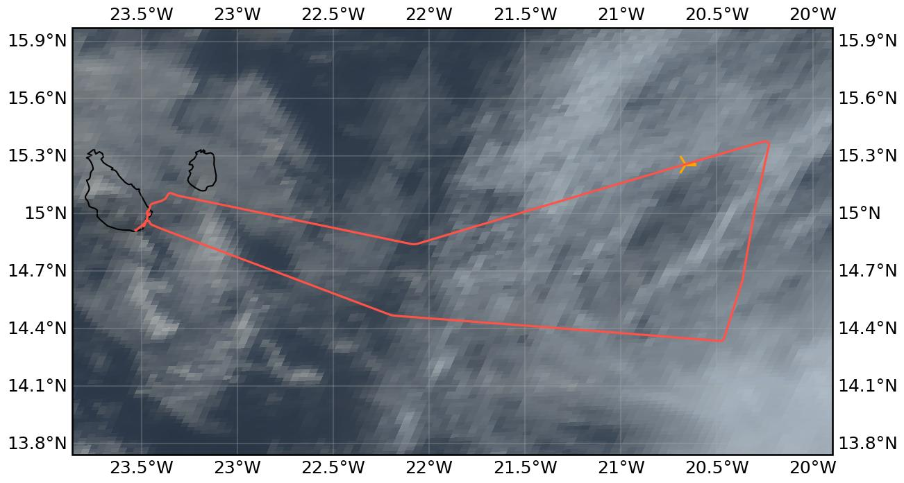

{logo}`CELLO`

# {front}`flight_id`

```{badges}
```

## Crew

```{crew-list}
```

```{admonition} EarthCARE target scenarios
:class: warning
Due to instrument failures, <b>no correlative measurements underneath EarthCARE</b> could be performed.

```

```{admonition} Flight summary
:class: note
<p style='text-align: justify;'>During the research flight on 15th August 2024, we targeted an EarthCARE overpass above mixed-phase clouds. However, we encountered probe failures on the way out to the correlative EC leg, and after multiple probe restarts the <b>mission had to be scrubbed</b>. On the way home, we managed to fix the probes to be ready for the next flight.</p>
```


## Track



Flight path superimposed on the natural color image from NOAA's Geostationary Operational Environmental Satellites (GOES) 16 satellite on 15th August 2024 at 15:40 UTC. The location of the aircraft at the time of the EarthCARE overpass is shown by the orange cross.

## Conditions
Distinct aerosol layer and mixed-phase clouds experienced during the flight. Mission aborted before EC leg.

## Flight video

No flight video available as mission had to be aborted before EC leg.

## Events

Time (UTC) | Comment
-------------| -----
13:50 | Takeoff Praia
14:46 | Restart probes but problems continue
15:18 | Mission scrubbed
16:02 | Probes fixed on way home
16:20 | Landing Praia


## Execution

- 13:41 UTC: All probes are good
- 13:50 UTC: takeoff (12:50 LT)
- heading to first waypoint FL230
- 14:24 UTC: anti icing on
- 14:46 UTC: restarted probes, now heading @FL100 to see clouds above at WP1
- 14:50 UTC: probe restart by accident
- 14:53 UTC: probes still not working
- 15:18 UTC: Mission scrubbed because probes not working
- 16:02 UTC: Probes fixed...yay...but too late for EC cal/val effort, will record aerosol until landing


## Impressions

- 13:57 UTC: FL090, above cloud layer, seeing dust on probes up to 5um
- 14:01 UTC: FL130, was a lull in dust now back again but less now for sure
- 14:10 UTC: FL215, no more Saharan dust layer
- 14:26 UTC: approaching cloud, some stuff on CAPS, ice on 2D-S
- 14:27 UTC: MPC cloud found, stellar dendrites, CAPS froze
- 14:53 UTC: upper cloud deck thinning, descending to cloud deck below, cloud probes still not working
- 16:03 UTC: lots of dust
- 16:07 UTC: lots of dust
- 16:15 UTC: approaching cloud, landing through cloud layer


## Instrument status & quicklooks
```{instrument-table}
```
````{card-carousel} 2
```{card}
:img-top: ../figures/KA-20240815a/hawkeye-screenshot.jpeg
In-flight view of Cloud Probe Imager (CPI).
```

````
