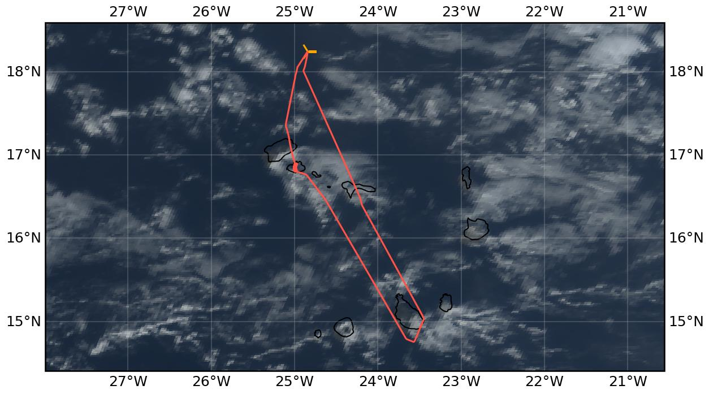

{logo}`CELLO`

# {front}`flight_id`

```{badges}
```

## Crew

```{crew-list}
```

```{admonition} EarthCARE target scenarios
:class: tip
<b>Cumulus and marine aerosol:</b> Marine low clouds. <br>
<b>Mixed aerosol types:</b> Marine and Saharan dust. 
```

```{admonition} Flight summary
:class: note
<p style='text-align: justify;'>During the research flight on 20th August 2024, we targeted a low <b>liquid cloud layer</b> North of Mindelo and Santo Antão underneath <b>EarthCARE (orbit #1302E)</b>. We flew the EC leg from North to South, coordinating with the ATR, which flew the leg above us from South to North. We reached the cloud deck towards the Southern end of the EC leg. Afterwards, we flew a spiral ascent above the Mindelo ground site (clear sky above a very low cloud deck). </p>
```


## Track



Flight path superimposed on the natural color image from NOAA's Geostationary Operational Environmental Satellites (GOES) 16 satellite on 20th August 2024 at 16:00 UTC. The location of the aircraft at the time of the EarthCARE overpass is shown by the orange cross.

## Conditions
The beginning of the EC leg (southward flying direction) was clear with only very scattered low marine clouds around, but we reached a low liquid cloud deck towards the Southern end of the EC leg (North of Santo Antão). Low clouds were also over the Mindelo ground site, with clear sky above.

## Flight video
This video shows the forward and sideward view from the King Air aircraft together with live data (basic navigation data, aerosol/cloud in-situ data) during the EC leg and the Mindelo spiral.

<video width="100%" controls="" >
  <source src="https://swift.dkrz.de/v1/dkrz_948e7d4bbfbb445fbff5315fc433e36a/ORCESTRA/static/KA-20240820a/KA-20240820a.mp4" type="video/mp4">
  Your browser does not support the video tag.
</video>

## Events

Time (UTC) | Comment
-------------| -----
13:50 | Takeoff Praia
15:51 | EarthCARE overpass (orbit #1302E)
15:51 | Collocation with ATR
16:20-16:37 | Spiral over Mindelo ground site
17:20 | Landing Praia


## Execution

- 13:50 UTC (12:50 LT): delayed takeoff due to ground handling issues at Praia
- Mindelo-rush: straight to cruising altitude and descended on approach
- lost GPS signal due to not being in center wind screen  
- on other side of Santo Antão: descended to MSA (FL030) and then spiraled up over Mindelo ground site (fixed radius semi-Lagrangian spiral, let the wind carry us so we spiraled towards the Northeast)
- stopped spiral at FL180 and headed home

## Impressions

- almost no clouds on arrival at EC leg, FL045
- ATR above on same flight line but flying from South to North
- at end of EC leg (close to Santo Antão): met the cloud layer and then descended over the island
- during Mindelo spiral: low clouds which we quickly exited as we climbed


## Instrument status & quicklooks
```{instrument-table}
```
````{card-carousel} 2
```{card}
:img-top: ../figures/KA-20240820a/KA-20240820a_1302E.png
EarthCARE MSI image (RGR-1C:AF) with EarthCARE ground track (red) and King Air flight track (yellow) for EC leg and Mindelo spiral.
```
```{card}
:img-top: ../figures/KA-20240820a/mindelo_spiral_view.jpeg
Cockpit forward view during ascending spiral over Mindelo ground site.
```
```{card}
:img-top: ../figures/KA-20240820a/hawkeye-screenshot.jpeg
In-flight view of Cloud Probe Imager (CPI), during cloud deck at Santo Antão.
```
````
