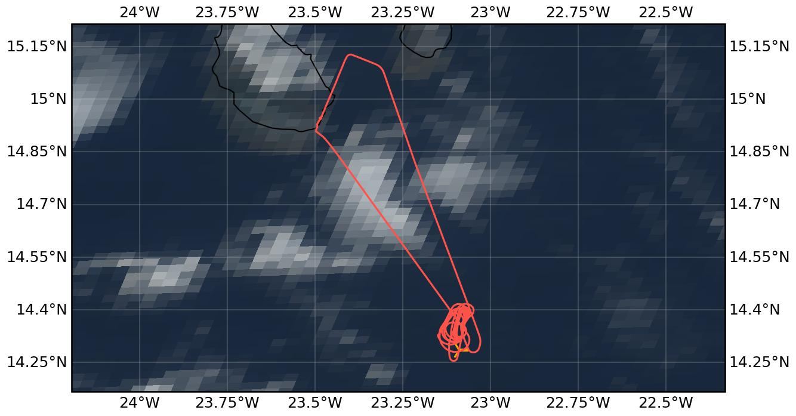

{logo}`CELLO`

# {front}`flight_id`

```{badges}
```

## Crew

```{crew-list}
```

```{admonition} EarthCARE target scenarios
:class: tip
<b>Cumulus and marine aerosol:</b> Marine low clouds. <br>
<b>Mixed aerosol types:</b> Marine and Saharan dust. 
```

```{admonition} Flight summary
:class: note
<p style='text-align: justify;'>During the research flight on 22nd August 2024, we targeted an <b>Saharan dust layer</b> between sea level and 4km during clear-sky conditions. We encompassed the <b>EarthCARE overpass (orbit #1333E)</b> with a downward and upward spiral measuring the aerosol in-situ. Additional coordination involved the so-called <b>'Quadlocation'</b> with HALO and ATR overflights over the King Air at the time of the EarthCARE overpass.</p>
```

## Track



Flight path superimposed on the natural color image from NOAA's Geostationary Operational Environmental Satellites (GOES) 16 satellite on 22nd August 2024 at 15:50 UTC. The location of the aircraft at the time of the EarthCARE overpass is shown by the orange cross.


## Conditions
Mostly clear-sky conditions, only very isolated scattered low clouds. No high clouds during EarthCARE overpass. Saharan dust aerosol layer up to around 4km altitude. Temperatures during the in-situ spirals varied between -10°C and +25°C.

## Flight video
This video shows the forward and sideward view from the King Air aircraft together with live data (basic navigation data, aerosol/cloud in-situ data) during the EC leg and HALO/ATR overpass.

<video width="100%" controls="" >
  <source src="https://swift.dkrz.de/v1/dkrz_948e7d4bbfbb445fbff5315fc433e36a/ORCESTRA/static/KA-20240822a/KA-20240822a.mp4" type="video/mp4">
  Your browser does not support the video tag.
</video>

## Events

Time (UTC) | Comment
-------------| -----
14:41 | Takeoff Praia
15:41 | EarthCARE overpass (orbit #1333E)
15:41 | Collocation with ATR and HALO
16:40 | Landing Praia

## Execution

- takeoff: 14:41 UTC (13:41 LT)
- 14:59 UTC: arrival WP, start holding pattern
- 15:01 UTC: still climbing
- 15:02 UTC: CAS speed 86 m/s looks good
- 15:09 UTC: practising racetrack pattern during hold
- 15:17 UTC: Pilots talk with ATR pilots
- 15:19 UTC: WP2 (other end of racetrack)
- 15:20 UTC: start descent FL200, 1000 ft/min, CAS looks good, WP1 of racetrack
- 15:29 UTC: WP2 of racetrack
- 15:40 UTC: same heading, continue after WP1 until EarthCARE passes
- 15:41 UTC: EC meet (orbit #1333), start ascent 1000 ft/min
- around EC meet: Overpass of ATR (planned @FL200/180) and HALO (planned @FL430/350)
- 16:00 UTC: FL200
- 16:02 UTC: WP2 of racetrack, FL200, WP1 ascent complete
- 16:02 UTC: going home


## Impressions

- 14:45 UTC: shortly through cloud, now above cloud deck
- CAS saw aerosol in dust layer, now clean, only scattered clouds below, no cloud above
- 15:20 UTC: clear sky, only very scattered clouds below
- 15:23 UTC: Tamb -3°C, FL167, TAS170kt
- 15:25 UTC: FL144
- 15:26 UTC: seeing some aerosol
- 15:28 UTC: FCDP sees particles, TAS140kt, FL117, Tamb 5.5°C
- 15:29 UTC: number concentration 14 cm-3
- 15:31 UTC: FL85
- 15:34 UTC: FL55, Tamb 17°C, number concentration 4 cm-3
- 15:38 UTC: FL024, number concentrations up to 50 cm-3 measured during descent
- 15:40 UTC: FL010
- 15:47 UTC: FL075, 15 cm-3
- 15:51 UTC: FL115, 3 cm-3, FCDP also saw aerosol on way up
- 15:51 UTC: still hazy out, but no clouds, only scattered below, no high clouds visible
- 15:55 UTC: Tamb 0°C, FL156
- 16:00 UTC: FL200


## Instrument status & quicklooks
```{instrument-table}
```
````{card-carousel} 2
```{card}
:img-top: ../figures/KA-20240822a/KA-20240822a_1333E.png
EarthCARE MSI image (RGR-1C:AF) with EarthCARE ground track (red) and King Air flight track (yellow).
```
```{card}
:img-top: ../figures/KA-20240822a/ec_overpass_scene.JPG
Sideward view from King Air at time of EarthCARE overpass 15:41 UTC.
```
```{card}
:img-top: ../figures/KA-20240822a/planet_screenshot.jpeg
Screenshot of the Planet interface during the 'Quadlocation' of the KingAir, HALO, ATR, and EarthCARE
```

````
