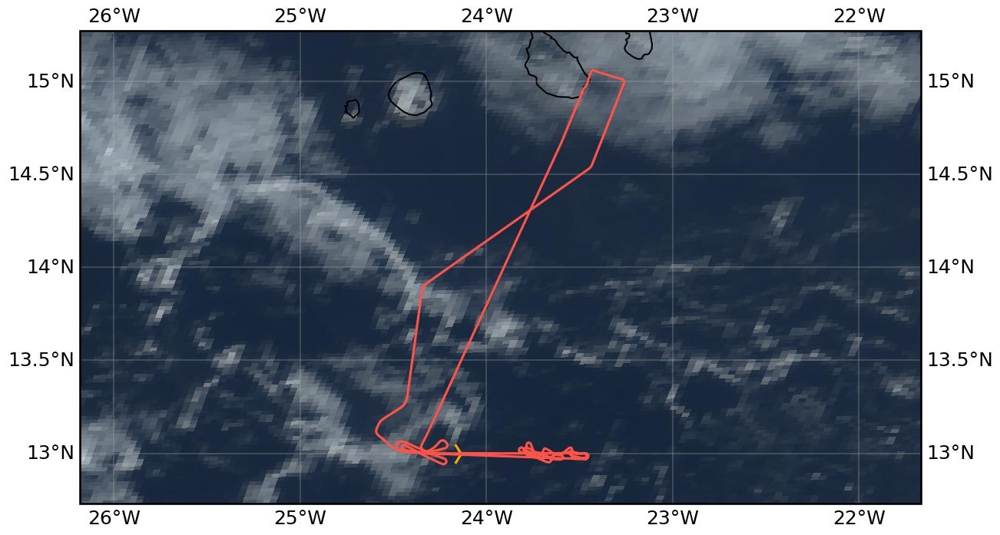

{logo}`CELLO`

# {front}`flight_id`

```{badges}
```

## Crew

```{crew-list}
```

```{admonition} EarthCARE target scenarios
:class: tip
We performed <b>indirect cal/val</b> during this flight, flying underneath HALO (specMACS in particular) and above the RV Meteor.
```

```{admonition} Flight summary
:class: note
<p style='text-align: justify;'>During the research flight on 27th August 2024, we performed <b>indirect calibration/validation</b> with the primary focus being on the <b>collocation with HALO and the RV Meteor</b>. We performed <b>cloud hunting</b> within the field of view of specMACS on HALO to provide in-situ validation. Overall, we sampled many low, liquid marine clouds in the vicinity of the collocation leg and also collocated with the RV Meteor (unfortunately clouds too thin and non-precipitating to be visible with SEA-POL). </p>
```

## Track



Flight path superimposed on the natural color image from NOAA's Geostationary Operational Environmental Satellites (GOES) 16 satellite on 27th August 2024 at 16:50 UTC. The location of the aircraft at the time of the HALO overpass is shown by the orange cross.

## Conditions
At the westernmost part of the HALO collocation leg there were scattered clouds within the field of view (FOV) of specMACS that we targeted with in-situ observations. Around and above the RV Meteor it was mostly clear-sky with some scattered clouds.

## Flight video
This video shows the forward and sideward view from the King Air aircraft together with live data (basic navigation data, aerosol/cloud in-situ data) during the collocation leg with the RV Meteor and HALO.

<video width="100%" controls="" >
  <source src="https://swift.dkrz.de/v1/dkrz_948e7d4bbfbb445fbff5315fc433e36a/ORCESTRA/static/KA-20240827a/KA-20240827a_HALO_Meteor.mp4" type="video/mp4">
  Your browser does not support the video tag.
</video>

## Events

Time (UTC) | Comment
-------------| -----
15:40 | Takeoff Praia
16:50-17:15 | Cloud hunting below HALO for specMACS collocation
17:25 | Flight over RV Meteor
18:45 | Landing Praia

## Execution

- 15:40 UTC (14:40 LT): takeoff, heading to WP1
- starting 16:50 UTC: Cloud hunting within the FOV of specMACS from HALO
- 17:25 UTC: Collocation with RV Meteor
- 18:45 UTC: landing

## Impressions

- 15:41 UTC: TAS60kt, Tamb 27°C
- 15:44 UTC: in-cloud, all probes working
- 15:47 UTC: out of cloud, FL120, no more aerosol
- 16:21 UTC: descending towards cloud top and approaching WP2
- 16:24 UTC: FL136, aerosol
- 16:31 UTC: in cloud @WP2, in and out of cloud
- 16:34 UTC: in cloud, one tower
- 16:53 UTC: no clouds really, just hunting run through the only cloud we have, FL020 just thin, in and out of cloud
- 18:10 UTC: glory, Tamb 15°C


## Instrument status & quicklooks
```{instrument-table}
```
````{card-carousel} 2
```{card}
:img-top: ../figures/KA-20240827a/meteor_view1.jpeg
King Air spotted from the RV Meteor.
```
```{card}
:img-top: ../figures/KA-20240827a/cloud_hunting.jpg
Hunting clouds within specMACS field of view during HALO overpass.
```
```{card}
:img-top: ../figures/KA-20240827a/meteor_from_cockpit.jpg
Cockpit view of the RV Meteor during overpass.
```
```{card}
:img-top: ../figures/KA-20240827a/meteor_view2.jpeg
King Air spotted even lower from the RV Meteor.
```

````
