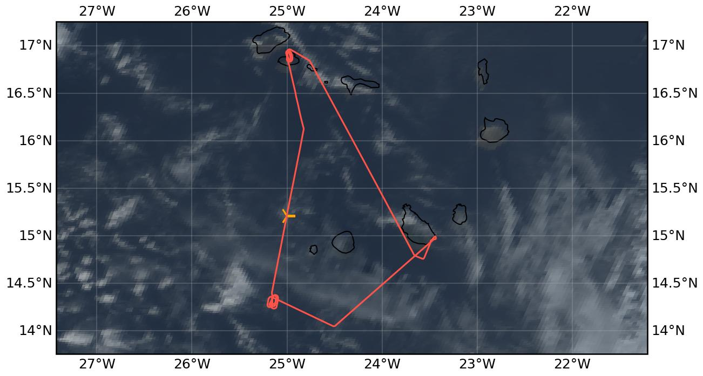

{logo}`CELLO`

# {front}`flight_id`

```{badges}
```

## Crew

```{crew-list}
```

```{admonition} EarthCARE target scenarios
:class: tip
<b>Cumulus and marine aerosol:</b> Marine low clouds. <br>
<b>Mixed aerosol types:</b> Marine and Saharan dust. 
```


```{admonition} Flight summary
:class: note
<p style='text-align: justify;'>During the research flight on 29th August 2024, we targeted low-level, <b>marine liquid clouds</b> below EarthCARE. After a full aerosol profile at the beginning of the EC leg, we collocated with the <b>ATR</b> on our way North and sampled in-cloud underneath <b>EarthCARE (orbit #1442E)</b>. Unfortunately, EarthCARE experienced a <b>CPR anomaly</b> on that day with no CPR measurements available. We concluded the flight with a double spiral (descending and ascending) over the <b>Mindelo</b> ground site, sampling a distinct <b>aerosol layer</b>.</p>
```

## Track



Flight path superimposed on the natural color image from NOAA's Geostationary Operational Environmental Satellites (GOES) 16 satellite on 29th August 2024 at 16:00 UTC. The location of the aircraft at the time of the EarthCARE overpass is shown by the orange cross.

## Conditions
During the EC leg, we experienced scattered low-level liquid clouds with thin higher clouds above. A distinct aerosol layer was visible during the descent before WP1 and over the Mindelo ground site.

## Flight video
This video shows the forward and sideward view from the King Air aircraft together with live data (basic navigation data, aerosol/cloud in-situ data) during the EC leg and ATR overpass.

<video width="100%" controls="" >
  <source src="https://swift.dkrz.de/v1/dkrz_948e7d4bbfbb445fbff5315fc433e36a/ORCESTRA/static/KA-20240829a/KA-20240829a.mp4" type="video/mp4">
  Your browser does not support the video tag.
</video>

## Events

Time (UTC) | Comment
-------------| -----
14:20 | Takeoff Praia
15:29-15:48 | Collocation with ATR
15:48 | EarthCARE overpass (orbit #1442E)
16:25-17:00 | Spiral descent and ascent over Mindelo ground site
18:00 | Landing Praia

## Execution

- 14:20 UTC (13:20 LT): takeoff, CAS works, TAS/Tamb OK
- 14:29 UTC: FCDP failed to connect to probe, restart, now works
- 14:34 UTC: CAPS display frozen
- 14:41 UTC: CAPS back
- 15:00 UTC: WP1, start hold, instruments work, request FL180 to go above aerosol layer
- 15:04 UTC: start climb to FL180
- 15:08 UTC: reached FL180, start descent 1000 ft/min
- 15:14 UTC: start descent for full profile
- 15:29 UTC: start @WP1 going down into cloud FL030
- 15:48 UTC: WP2 EC_meet right on time
- 16:09 UTC: arrive WP3, head towards WP4, start climb to FL180
- 17:01 UTC: go home towards RAI
- 18:00 UTC: landing Praia


## Impressions

- 15:04 UTC: Cirrus seems too high to reach, there seem to be low clouds at beginning of EC track, CAS/FCDP almost at 0 (above aerosol layer)
- 15:34 UTC: FL021, TAS87m/s, in and out of thin clouds
- 15:39 UTC: FL020
- 15:40 UTC: cruising at 'cloud level', have to get lucky, TAS91m/s
- 15:43 UTC: FCDP/2DS see some droplets from time to time
- 15:47 UTC: also some signal in CIP, in and out of cloud
- 15:49 UTC: number concentration 300-1500 cm-3
- 15:53 UTC: stay at FL020, lands us at in-and-out-of-cloud level, TAS150kt, Tamb 20°C
- 15:58 UTC: TAS155kt
- 16:05 UTC: less clouds now, but we stay at FL020 until WP3, TAS157kt, Tamb 23°C, ATR 20 miles behind us
- 16:23 UTC: over the island, FL165, CAS shows 4 cm-3
- 16:25 UTC: start descent from FL175 for racetrack descent over Mindelo supersite, 1000 ft/min, right turn, hazy outside, 2D-S sees particles
- 16:30 UTC: some low clouds in vicinity, but clear sky above ground-based lidar
- 16:37 UTC: FL055
- 16:41 UTC: FL040 full overflight Mindelo direct hit
- 16:42 UTC: start ascent again, same racetrack pattern, 1000 ft/min, right turn, CAS 0.1 cm-3
- 16:48 UTC: TAS190kt, Tamb 16°C
- 16:53 UTC: CAS 23 cm-3, FL140, Tamb 5°C, TAS200kt
- 17:00 UTC: CAS 1 cm-3, FCDP 0 cm-3, TAS215kt, Tamb -6°C, direct overpass over Mindelo, end of ascent


## Instrument status & quicklooks
```{instrument-table}
```
````{card-carousel} 2
```{card}
:img-top: ../figures/KA-20240829a/KA-20240829a_1442E.png
EarthCARE MSI image (RGR-1C:AF) with EarthCARE ground track (red) and King Air flight track (yellow).
```
```{card}
:img-top: ../figures/KA-20240829a/mindelo_spiral_view.jpg
Sideward view to Mindelo ground site during spiral.
```
```{card}
:img-top: ../figures/KA-20240829a/ec_overpass_view.JPG
Sideward view during the EarthCARE overpass at around 15:48 UTC.
```

````
