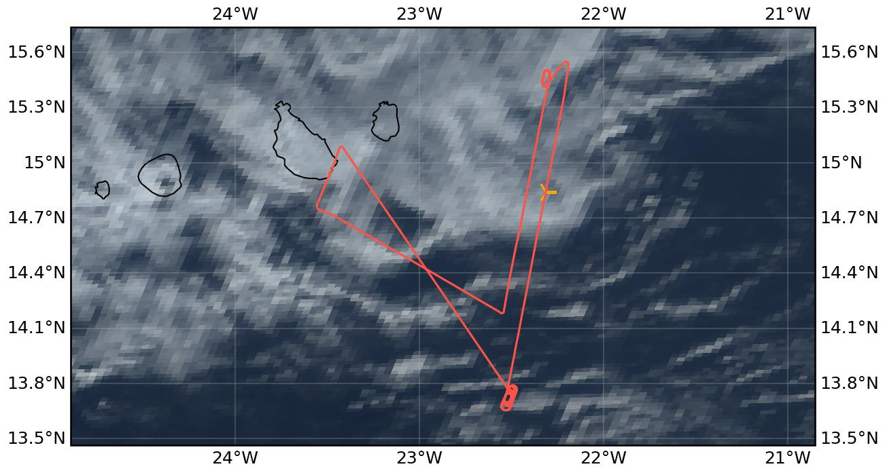

{logo}`CELLO`

# {front}`flight_id`

```{badges}
```

## Crew

```{crew-list}
```

```{admonition} EarthCARE target scenarios
:class: tip
<b>Cumulus and marine aerosol:</b> Marine low clouds. <br>
<b>Mixed aerosol types:</b> Marine and Saharan dust. <br>
<b>Complex multi-layer scenes:</b> Multiple low cloud decks and potential cirrus.
```

```{admonition} Flight summary
:class: note
<p style='text-align: justify;'>During the research flight on 31st August 2024, we targeted a <b>complex multi-layer scene</b>, which consisted of multiple <b>low cloud decks between 1.0 and 1.2 km altitude</b> with potentially overlying cirrus underneath <b>EarthCARE (orbit #1473E)</b>. During the northbound EC leg we were flying in-cloud below the <b>ATR</b> (remote sensing mode). Afterwards, the ORCESTRA performed <b>'formation flying'</b> on the southbound leg: after the EarthCARE overpass, the <b>King Air flew to the right of the ATR</b> (now also lower in-cloud) within the range of ATR's rightward-looking remote sensing instrumentation, while <b>HALO</b> (going northward) passed over the ATR.</p>
```

## Track



Flight path superimposed on the natural color image from NOAA's Geostationary Operational Environmental Satellites (GOES) 16 satellite on 31st August 2024 at 15:40 UTC. The location of the aircraft at the time of the EarthCARE overpass is shown by the orange cross.

## Conditions
The EC leg was characterized by multiple low cloud decks of different characteristics (scattered cumuliform clouds as well as more stratiform layers) with occassionally overlying cirrus clouds. Some of the clouds we measured in were drizzling.

## Flight video
This video shows the forward and sideward view from the King Air aircraft together with live data (basic navigation data, aerosol/cloud in-situ data) during the EC leg (ATR above) and the southbound leg (right of the ATR in cloud, HALO northward above) formation flying.

<video width="100%" controls="" >
  <source src="https://swift.dkrz.de/v1/dkrz_948e7d4bbfbb445fbff5315fc433e36a/ORCESTRA/static/KA-20240831a/KA-20240831a.mp4" type="video/mp4">
  Your browser does not support the video tag.
</video>

## Events

Time (UTC) | Comment
-------------| -----
14:08 | Takeoff Praia
15:37 | EarthCARE overpass (orbit #1473E), ATR above in remote sensing mode
16:10 | Coordinated leg to the right of ATR in-cloud, HALO above ATR
17:30 | Landing Praia

## Execution

- 14:08 UTC (13:08 LT): takeoff, all instruments are nominal except LWC, drizzle during taxi
- 14:46 UTC: at waypoint KA_South
- 14:51 UTC: descending to FL065
- 15:13 UTC: heading toward EC2 together with ATR
- 15:50 UTC: passed EC1
- 15:51 UTC: heading to EC1 had to wait for ATR to come down
- 15:56 UTC: hold begin
- 16:08 UTC: almost on coordinated leg
- 16:31 UTC: leg over, heading home
- good flight maybe some issue with CIP


## Impressions

- 14:09 UTC: in cloud
- 14:10 UTC: in and out of cloud, cloud top FL060
- 14:18 UTC: aerosol layer top at around FL120
- 14:55 UTC: aerosol FL110
- 15:04 UTC: in cloud
- 15:17 UTC: in and out of cloud
- 15:25 UTC: FL030 @EC2, in and out of cloud, perfect coordination
- 15:31 UTC: in cloud
- 15:32 UTC: in cloud
- 15:34 UTC: ending this cloud, lots of drops, some drizzle
- 15:41 UTC: below cloud layers a bit, nice bimodal distribution
- 15:49 UTC: basically clearing up to the North, but also at EC1, we are just above cloud top, and just a little bit off track the last minute or so but not much to the right anyway
- 16:11 UTC: in line with them not in cloud yet
- 16:14 UTC: lots of cloud and rain
- 16:17 UTC: not in cloud but drizzle a bit before
- 16:19 UTC: in cloud-ish again
- 16:23 UTC: out of cloud, but lots of big drops before
- on approach only CAPS data because Hawkeye download started
- CAPS data in different folder


## Instrument status & quicklooks
```{instrument-table}
```
````{card-carousel} 2
```{card}
:img-top: ../figures/KA-20240831a/KA-20240831a_1473E.png
EarthCARE MSI image (RGR-1C:AF) with EarthCARE ground track (red) and King Air flight track (yellow).
```
```{card}
:img-top: ../figures/KA-20240831a/atr_side_view.jpg
The ATR as seen from the King Air during common leg (KA to the right of ATR)
```
```{card}
:img-top: ../figures/KA-20240831a/ec_overpass_view.JPG
Sideward view during EarthCARE overpass around 15:37 UTC.
```

````
