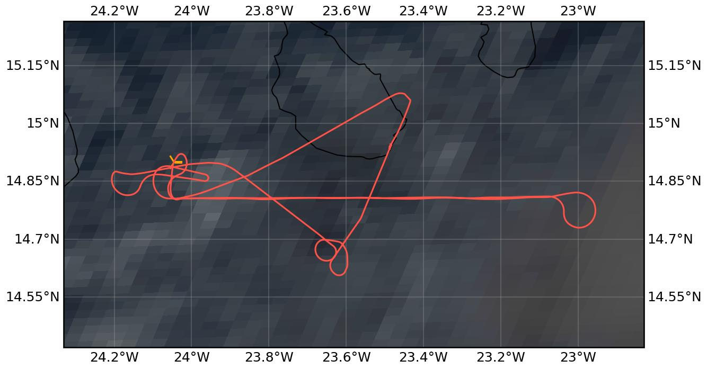

{logo}`CELLO`

# {front}`flight_id`

```{badges}
```

## Crew

```{crew-list}
```

```{admonition} EarthCARE target scenarios
:class: tip
We performed <b>indirect cal/val</b> during this flight, flying underneath HALO (specMACS in particular).
```

```{admonition} Flight summary
:class: note
<p style='text-align: justify;'>During the research flight on 3rd September 2024, we performed <b>indirect cal/val</b> in the vicinity of Praia. For this, we had a common leg with <b>HALO</b> during dusk, probing <b>multi-layer mixed-phase clouds (partly precipitating)</b> whilst flying within the field of view of <b>specMACS</b>.</p>
```

## Track



Flight path superimposed on the natural color image from NOAA's Geostationary Operational Environmental Satellites (GOES) 16 satellite on 3rd September 2024 at 18:40 UTC. The location of the aircraft at the time of the HALO overpass is shown by the orange cross.


## Conditions
The conditions were characterized by a very complex multi-layer scene of mixed-phase clouds at different stages of convection, including precipitating clouds. 

## Flight video
This video shows the forward and sideward view from the King Air aircraft together with live data (basic navigation data, aerosol/cloud in-situ data) during the HALO collocation.

```{card}
<video width="100%" controls="" >
  <source src="https://swift.dkrz.de/v1/dkrz_948e7d4bbfbb445fbff5315fc433e36a/ORCESTRA/static/KA-20240903a/KA-20240903a.mp4" type="video/mp4">
  Your browser does not support the video tag.
</video>
```


## Events

Time (UTC) | Comment
-------------| -----
18:09 | Takeoff Praia
18:40-18:50 | Flying in specMACS field of view below HALO 
19:40 | Landing Praia

## Execution

- 18:09 UTC (17:09 LT): takeoff, go to KA_West towards FL180 and check clouds on the way
- 18:19 UTC: FL127, HALO arrive at 18:33 UTC
- 18:24 UTC: decision to go higher to reach clouds above us
- 18:27 UTC: arrive KA_West, FL197, maneuver to get in line and climb to cloud level
- 18:51 UTC: KA_East again towards KA_West
- 19:06 UTC: back at KA_West
- 19:09 UTC: turn right again to be parallel to track, but nothing in front so turn again, pilots saw good cloud, fly manual have fun
- 19:18 UTC: heading towards home
- 19:40 UTC: landing, 2.6 million particles seen by 2D-S

## Impressions

- 18:10 UTC: huge droplets in low cloud level during takeoff (seen in CIP+2D-S)
- 18:14 UTC: FL065, TAS70m/s, estimated arrival 18:29 UTC
- 18:25 UTC: FL180, anti-ice on, Tamb -2°C
- 18:28 UTC: Tamb -5°C, TAS92m/s, loads of ice
- 18:32 UTC: started leg, in and out of cloud, scattered high clouds above, multi-layered scene
- 18:34 UTC: climb higher into clouds, CIP probably doesn't work but other probes work
- 18:39 UTC: Tamb -10°C, TAS109m/s
- 18:40 UTC: FL220, now low clouds below, scene changes a lot very difficult to assess
- 18:44 UTC: not much to see on instruments, FL240, finish the line to KA_East, continue climb, Tamb -14°C, HALO starts circle now, TAS100m/s
- 18:50 UTC: some big crystals in 2D-S, turn around
- 18:52 UTC: cloud in front of us
- 18:53 UTC: FL250
- 18:55 UTC: into cloud, climb a bit more, low clouds below us vanish again to the West so no point in trying down there
- 18:56 UTC: small droplets @Tamb -17°C, TAS100m/s
- 18:57 UTC: some icing, more cloud in front of us, LWC shows something, in and out of cloud in the instruments all the time, from small drops to large crystals, high cloud above, some more cloud in front of us trying to hit it, FL270, had loads of data so far even though we were often not in cloud as it seems (seeder-feeder?)
- 19:07 UTC: right into clouds to get to 3-4nm North of track
- 19:08 UTC: quite some small+big stuff in 2D-S, also CAS saw something
- 19:13 UTC: in cloud again, big crystals and supercooled droplets, not much above us (could see Sun)
- 19:16 UTC: Glory to the right, surfing at cloud top, NW of KA_West, small+big particles change super quickly
- 19:21 UTC: picture at 19:21 UTC of what we flew through to the SW of us
- 19:26 UTC: anti-ice off @Tamb 1.5°C
- 19:30 UTC: during descent flying through the low cloud deck could be representative of low layer (during the spiral to go down during approach South of Praia)
- 19:37 UTC: CIP is doing something again

## Instrument status & quicklooks
```{instrument-table}
```
```{card}
:img-top: ../figures/KA-20240903a/cdnc_quicklook.png
Particle size distribution and cloud droplet number concentration (CDNC) from CAS-DPOL instrument underneath specMACS.
```
```{card}
:img-top: ../figures/KA-20240903a/iwc_quicklook.png
Particle size distribution and ice water content (IWC) from 2D-S instrument underneath specMACS.
```
````
