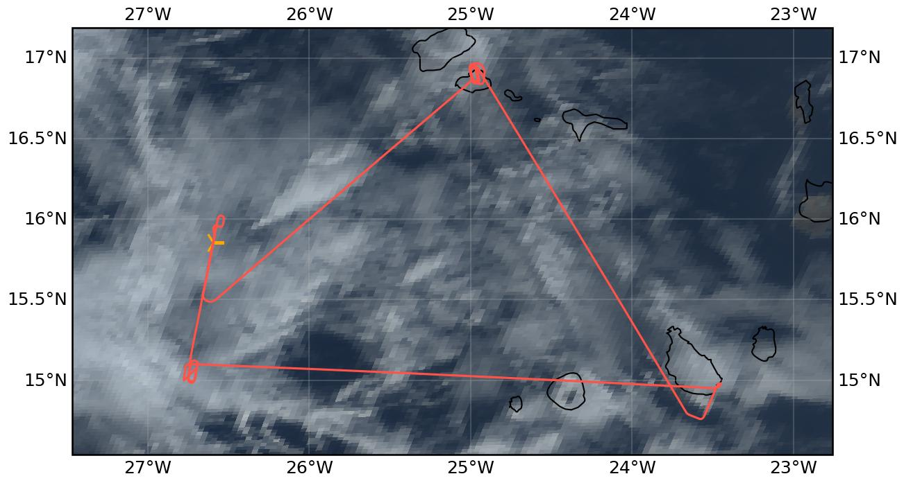

{logo}`CELLO`

# {front}`flight_id`

```{badges}
```

## Crew

```{crew-list}
```

```{admonition} EarthCARE target scenarios
:class: tip
<b>Cumulus and marine aerosol:</b> Marine mid-level clouds (supercooled). <br>
<b>Mixed aerosol types:</b> Marine and Saharan dust. <br>
<b>Complex multi-layer scenes:</b> Multiple low and mid-level cloud decks and potential cirrus.
```

```{admonition} Flight summary
:class: note
<p style='text-align: justify;'>During the research flight on 5th September 2024, we targeted <b>EarthCARE (orbit #1551E)</b> and sampled in <b>multi-layered, supercooled liquid clouds</b>. We performed porpoising to envelope the cloud decks between <b>5.7 and 6.2 km altitude</b>. After the EC leg, we flew a <b>spiral over the Mindelo ground site</b> (low cloud deck, aerosol layer above).</p>
```

## Track



Flight path superimposed on the natural color image from NOAA's Geostationary Operational Environmental Satellites (GOES) 16 satellite on 5th September 2024 at 16:00 UTC. The location of the aircraft at the time of the EarthCARE overpass is shown by the orange cross.


## Conditions
During the EC leg we sampled within a complex multi-layer scene with us flying through supercooled liquid clouds (Tamb -4 to -7 °C). Over Mindelo, we spiraled above very low clouds.

## Flight video
This video shows the forward and sideward view from the King Air aircraft together with live data (basic navigation data, aerosol/cloud in-situ data) during the EC leg...

<video width="100%" controls="" >
  <source src="https://swift.dkrz.de/v1/dkrz_948e7d4bbfbb445fbff5315fc433e36a/ORCESTRA/static/KA-20240905a/KA-20240905a_ec_overpass.mp4" type="video/mp4">
  Your browser does not support the video tag.
</video>

... and during the Mindelo spiral.

<video width="100%" controls="" >
  <source src="https://swift.dkrz.de/v1/dkrz_948e7d4bbfbb445fbff5315fc433e36a/ORCESTRA/static/KA-20240905a/KA-20240905a_mindelo_spiral.mp4" type="video/mp4">
  Your browser does not support the video tag.
</video>


## Events

Time (UTC) | Comment
-------------| -----
14:18 | Takeoff Praia
15:55 | EarthCARE overpass (orbit #1551E)
16:44-17:18 | Spiral over Mindelo ground site
18:08 | Landing Praia

## Execution

- 14:18 UTC (13:18 LT): takeoff, all probes working
- 15:22 UTC: at WP1, in cloud but not a lot around us, will hold in the cloud and get statistics
- 15:55 UTC: at WP2
- 16:09 UTC: heading to Mindelo
- 16:44 UTC: start spiral over Mindelo
- 17:18 UTC: spiral done
- 17:24 UTC: HAWKEYE stop for data download
- 17:50 UTC: descending, transect home
- 18:08 UTC: landing

## Impressions

- 14:20 UTC: in cloud
- 14:22 UTC: through cloud layer, FL050
- 14:26 UTC: Tamb 12°C TAS74m/s
- 14:30 UTC: FL140, aerosol almost gone
- 14:35 UTC: at FL180 some ice falling from above, in and out of cloud, thin cirrus, CIP not working well
- 14:41 UTC: FL180, in liquid cloud @Tamb -6°C
- 14:43 UTC: climbing to get into cloud
- 15:27 UTC: blue screen on CAPS
- 15:31 UTC: CAPS back on but let's see
- 15:40 UTC: FL180, Tamb -1°C, but Tamb -5°C at FL177, starting leg in cloud
- 15:56 UTC: one ice crystal
- 15:58 UTC: left cloud and we headed back to WP2 to be more in cloud
- 16:01 UTC: the cloud is clearing, going toward lower deck
- 16:35 UTC: catching a cloud layer on approach to Mindelo
- 16:40 UTC: right at cloud top approaching Mindelo
- 16:42 UTC: approaching
- 16:44 UTC: spiral started above cloud
- 16:48 UTC: some ice on probes
- 17:03 UTC: start climb, we were just above the cloud layer
- 17:05 UTC: FL054: clear, FL070: getting dirty again
- 17:13 UTC: FL140, Tamb 4°C, getting clean again
- 17:15 UTC: ice crystals, lots of columns, lots of ice, Tamb -3°C
- 17:18 UTC: spiral done, lots of ice, Tamb -5°C, top of cloud is at FL210 likely estimate (T -7°C)
- 17:19 UTC: mainly liquid now and a bit of ice, Tamb -6°C, mainly columns
- 17:50 UTC: descending, transect home we were just below cloud, in and out sometimes

## Instrument status & quicklooks
```{instrument-table}
```
````{card-carousel} 2
```{card}
:img-top: ../figures/KA-20240905a/KA-20240905a_1551E.png
EarthCARE MSI image (RGR-1C:AF) with EarthCARE ground track (red) and King Air flight track (yellow).
```

````
