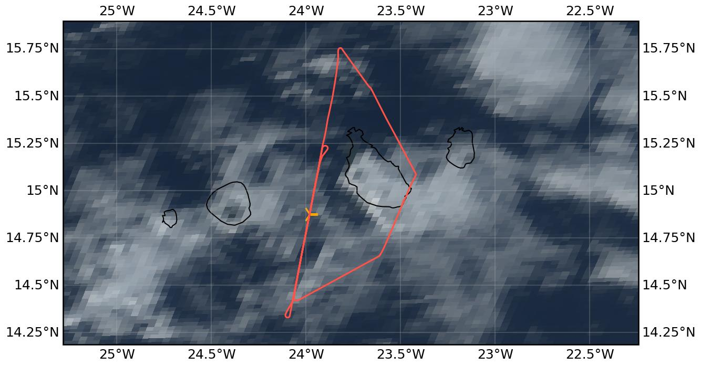

{logo}`CELLO`

# {front}`flight_id`

```{badges}
```

## Crew

```{crew-list}
```

```{admonition} EarthCARE target scenarios
:class: tip
<b>Cumulus and marine aerosol:</b> Marine low clouds. <br>
<b>Mixed aerosol types:</b> Marine and Saharan dust. <br>
<b>Complex multi-layer scenes:</b> Multiple low-level cloud decks and potential cirrus.
```

```{admonition} Flight summary
:class: note
<p style='text-align: justify;'>During the research flight on 7th September 2024, we targeted <b>EarthCARE (orbit #1582E)</b> and sampled in <b>multi-layered, warm liquid clouds</b> (16-20°C). We performed porpoising to envelope the cloud decks between <b>1.0 and 1.8 km altitude</b>.</p>
```

## Track



Flight path superimposed on the natural color image from NOAA's Geostationary Operational Environmental Satellites (GOES) 16 satellite on 7th September 2024 at 15:40 UTC. The location of the aircraft at the time of the EarthCARE overpass is shown by the orange cross.

## Conditions
Thicker low cloud deck over Praia and almost all Santiago, but north and west of Santiago thinner clouds. Around WP1 it was actually cloud free, as dry air from the north moved in. Very interesting cloud conditions from north of WP2 to about 5min north of WP1. Along the EC track, we experienced multi-layer clouds, with a thin, more continuous cloud deck at around FL040, and more scattered low clouds at around FL030. However, also the cloud tops of the uppermost layer changed often. As far as visible to the naked eye, no high clouds above. 


## Flight video
This video shows the forward and sideward view from the King Air aircraft together with live data (basic navigation data, aerosol/cloud in-situ data) during the EC leg.

<video width="100%" controls="" >
  <source src="https://swift.dkrz.de/v1/dkrz_948e7d4bbfbb445fbff5315fc433e36a/ORCESTRA/static/KA-20240907a/KA-20240907a.mp4" type="video/mp4">
  Your browser does not support the video tag.
</video>

## Events

Time (UTC) | Comment
-------------| -----
14:39 | Takeoff Praia
15:44 | EarthCARE overpass (orbit #1582E)
16:28 | Landing Praia

## Execution

- 14:39 UTC (13:39 LT): takeoff
- 15:01 UTC: skip hold, go towards WP2 already

We took off on time, heading towards WP1. We adapted our plans a bit when reaching WP1, as the cloud situation around WP1 was not good - we had mostly clear sky, with some low cloud band slightly N/E, but according to latest sat image this was just a very narrow band. So we decided to skip the hold at WP1 and turn south on the EC track early towards WP2 to assess the cloud situation. There were good clouds to measure in starting slightly north of WP2 and reaching until about 5 min north of WP3. We were in and out of cloud, and the pilots performed "cloud top hunting" along the track as they tried to account for changing cloud top altitude. This worked quite well, so we were in cloud very often. As we had enough time, we decided to turn north again shortly before WP3 to meet EC within good cloud conditions. North of WP2, we reached the cloud boundary again, so turned back south (10min after EC overpass) again to sample clouds again shortly after EC overpass. 25min after EC overpass, we left the track and turned back home.


## Impressions

- 14:41 UTC: in-cloud on way up
- 14:42 UTC: small particles at cloud top (FCDP)
- 15:00 UTC: arrival WP1, clouds to the E and NE, but look similar on the satellite image as clouds farther south
- 15:02 UTC: descent to FL040 to be at right altitude for clouds
- 15:04 UTC: just some broken clouds below us, not much yet
- 15:06 UTC: Tamb 17°C, TAS 65m/s, FL048
- 15:08 UTC: FL040 alt capture
- 15:09 UTC: start to enter thin clouds, signal on FCDP, CAS and some in CIP
- 15:12 UTC: going up to get in cloud again
- 15:14 UTC: in cloud, FL058
- 15:15 UTC: 2 layers, very thin at top (where we are right now), descent again into lower layer
- 15:16 UTC: FL040 in cloud, big droplets, continue descent a bit more to FL035
- 15:19 UTC: droplets in CIP when we reached cloud top of lower layer, 'cloud hunting in altitude' a bit, Tamb = 17°C
- 15:21 UTC: FL037 ft, in cloud
- 15:22 UTC: cloud top (see blue shining through)
- 15:27 UTC: in and out of cloud but long stretches in
- 15:32 UTC: cloud leg N was good, 5min before WP3 turn N again to go back to WP2 for the satellite overpass
- 15:34 UTC: still 2 layers, thin deck at top, lower clouds scattered
- 15:35 UTC: climb to FL050 to get to top
- 15:36 UTC: FL055
- 15:37 UTC: FL053: reached cloud top
- 15:38 UTC: descent towards FL020 for full profile
- 15:40 UTC: enter lower-layer cloud deck, out of lower cloud, go higher again
- 15:43 UTC: in cloud again, FL040, TAS165kt
- 15:44 UTC: EC overpass in cloud, a bit in and out
- 15:46 UTC: nice thin deck, Tamb 18°C, TAS70m/s, FL040, we are at cloud top
- 15:48 UTC: out of cloud, climb to get in again, CIP also sees particles
- 15:50 UTC: hunting cloud top along track
- 15:52 UTC: no more clouds again in front, turn back south
- 15:55 UTC: back on track (North of WP2)
- 15:56 UTC: in cloud again
- 15:57 UTC: climb up again
- 15:59 UTC: FL040 in lower cloud deck
- 16:00 UTC: CAS data error? "instrument data checksum was not validated", but still measuring, likely too many particles and not quick enough in writing to disk
- 16:03 UTC: go down to get below clouds
- 16:05 UTC: FL035, some cloud again, FL030 alt capture, up again to FL040
- 16:07 UTC: FL040
- 16:11 UTC: end track, go home
- 16:13 UTC: stop recording and start data transfer
- 16:17 UTC: CAPS measuring again for landing profile
- 16:28 UTC: Landing, CAS stop.
- Campaign is a wrap!


## Instrument status & quicklooks
```{instrument-table}
```
````{card-carousel} 2
```{card}
:img-top: ../figures/KA-20240907a/KA-20240907a_1582E.png
EarthCARE MSI image (RGR-1C:AF) with EarthCARE ground track (red) and King Air flight track (yellow).
```
```{card}
:img-top: ../figures/KA-20240907a/kh_wave_kingair.jpg
Kelvin-Helmholtz wave action behind King Air right before takeoff.
```
```{card}
:img-top: ../figures/KA-20240907a/ec_overpass_view.jpg
Sideward view during EC overpass at around 15:44 UTC.
```

````