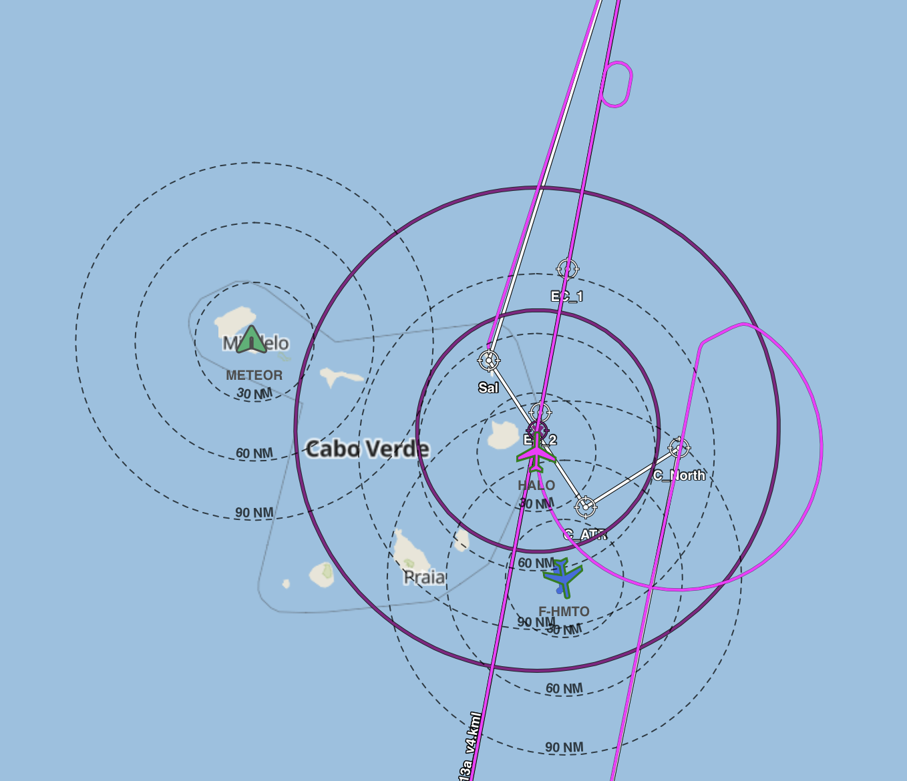

{logo}`BOWTIE`

# {front}`report_id`

## Summary

RV-METEOR is still at the port in Mindelo. Wind lidar (WindCube) and batteries for drones arrived and the installation of WindCube started.   

Still awaiting the arrival of containers with scientific equipment and ship provisions. Waiting also for drones.  

Scientific groups continue with the installation and calibration of instruments.

## Remarks

- PIs in RV-METEOR joined virtually flights of HALO and ATR.

## Outlook

- 14.08: At 16:00 hr, Akhisar cargo ship will arrive in Midelo with the missing five containers
- 15.08: Expected day to load containers and starting the calibration of wind lidar (MPI)
- 15.08 or 16.08 : Provisional dates to leave Mindelo.

## Events

Time | Comment
--- | ---
10:20 | Meeting lead by D. Klocke
19:30 | RV-METEOR joined virtually HALO and ATR

