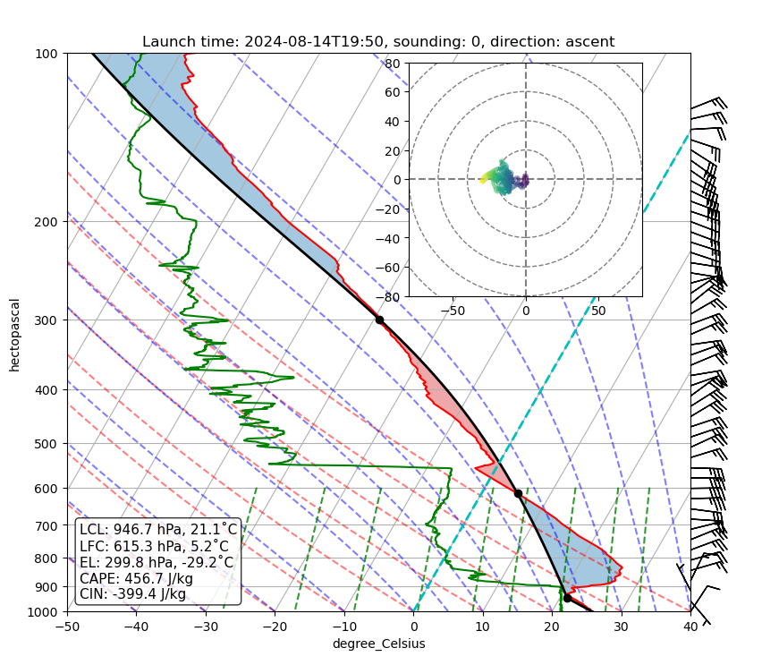

{logo}`BOWTIE`

# {front}`report_id`

## Summary

RV-METEOR is still at the port in Mindelo. The ship with scientific equipment arrived. Still waiting for the drones.

The ocean and atmosphere forecast was presented in the meeting at 10:20.

The approval for launching radiosondes is granted.

## Remarks

- Delina, Dominik, Charlotte, and Abiel finished the poster with the photos of the scientific group.
- The first radiosonde was launched.

## Plans

- 15.08: At 20:00 hr (local time), leaving Mindelo if Raman lidar is calibrated.
- 15.08: Head for Pirata buoy at 23W and 11.5N to deploy two gliders and a wirewalker some miles south (to make sure it does not drift into the EEZ)
- 17.08: Head towards the southern edge.
- 18.08: No able to reach the orbit of EC. First encounter with EC and HALO on the 20th.

## Events

Time | Comment
--- | ---
10:20 | Meeting lead by D. Klocke
18:50 | Launch of the first radiosonde

