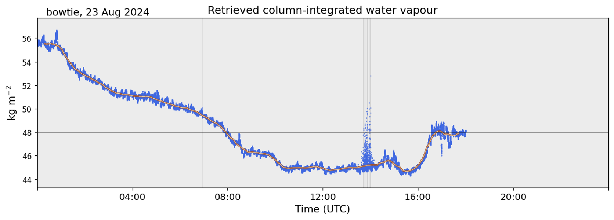

{logo}`BOWTIE`

# {front}`report_id`

## Summary

RV Meteor steamed south last night and today in search of the southern edge of the ITCZ. The ECMWF forecast had called for the 48 mm PW contour (our definition of the edge of the ITCZ) to be around 5N at our longitude. Measurements of column-integrated water vapor from our microwave radiometer (see figure below, courtesy Anna Trosits) indicated that we passed this threshold at 7:51 UTC (6:51 LT), at 5.42N, 24.75W.  We continued heading south a bit further to 4.65N, 24.88W, at which point the 15 UTC radiosonde, launched at 13:50 UTC (12:50 LT), indicated a column-integrated water vapor value of 48.3 mm. The 12 UTC radiosonde had measured a value of 49.5 mmm. After performing an MSS and CTD station, we turned around to head back north into the ITCZ.The radiometer measurements indicated that we stayed below 48 mm for about 8 hours, until we passed north of 5N.

After days of rough seas with strong ocean currents in the opposite direction to the swell and brisk southwesterly winds, our trip south and the passage of an African Easterly Wave to our west have finally brought us more canonical ITCZ weather conditions, with lighter winds and blissfully calmer seas. The calmer seas allowed for better views of flying fish skimming the ocean surface, chased by a juvenile [brown booby](https://en.wikipedia.org/wiki/Brown_booby) (Tölpel in German) that we have named 'Pico', who was in turn chased by our familiar [frigate bird](https://research.bangor.ac.uk/portal/files/18058314/2016_Frigate_birds_track_atmospheric_conditions_over_months.pdf) 'Bowie'. We look forward to seeing if our feathered friends stick with us as we travel through the doldrums in the coming days.

The daily status briefing and science discussion was held at 10:20. Michael Bell presented the fundamentals of radar science. The RV Meteor actually has radars operating in each of the 5 typical weather radar bands: the C-band SEA-POL precipitation radar, an X-band wave radar, a K-band micro rain radar, and a W-band cloud radar. The ship's bridge also has S-band and X-band radars for wave monitoring. RV Meteor is also operating several lidars, which operate in the visible part of the spectrum. Michael presented an overview of the specific measurements taken by the SEA-POL radar, which utilizes a 5 cm wavelength that is in the Rayleigh regime for rain drops, in which the power of the radar return is proportional to the size of the particles. Currently SEA-POL is only retrieving reflectivity and Doppler velocity. Since reflectivity depends on both drop size and number, we are unable to distinguish between the two without additional information. After retrieving replacement parts from Praia, SEA-POL will hopefully be able to measure additional dual-polarization variables, allowing us to obtain more information on the microphysical characteristics of the precipitation.

## Remarks

- Radiosondes were launched on the normal 3-hourly schedule.
- Near real-time (within 15 minutes) SEA-POL imagery is now available [online](https://seapol.colostate.edu/data/PICCOLO/)
- We will return to Cape Verde to retrieve parts, instruments, and personnel from Praia. We will not be able to take measurements while in the harbor.
- The next coordination with HALO is planned for 31.08. Coordination with the ATR and King Air may be possible while we are near Praia. 

## Plans
- 23.08 14:00 LT - 28.08 10:00 LT: Steam north to Praia, performing MSS, CTD, and SEA-POL circles every 6 hours.
- 28.08 10:00 LT - 22:00 LT: Retrieve parts, instruments and personnel in Praia. 
- 28.08 22:00 LT - 30.08 11:00 LT: Steam to Pirata buoy at 11.5N, 23 W to retrieve drifters and gliders.
- 30.08 17:00 LT - 31.08 14:00 LT: Steam to 9N, 23.07 W to meet EarthCare and HALO.
- 31.08 15:00 LT -  06.09 19:00 LT: Steam to central Atlantic buoy at 8N, 38W, performing MSS, CTD, SEA-POL circle every 6 hours.

## Events

Time (Local) | Comment
----- | -----
2:32 - 3:17 | MSS
3:26 - 4:44 | CTD
10:20 | Meeting led by D. Klocke, science presentation by M. Bell
11:31 - 12:08 | MSS
12:15 - 1:36| CTD
1:50 | Turned to head North
20:19 - 20:51 | MSS
20:56 - 21:42 | Plankton CTD
22:00 - 22:20 | SEA-POL circle
22:25 - 23:05 | SEA-POL zig zag

