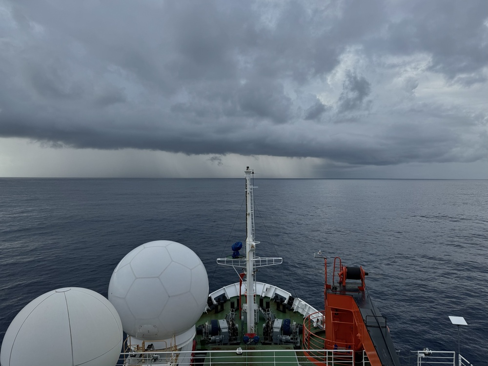
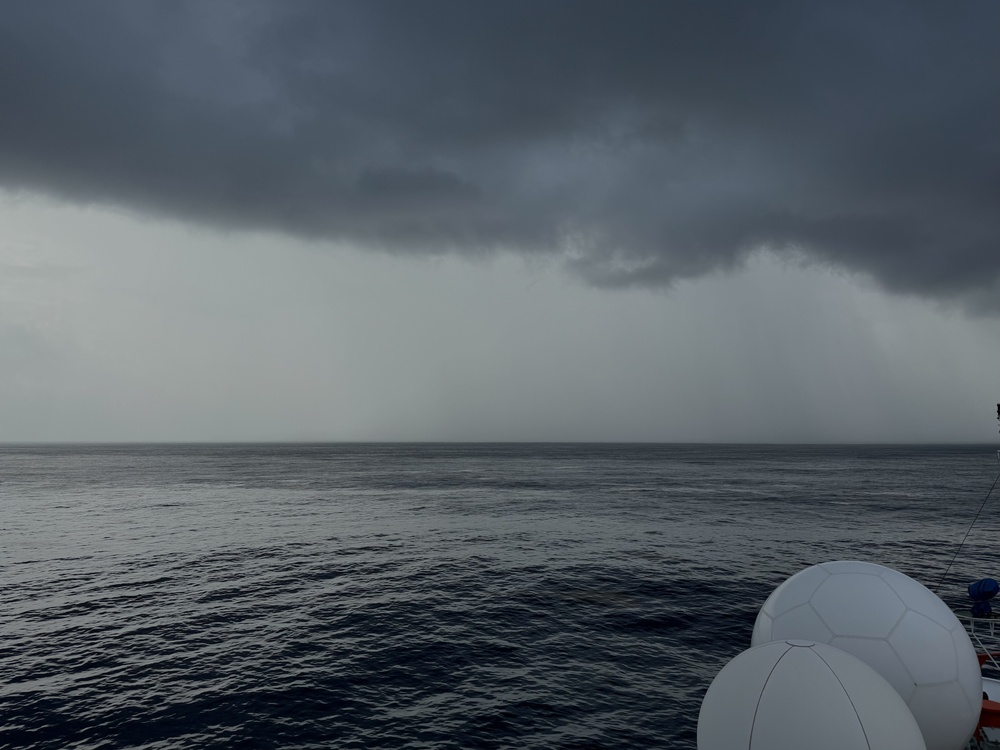

{logo}`BOWTIE`

# {front}`report_id`

## Summary

RV Meteor continues its trek north across the ITCZ and through the doldrums. Overnight, the sea was flat, winds were light (5-6 kts), and the moon was bright. Calm and sunny conditions continued through most of the day, while we carried on with our regular schedule of 6-hourly oceanographic stations. Our quiet day was interrupted by the arrival of a squall line (see picture below) around 17:20 LT, which seemed to be associated with a re-invigoration of the ITCZ as an African Easterly Wave moved off the coast of Africa. SEA-POL measured reflectivities upwards of 45 dBZ, indicating moderatly heavy rain, and we experienced a truly impressive gust front (see picture below) as the line approached. The wind speed increased from 1.8 to 9.3 m/s over a span of 2 minutes (1.8 to 7.8 in the first minute). It rained on and off for the next several hours as widespread convection moved over our location. 

The daily status briefing and science discussion was held at 10:20. We discussed how to organize the data collected by Meteor as well as the scientific topics that each person was interested in investigating. This includes plans for a Meteor overview paper. We will continue to have discussions on our research strategy and publication plans over the coming weeks.

## Remarks

- Radiosondes were launched on the normal 3-hourly schedule.
- We will return to Cape Verde to retrieve parts, instruments, and personnel from Praia on 28.08. We will not be able to take measurements while in the harbor.
- Coordination with the ATR and King Air may be possible while we are near Praia, and perhaps with HALO on 27.08 while we are just south of Praia. We also plan to meet HALO and EarthCare on 31.08. 

## Plans
- 24.08 - 27.08 15:00 LT: Steam north to meet HALO about 110 km south of Praia, performing MSS, CTD, and SEA-POL circles every 6 hours.
- 27.08 16:00 LT - 28.08 6:00 LT: Steam north to Praia.
- 28.08 6:00 LT - 18:00 LT: Retrieve parts, instruments and personnel in Praia. 
- 28.08 18:00 LT - 30.08 08:00 LT: Steam to Pirata buoy at 11.5N, 23 W to retrieve drifters and gliders.
- 30.08 16:00 LT - 31.08 14:00 LT: Steam to EarthCare orbit then SE along EarthCare orbit towards 9N, 23.07 W to meet EarthCare and HALO.
- 31.08 15:00 LT -  06.09 19:00 LT: Steam to central Atlantic buoy at 8N, 38W, performing MSS, CTD, SEA-POL circle every 6 hours.

## Events

Time (Local) | Comment
----- | -----
5:07 - 5:47 | MSS
5:54 - 7:13 | CTD
10:20 | Meeting led by D. Klocke
13:33 - 14:17 | MSS
14:24 - 15:43 | CTD
16:00 - 16:40 | SEA-POL straight leg at 5 kts
23:00 - 23:45 | MSS
23:45 - 1:30 | CTD + Incubation at 10 m

