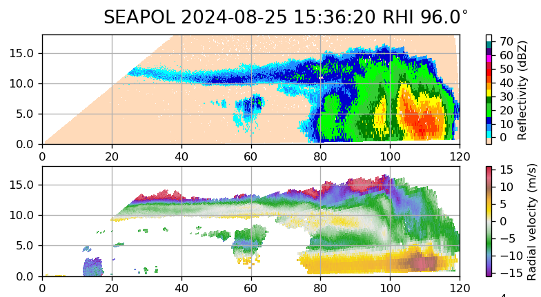

{logo}`BOWTIE`

# {front}`report_id`

## Summary

RV Meteor continues its trek north across the ITCZ and through the doldrums. Today the winds were a little bit stronger, near 5 m/s, and skies were overcast throughout the day. Around 15:00 LT, convection erupted around us and anyone working on deck was drenched by heavy rain. This was some of the deepest and strongest convection we've experienced, with echo tops regularly above 15 km (or up to 17 km on one scan!) and reflectivities of 45 - 55 dBz. The figure below shows one of the cells, at 15:36 UTC/14:36 LT, in which the top panel is reflectivity and the bottom panel is radial velocity in which positive values indicate motion away from the radar. The x-axis is distance from the radar (range, in km) while the y-axis is height above the surface (km), hence the name "Range-Height Indicator", or RHI, for this type of scan. The strong radial gradient in radial velocity around 115 km in the bottom panel indicates convergent flow at low-levels into the storm, with divergent flow around 100 km.  The rain continued on and off for hours due to the widespread convection in the area, which was well-captured by a full 80 minutes of circling to fill SEA-POL's blanked sector. Just as we prepared to launch the 21 UTC radiosonde (launched at 19:50 UTC/18:50 LT), we were hit by another gust front followed by heavy rain, lightning, and the first rolls of thunder heard on the cruise. It made for epic conditions for launching the radiosonde, as lightning struck around us just as the balloon took flight. 

Throughout the rainy conditions, we also continued to conduct our regular 6-hourly CTD measurements of the ocean profile, which measure current, temperature, and depth. The CTD at 16:00 LT was a "plankton CTD" in which bottle nets open at specific depths to collect samples that are then analyzed under the microscope to identify zooplankton. Different types of zooplankton are present at different depths and they also migrate up and down the water column from day to night. Stay tuned tomorrow for a photo of our "plankton of the week"!

Since it was Sunday, there was no daily briefing or science discussion. Instead, we enjoyed an excellent Sunday lunch prepared by the chef and some time for relaxation in between our work tasks. 

## Remarks

- Radiosondes were launched on the normal 3-hourly schedule. The 18 and 21 UTC radiosondes were launched directly into storms.
- We will return to Cape Verde to retrieve parts, instruments, and personnel from Praia on 28.08. We will not be able to take measurements while in the harbor.
- We plan to meet HALO at 13 N, 23.5 W while we are just south of Praia on 27.08. Coordination with the ATR and King Air may also be possible while we are near Praia. We also plan to meet HALO and EarthCare on 31.08. 

## Plans
- 25.08 - 27.08 15:00 LT: Steam north to meet HALO about 110 km south of Praia, performing MSS, CTD, and SEA-POL circles every 6 hours.
- 27.08 16:00 LT - 28.08 6:00 LT: Steam north to Praia.
- 28.08 6:00 LT - 18:00 LT: Retrieve parts, instruments and personnel in Praia. 
- 28.08 18:00 LT - 30.08 08:00 LT: Steam to Pirata buoy at 11.5N, 23 W to retrieve drifters and gliders.
- 30.08 16:00 LT - 31.08 14:00 LT: Steam to EarthCare orbit then SE along EarthCare orbit towards 9N, 23.07 W to meet EarthCare and HALO.
- 31.08 15:00 LT -  06.09 19:00 LT: Steam to central Atlantic buoy at 8N, 38W, performing MSS, CTD, SEA-POL circle every 6 hours.

## Events

Time (Local) | Comment
----- | -----
23:08 - 00:25 | CTD + Incubation at 10 m
00:36 - 1:18 | MSS
8:01 - 8:37 | MSS
8:43 - 10:02 | CTD
10:10 - 10:30 | SEA-POL circle
16:00 - 16:42 | Plankton CTD
16:50 - 18:10 | SEA-POL circles

