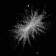
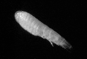

{logo}`BOWTIE`

# {front}`report_id`

## Summary

RV Meteor continues its trek north across the ITCZ. After yesterday evening's thunderstorms, we've moved north of the convectively active region of the ITCZ. This morning, the skies were blue with no clouds in any direction, as far as the eye can see. Later in the afternoon, some small, shallow cumulus developed near us, but any substantial clouds with rain were more than 100 km away. 

As we are running ahead of schedule for our meeting with HALO tomorrow, we took the time to do extra long microstructure measurements. During an MSS, or microstructure sounding, the ship moves at a slow speed (1.5 kts) into the waves and a microstructure profiler is deployed. This instrument is designed to mesaure velocity shear and temperature variability on vertical scales of less than a millimeter, as well as high frequency measurements of other physical quantities. Typically we have been conducting an MSS for 30-40 minutes, but tonight we will perform these measurements for 10 hours! These measurements are critical for quantifying the strength of turbulence and resulting ocean mixing processes, which play an important rule in the heat budget.

Analysis also continues on the other oceanographic samples that have been collected. Marine particles and plankton are crucial to biogeochemical cycles and trophic webs. Several image-based instruments have been developed to study these oceanic particles, including the Underwater Vision Profiler (UVP). The UVP quantifies large aggregates (>100 μm) and zooplankton in a known water volume. It has enabled the identification of various aggregates linked to surface primary production and provided in situ observations of rare and delicate plankton like rhizarians, planktonic polychaetes, Trichodesmium colonies, Arctic copepods, and broader plankton communities. Below are a few images of some of the zooplankton found in the east tropical Atlantic on our recent CTDs, courtesy Joelle Habib. Top to bottom, they are trichodesium, amphipoda Eumalacostraca, and appendicularia. 

## Remarks

- Radiosondes were launched on the normal 3-hourly schedule. 
- We will return to Cape Verde to retrieve parts, instruments, and personnel from Praia on 28.08. We will not be able to take measurements while in the harbor.
- We plan to meet HALO and the King Air at 13 N, 23.5 W on 27.08. The ATR will also be within our radar scan volume. There may be additional opportunities to coordinate on 29.08, while we are steaming south of Praia, and we plan to meet HALO and EarthCare on 31.08. 

## Plans
- 26.08 20:00 LT - 27.08 15:00 LT: Steam along 13N, performing MSS, CTD, and SEA-POL circles, and meet HALO and King Air at 13 N, 23.5 W.
- 27.08 17:00 LT - 28.08 6:00 LT: Steam north to Praia. 
- 28.08 6:00 LT - 18:00 LT: Retrieve parts, instruments and personnel in Praia. 
- 28.08 18:00 LT - 30.08 08:00 LT: Steam to Pirata buoy at 11.5N, 23 W to retrieve drifters and gliders.
- 30.08 16:00 LT - 31.08 14:00 LT: Steam to EarthCare orbit then SE along EarthCare orbit towards 9N, 23.07 W to meet EarthCare and HALO.
- 31.08 15:00 LT -  06.09 19:00 LT: Steam to central Atlantic buoy at 8N, 38W, performing MSS, CTD, SEA-POL circle every 6 hours.

## Events

Time (Local) | Comment
----- | -----
02:16 - 03:31 | CTD
03:50 - 04:40 | SEA-POL circle + zig zag
10:15 - 11:37 |CTD
10:20 | Meeting led by D. Klocke
11:50 - 12:50 | SEA-POL circles
6:14 - 7:35 | CTD
7:45 - 8:05 | SEA-POL circle
8:30 - 6:30 | MSS

