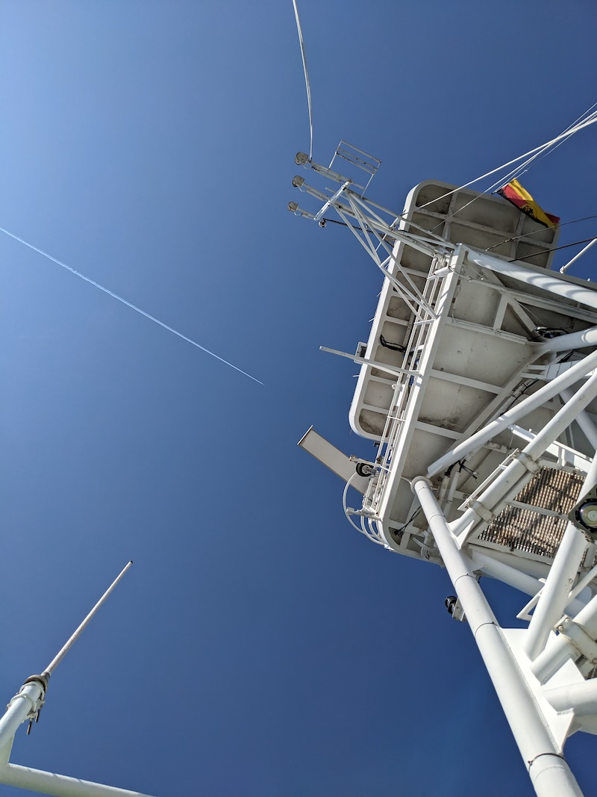
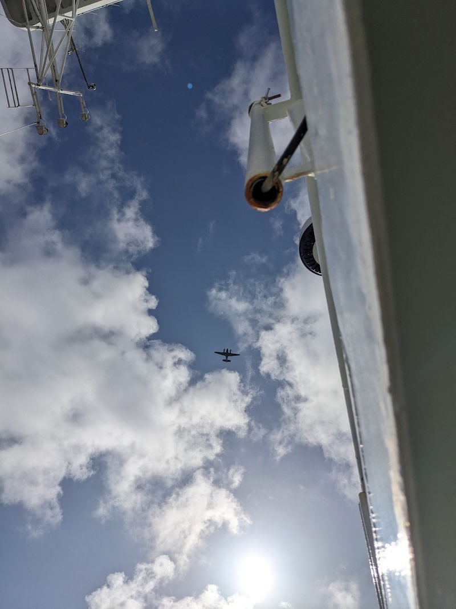
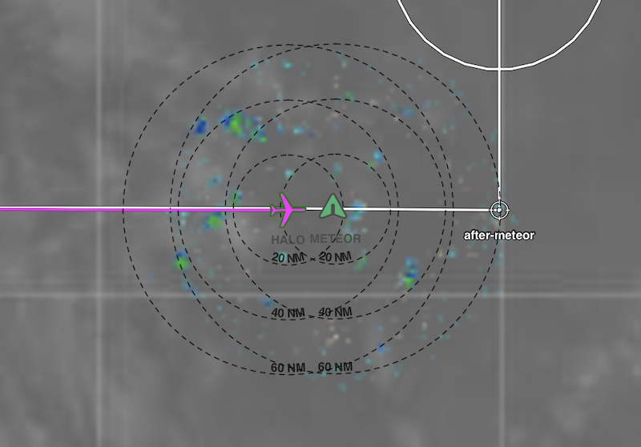

{logo}`BOWTIE`

# {front}`report_id`

## Summary

RV Meteor received its first airborne visitors today, with overpasses by both HALO and the King Air! After performing 60 microstructure measurements over the course of 17 hours (slowly steaming 2 nmi back and forth), we prepared ourselves for the arrival of the aircraft. Mostly cloudy skies earier in the day had evolved into mostly sunny skies, with scattered shallow rain showers and trade cumulus clouds around us. We did one circle to give the SEA-POL radar a chance to survey the entire scene, and then parked at 13N, 23.5W. We had a busy hour of plane- and whale-spotting! HALO flew over us first from west to east, before turning around to pass over us again from east to west, during which time they attempted to land a dropsonde on us, but missed by 2.32 nm to the east. They then flew over us again one more time before turning north to head back towards Sal. HALO was flying high, around 45,000 ft, but we were still able to see the tiny speck of the plane from the ship, in addition to its contrail (see first photo below, courtesy Hauke Schmidt). Meanwhile, the King Air was maneuvering to the west, and flew over Meteor at a much lower altitude, offering better views (see second photo below, courtesy Hauke Schmidt), and we could easily hear it as well. It flew over us again as it ascended in a racetrack pattern before heading off to the west again. Meanwhile, several whales were also cited in the vicinity of the ship, our third whale sighting of the day! 

One of our objectives was to compare the remote sensing retrievals from Meteor (upward-looking) and HALO (downward-looking) to the in situ microphysics retrievals on board the King Air. Unfortunately for the radars, there were clear skies over Meteor during the overpasses, but SEA-POL saw some scattered light rain showers in the area, which were also sampled by the planes (see figure below for radar image overlaid on HALO's flight track, along with Meteor's position, at 15:52 LT, 2 minutes before they passed over us). We peformed a sequence of RHI scans along the flight legs as well as volume scans for spatial context. It was a good day for lidar retrievals, and other instruments that detect thin clouds or work in clear air. Our final aircraft coordination of the day was during the ATR's flight this evening. While they didn't fly over us, they passed within SEA-POL's scan volume. SEA-POL detected drizzling shallow convection, which was validated by the ATR crew's in situ observations of clouds and drizzle. 

Following the excitement of the whales and planes, we performed a CTD before beginning to steam north to Praia, where we will pick up parts for SEA-POL, drones, and drone pilots tomorrow. We also held our regular daily status briefing at 10:20 LT followed by a presentation from Anna Trosits about the suite of remote-sensing instrumentation from Uni Leipzig. Stay tuned for a summary of her presentation in tomorrow's report.

## Remarks

- Radiosondes were launched on the normal 3-hourly schedule. An extra radiosonde was launched at 14:50 LT in addition to the regular one at 15:50 LT.
- We will return to Cape Verde to retrieve parts, instruments, and personnel from Praia tomorrow (28.08). We will not be able to take measurements while in the harbor.
- We met HALO and the King Air at 13 N, 23.5 W today for coordinated measurements. The ATR was also within our radar scan volume during the southern part of their flight in the evening. There may be additional opportunities to coordinate on 29.08, while we are steaming south of Praia, and we plan to meet HALO and EarthCare on 31.08. 

## Plans
- 27.08 18:30 LT - 28.08 7:30 LT: Steam north to Praia. 
- 28.08 7:30 LT - 18:00 LT: Retrieve parts, instruments and personnel in Praia. 
- 28.08 18:00 LT - 30.08 08:00 LT: Steam to Pirata buoy at 11.5N, 23 W to retrieve drifters and gliders.
- 30.08 16:00 LT - 31.08 14:00 LT: Steam to EarthCare orbit then SE along EarthCare orbit towards 9N, 23.07 W to meet EarthCare and HALO.
- 31.08 15:00 LT -  06.09 19:00 LT: Steam to central Atlantic buoy at 8N, 38W, performing MSS, CTD, and SEA-POL circles every 6 hours.

## Events

Time (Local) | Comment
----- | -----
23:29 - 00:29 | MSS
1:39 - 2:56 | MSS
3:30 - 4:38 | MSS
5:10 - 6:11 | MSS
7:07 - 8:08 | MSS
8:41 - 9:47 | MSS
10:18 - 11:16 | MSS
11:50 - 12:47 | MSS
10:20 | Meeting led by D. Klocke, presentation by A. Trosits
15:00 - 15:20 | SEA-POL circle
15:30 - 17:00 | Coordinated SEA-POL scans with HALO and King Air
17:05 - 18:30 | CTD 

