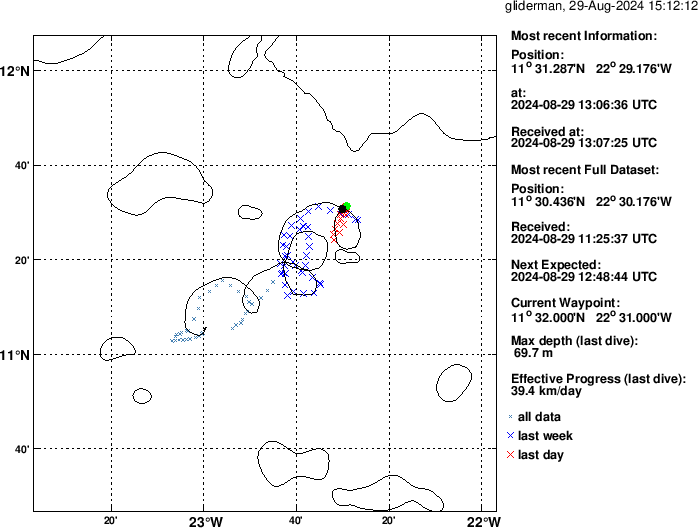
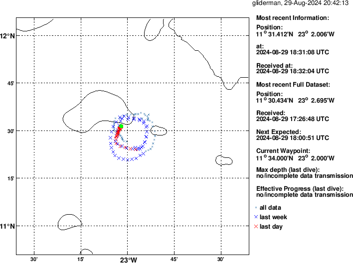
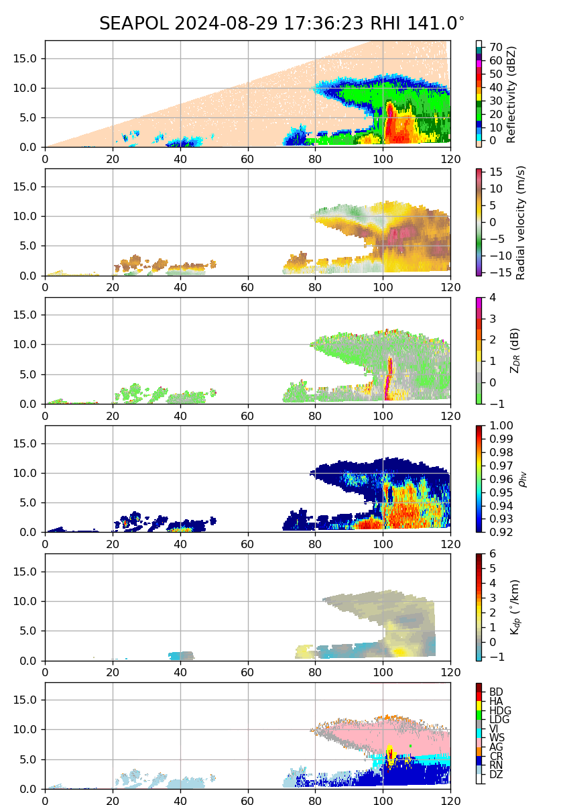

{logo}`BOWTIE`

# {front}`report_id`

## Summary

RV Meteor had a busy day of oceanographic operations today. After 11 days of traveling on their own, we returned to the vicinity of the Pirata buoy at 11.5 N, 23 W to retrieve gliders and drift buoys that had been deployed on 18.08. The below figures (courtesy GEOMAR) show the trajectories of each of the gliders during their journey. One of the gliders spiraled from its deployment location just north of 11N, 23W to the northeast, while the other circled around 11.5N, 23 W. Gliders are autonomous platforms that continuously measure physical and biogeochemical properties of the ocean, and can modify their volume to rise and sink in the water column.  

We also had two big firsts today by the sub-campaigns on board Meteor -  PICCOLO's first collection of dual-polarization data with SEA-POL, and STRINQS' first drone test flight. After a long day of repairs yesterdays, SEA-POL's heroic engineers were able to repair the radar, and we can now say that an advanced ship-stabilized dual-polarization radar has taken measurements in the Atlantic Ocean for the first time. The atmosphere also cooperated, giving us some well-developed convective cells to scan on the margins of the two mesoscale convective systems we were between. This was a great test for SEA-POL's capabilities, and the early results (see figure below) are incredibly promising. In the figure, the co-located low values of correlation coefficient (rho) and high values of reflectivity suggest the presence of graupel, as indicated by the hydrometeor identification in the bottom panel. The worm-like structure of high differential reflectivity (Zdr) within the region of high reflectivity indicates the rain shaft with large rain drops and melting graupel. 

We also held our usual daily briefing and science discussion at 10:20 LT, in which Joelle Habib presented about the oceanic carbon pump. She focused on the gravity pump, in which phytoplankton that have taken up CO2 die and fall down the water column as particular matter, and the migration pump, in which zooplankton rise up and down the water column and eat phytoplankton. Joelle also described the two tools being used on BOWTIE to measure these fluxes and classify zooplankton - an underwater vison camera attached to the CTD and bottle nets, as described in the last few reports.

## Remarks

- Radiosondes were launched on the normal 3-hourly schedule. 
- Gliders and drift buoys were retrieved.
- SEA-POL is now operating in dual-polarization mode. 
- STRINQS' first drone test flight took place. 
- We plan to meet the nighttime orbit of Earthcare tonight, at 2:29 LT/3:29 UTC on 30.08. We plan to meet HALO and EarthCare on 31.08, 03.09, as well as HALO on 05.09. 

## Plans
- 30.08 02:29 LT: Meet EarthCare at 11.5N, 23.56W.
- 30.08 03:00 LT - 30.08 12:00 LT: Retrieve the wire walker drifter near Pirata buoy at 11.5N, 23 W.
- 30.08 12:00 LT - 31.08 14:00 LT: Steam to EarthCare orbit towards 8.5N, 23.5 W to meet EarthCare and HALO.
- 31.08 15:00 LT -  03.09 14:00 LT: Steam to EarthCare orbit at 8.5N, 30.8W to meet EarthCare and HALO.
- 03.09 15:00 LT - 07.09 00:00 LT: Steam to central Atlantic buoy at 8N, 38W, performing MSS, CTD, and SEA-POL circles every 6 hours. Meet HALO on 05.09 around 8N, 35W.

## Events

Time (Local) | Comment
----- | -----
23:02 - 00:19 | Incubation CTD
00:28 - 00:48 | SEA-POL circle
01:10 - 1:23 | Incubation CTD
10:20 | Meeting led by D. Klocke, science presentation by J. Habib
11:45 - 12:12 | Retrieved glider
12:59 - 1:08 | Retrieved drifter
17:02 - 17:31 | Retrieved glider
17:53 - 17:38 | MSS
18:43 - 20:00 | Plankton CTD, Drone test flight

