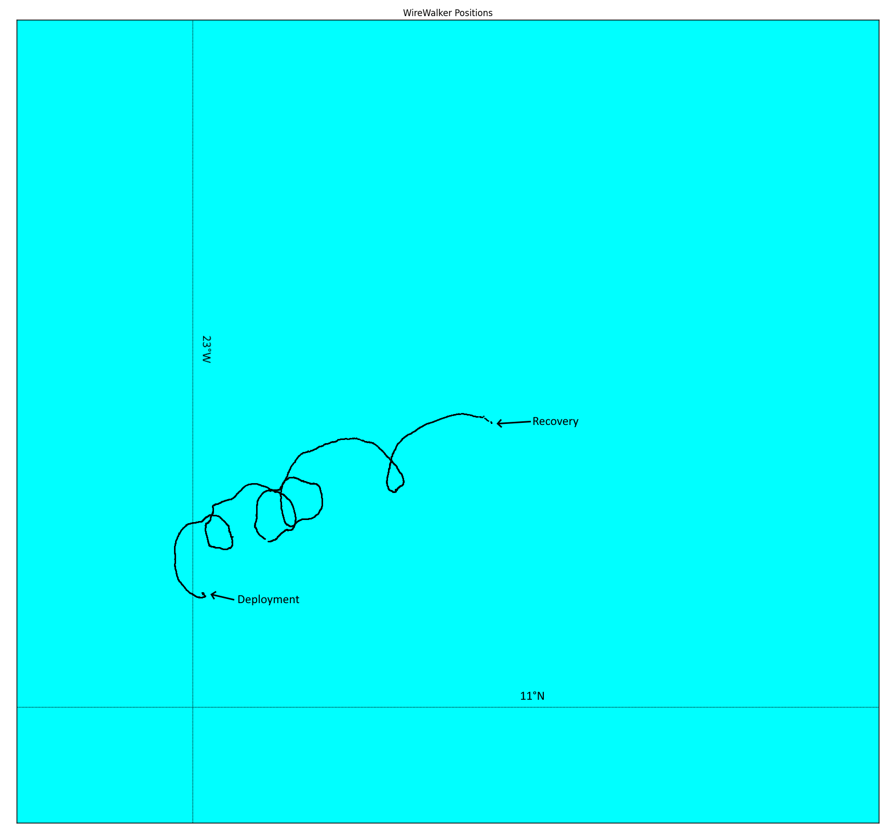
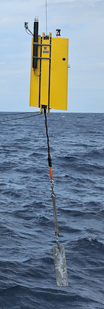
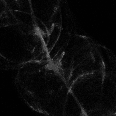

{logo}`BOWTIE`

# {front}`report_id`

## Summary

Last night, RV Meteor took a brief detour from its station near the Pirata buoy to conduct our first nighttime coordination with the EarthCare satellite. We positioned ourselves at 11.5N, 23.56W for the EarthCare overpass at 2:29 LT. Following the EarthCare overpass, we returned to our task of searching for deployed ocean instruments, and retrieved the wirewalker drift buoy this morning. Meteor is now heading along the EarthCare orbit of 31.08, with plans to meet HALO and EarthCare tomorrow. 

The wirewalker is one of several unique instruments that have been deployed on BOWTIE. It is attached to a steel cable hung from a drift buoy, with a weight at the bottom. As the buoy drifts around following the currents (see figure below, courtesy Daniel Blandfort), the wirewalker moves up and down the cable, taking hundreds of vertical profiles down to 750 m depth during its 12 day deployment. The wirewalker is the only non-electronic vertical ocean profiler, operating entirely mechanically through a remarkably simple design. As the buoy bobs up and down in the waves, the locking mechanism through which cable runs opens and closes, moving the wirewalker down the column. After it reaches the designated depth, a clamp engages to prevent it from going down further, the internal locking mechanism opens, and the wirewalker then free floats back to the surface, due to its internal buoyancy foam. The instrumentation attached to the wirewalker includes a CTD that measures current, temperature, and depth, sensors for chlorophyll and oxygen, an underwater vision profiler (UVP) that takes photos of plankton, and a microstructure sounder for ocean turbulence (see figures below showing the wirewalker being deployed, and an image of plankton from the UVP, courtesy Daniel Blandfort). Our deployment of the wirewalker is its longest and deepest deployment to date. 

We also held our usual daily briefing and science discussion at 10:20 LT, in which Peristera Paschou presented about the Licht Raman lidar. A lidar is an active sensor in which laser pulses are transmitted and a portion of the incident beam is backscattered by particles. The Raman lidar on board Meteor sends pulses at 10Hz at three different wavelengths in the visible part of the spectrum; 355, 532, and 1064 nm. The fact that the lidar sends a laser pulse is readily apparent at night on board Meteor, when we see the green beam of light shooting up into the sky. Several telescopes collect the backscattered laser pulses and receive with 34 channels acorss 6 detected wavelengths. In addition to the backscattered pulses by aerosol particles, rotational and vibrational Raman modes of nitrogen and water vapor permit retrieval of particle backscatter, volume/particle linear depolarization ratio, water vapor mixing ratio, relative humidity, and, unique to this lidar, temperature. Peristera also shared some preliminary results of a dust/aerosol layer after we departed Praia. 

## Remarks

- Radiosondes were launched on the normal 3-hourly schedule. We launched an extra radiosonde for the EarthCare overpass. 
- The wirewalker drift buoy was retrieved.
- SEA-POL is now operating in dual-polarization mode. 
- We plan to meet HALO and EarthCare on 31.08, 03.09, as well as HALO on 05.09. 

## Plans
- 30.08 - 31.08 16:00 LT: Steam to EarthCare orbit towards 8N, 23.6 W to meet EarthCare and HALO, performing MSS, CTD, drone flight, and SEA-POL circles every 6 hours.
- 31.08 16:00 LT -  03.09 16:00 LT: Steam to EarthCare orbit at 8.5N, 30.8W to meet EarthCare and HALO.
- 03.09 16:00 LT - 05.09 16:00 LT: Steam to meet HALO transfer flight at 8N, 35W, performing MSS, CTD, drone flight, and SEA-POL circles every 6 hours.
- 05.09 16:00 LT - 07.09 00:00 LT: Steam to central Atlantic buoy at 8N, 38W, performing MSS, CTD, drone flight, and SEA-POL circles every 6 hours.

## Events

Time (Local) | Comment
----- | -----
23:43 - 00:30 | MSS
00:40 - 01:19 | CTD
01:36 - 02:00 |CTD
02:29 | EarthCare overpass, coordinated SEA-POL scans
08:00 - 09:09 | Retrieved drift buoy with wirewalker
09:35 - 10:13 | Drone test flight
10:20 | Meeting led by D. Klocke, science presentation by P. Paschou
15:00 - 15:45 | MSS
15:45 - 17:30 | CTD, Drone flight
17:30 - 18:00 | SEA-POL circles

