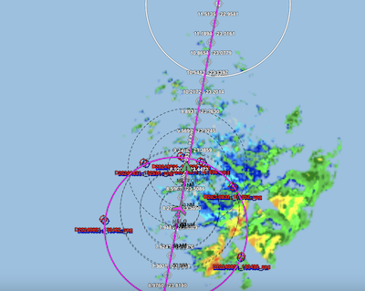

{logo}`BOWTIE`

# {front}`report_id`

## Summary

As August comes to an end, RV Meteor had its 5th EarthCare overpass, 4th coordination with HALO, and 2nd HALO overpass today. We met with HALO around 9 AM LT on their way south, during which time there were brisk southwesterly winds, partly cloudy skies, and scattered shallow rain showers around the ship that were mostly invisible to infrared satellite. A thin cloud layer at 5 km, as measured by the Uni Leipzig cloud radar on board Meteor, and their flight level above 40,000 ft, prevented HALO from visually seeing Meteor, but we saw their contrail through breaks in the clouds. As HALO began their center circle at 11:52 LT, SEA-POL radar scans from Meteor's position near the northern edge of the circle indicated that the southeast part of the circle was rainiest. While within the HALO circle, Meteor performed its own mini circle to fill the SEA-POL volume. After completing their circle, HALO again passed over Meteor on their way north (see figure below, showing the SEA-POL scan overlaid on HALO and Meteor's positions just before HALO's second overpass), though this time overcast skies prevented us from seeing them. Finally, Meteor collected co-located measurements with the EarthCare overpass at 2:40 LT. We have now turned west, to finally leave the eastern Atlantic and spend the next several days heading towards the central Atlantic at 38 W.

We also had our daily briefing and science discussion at 10:20 LT, with a presentation by Judith van der Giessen and Abiel Kidane. They discussed the measurements they are collecting to study methane production and nitrogen fixation. Their science objectives include investigating how environmental parameters such as nutrient availability influence methane production, assessing how much nitrogen and carbon dioxide is fixed by micro-organisms in this region, and how iron uptake, such as that associated with Saharan dust, affects the fixation rates. To address these questions, they use "Incubation CTDs" to measure profiles of oxygen, photosynthetically active radiation, and chlorophyll as well as collect discrete water samples at different depths. From these water samples, they measure nutrients, particulated organic matter, and other quantities as well as use the water to set up incubation experiments on Meteor's deck (see second photo below, courtsey Judith van der Giessen and Abiel Kidane). In the incubation experiments, they pump through ocean surface water to keep the incubation tanks cool under the hot tropical sun and utilize photo paper to mimic light levels at different depths in the surface layer (10-90 m). The micro-organisms are allowed to grow for 24 hours with the addition of stable isotopes, before being fixed with Paraformaldehyd (PFA) and collected on filters which will be kept frozen until single-cell stable isotope imaging using the nanoscale secondary ion mass spectrometry in performed in Bremen. In general, the samples from the profiling CTD as well as the samples from the incubation experiments will be transported to MPI Bremen where most of the analysis will be undertaken (i.e. nutrient measurements, stable isotope analysis, microscopy).

## Remarks
- Meteor will change time zones tonight at 3 AM LT, moving from UTC-1 to UTC-2, which is sure to confuse everyone on board.
- Radiosondes were launched on the normal 3-hourly schedule, mostly. We launched extra radiosondes at 7:50 LT/8:50 UTC and 13:50 LT/14:50 UTC in association with the HALO and EarthCare overpasses, and launched our 3 UTC sonde 25 minutes early for the second HALO overpass, at 12:25 LT/13:25 UTC instead of 12:50 LT/13:50 UTC.
- We plan to meet HALO and EarthCare again on 03.09, as well as HALO on 05.09. 

## Plans
- 31.08 15:00 LT -  03.09 15:00 LT: Steam to EarthCare orbit at 8N, 30.9W to meet EarthCare and HALO, performing MSS, CTD, drone flight, and SEA-POL circles every 6 hours.
- 03.09 15:00 LT - 05.09 15:00 LT: Steam to meet HALO transfer flight at 8N, 35W, performing MSS, CTD, drone flight, and SEA-POL circles every 6 hours.
- 05.09 15:00 LT - 07.09 00:00 LT: Steam to central Atlantic buoy at 8N, 38W, performing MSS, CTD, drone flight, and SEA-POL circles every 6 hours.

## Events

Time (Local) | Comment
------------ | -----
00:05 - 00:45 | MSS
00:55 - 02:12 | CTD
09:07 | HALO overpass, coordinated SEA-POL scans
09:32 - 10:51 | CTD
09:49 - 11:18 | Drone flight
10:20 | Meeting led by D. Klocke, science presentation by J. Giessen and A. Kidane
12:30 - 12:50 | SEA-POL circle
13:07 | HALO overpass, coordinated SEA-POL scans
14:00 - 14:20 | SEA-POL circle
14:40 | EarthCare overpass, coordinated SEA-POL scans
17:15 - 17:49 | MSS
17:57 - 19:16 | CTD
18:08 - 19:23 | Drone flight
19:30 - 19:50 | SEA-POL circle

