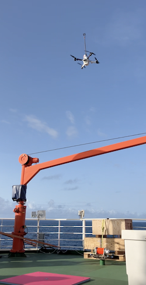
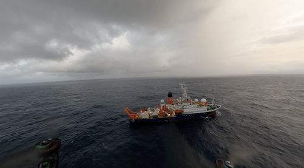

{logo}`BOWTIE`

# {front}`report_id`

## Summary

RV Meteor continued west (into a new time zone!), heading into a brisk west/southwesterly wind around 20-25 kts, with swell from the south. We spent the day just to the north/northeast of a well-developed mesoscale convective system. Real-time MCS tracking by TOOCAN provided by MAESTRO indicated that the MCS was moving west at about the same speed as Meteor (10 kts), and persisted throughout last night and the day today. The SEA-POL radar captured steady returns to our south/southwest throughout most of the day as we followed the MCS to the west.  Several persistent narrow convective lines brought moderately heavy rain to the ship in the early morning and late afternoon while numerous short-lived, shallow small rain showers popped up on and off throughout the day. 

Today also featured notable achievements for STRINQS, who held their first simulataneous drone flight in which they flew two drones in formation at the same time. They also reached the furthest distance from the ship, 750 m, and highest altitude, 1.5 km, as they have achieved thus far. The drones flew a hexagon pattern around the ship, with one at an altitude of 300 m and the other at 600 m. They also conducted simulataneous vertical profiles. The first photo below shows one of the drones taking off from Meteor, courtesy James Ruppert, while the second photo shows a view of the Meteor from a GoPro camera attached to the drone from the flight yesterday evening (courtsey Rob MacKenzie). It captures the low-level clouds and rain shower off of Meteor's port side. 

There was no briefing and science discussion today as it was Sunday.

## Remarks
- Meteor changed time zones last night and is now UTC-2.
- Radiosondes were launched on the normal 3-hourly schedule.
- We plan to meet HALO and EarthCare again on 03.09, as well as HALO on 05.09. 

## Plans
- 01.09 -  03.09 10:00 LT: Steam to EarthCare orbit at 8N, 30.9W to meet EarthCare and HALO, performing MSS, CTD, drone flight, and SEA-POL circles every 6 hours.
- 03.09 15:00 LT - 05.09 7:00 LT: Steam to meet HALO transfer flight near 8N, 35W, performing MSS, CTD, drone flight, and SEA-POL circles every 6 hours.
- 05.09 13:00 LT - 06.09 06:00 LT: Steam to central Atlantic buoy at 8N, 38W, performing MSS, CTD, drone flight, and SEA-POL circles every 6 hours.

## Events

Time (Local) | Comment
------------- | -----
02:00 - 02:36 | MSS
02:44 - 04:08 | CTD
11:01 - 11:28 | MSS
11:35 - 12:50 | CTD
12:30 - 13:28 | Drone (x2) flight
13:30 - 13:50 | SEA-POL zig zag
17:06 - 18:25 |CTD
17:52 - 18:33 | Drone flight

