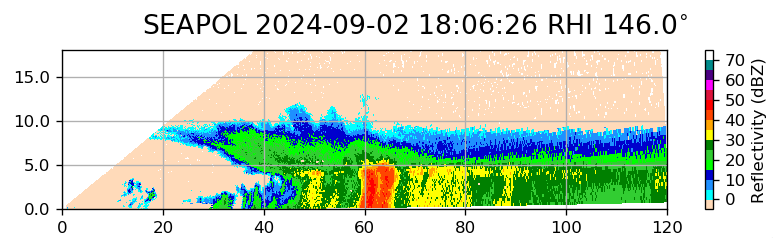
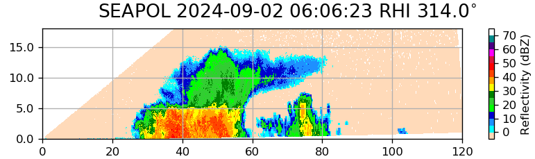
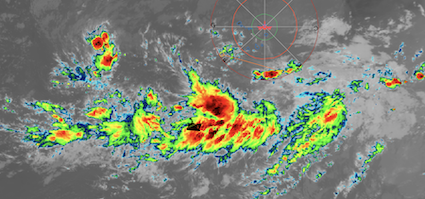

{logo}`BOWTIE`

# {front}`report_id`

## Summary

RV Meteor continues its trek westward. For the first time, we find ourselves within a mesoscale convective system, with classical structure of leading deep convection followed by trailing stratiform rain (see first RHI scan from SEA-POL below). The deep convective core is indicated by the high reflectivity (45 dBz) region around 60 km from the radar. To the left of that (closer to the radar) is the spreading anvil, and to the right is the broad region of stratiform rain with lower reflectivities. There is also a prominent bright band of relatively higher reflectivities just below 5 km, which indicates the freeezing level. The second RHI scan, from a system earlier in the day, shows a different stage of convective organization. In that image, a smaller congestus cell is beginning to form underneath the anvil of a mature deep convective cell. Subsequent scans indicated a deepening and broadening of the congestus cell until it merged with the neighboring cell into a larger system.

We are positioned between two tropical wave axes, in the region of active convection ahead of the wave that has just moved off the coast of Africa. The wave is moving west at about 15 kts, while we are traveling at 10 kts, so while the wave will catch up to us, we will be within the region of deep convection for some time (see GOES satellite image below, with Meteor's position indicated by the ship icon, from the MAESTRO/ORCESTRA operational center). Things were particularly interesting around 20:00 LT, when a previously un-seen MCS in SEA-POL's blanked sector was revealed by a circle manuever. Satellite imagery indicated an explosive blow-up of convection to our northeast, with evident outward propagating gravity waves in the infrared brightness temperature field. The SEA-POL team is perhaps the only group happy with the day of rain; while not ideal for activities on deck, it was good for radar science! 

The regular daily briefing with science discussion was held at 10:20 LT, with a presentation by James Ruppert. James discussed the diurnal cycle of tropical convection. Over land areas, rainfall peaks in the late afternoon, but over ocean, it peaks overnight and in the early morning. Nocturnal convection is thought to be promoted by nighttime cloud top radiative cooling. However, there may also be a secondary afternoon peak in convective develompent over the ocean, which is less well understood but might be related to diurnal warm layers, which is when a shallow layer of the upper ocean warms under light wind conditions. James shared some results from the DYNAMO field campaign in the Indian Ocean and some preliminary results of diurnal variability from Meteor's radiosondes and sea surface temperature measurements. One of the objectives of the PICCOLO sub-campaign is to use SEA-POL data and other complementary measurements from the ship to study the diurnal cycle of distinct convective cloud modes and investigate whether cloud-radiative interactions play a role in driving clustered compared to isolated convection.  

## Remarks
- Meteor changed time zones is now UTC-2.
- Radiosondes were launched on the normal 3-hourly schedule.
- We plan to meet HALO and EarthCare again on 03.09, as well as HALO on 05.09. 

## Plans
- 02.09 -  03.09 8:00 LT: Steam to EarthCare orbit at 8.5N, 30.845W to meet EarthCare and HALO, performing MSS, CTD, drone flight, and SEA-POL circles every 6 hours.
- 03.09 15:00 LT - 05.09 7:00 LT: Steam to meet HALO transfer flight near 8N, 35W, performing MSS, CTD, drone flight, and SEA-POL circles every 6 hours.
- 05.09 7:00 LT - 06.09 10:00 LT: Steam to central Atlantic buoy at 8N, 38W, performing MSS, CTD, drone flight, and SEA-POL circles every 6 hours.

## Events

Time (Local) | Comment
------------- | -----
00:02 - 00:36 | MSS
00:45 - 02:04 | Incubation CTD
02:10 - 03:10 | SEA-POL circles
03:10 - 03:21 | Incubation CTD
08:59 - 09:32 | MSS
09:38 - 12:57 | CTD
09:46 - 11:34 | Drone flight
13:40 - 14:00 | SEA-POL circle
16:48 - 18:07 | CTD
17:05 - 18:47 | Drone flight
18:52 - 19:28 | MSS
19:35 - 20:15 | SEA-POL circles 

