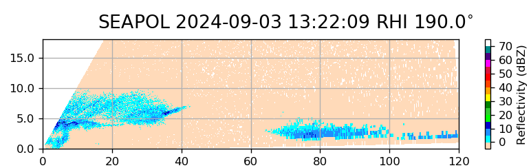
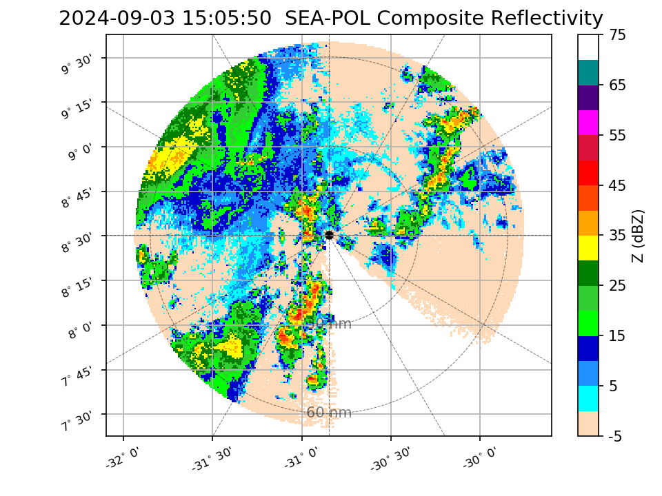
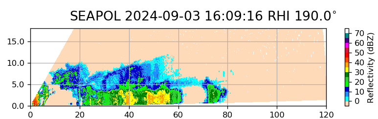

{logo}`BOWTIE`

# {front}`report_id`

## Summary

RV Meteor paused our trek westward today for successful coordination with the HALO aircraft at the center point of their middle circle along the EarthCare orbit at 8.5 N, 30.845 W. The atmosphere cooperated as well; unlike some of our prior coordinated flights, there was ample convection for our collective instruments across the three platforms to sample. 

HALO first passed over Meteor on its way south, at 11:22 LT/13:22 UTC. At this time we were under the cold cloud shield of a mesoscale convective system but most of the convection was to our northwest, with little along the heading that HALO was flying. However, the SEA-POL RHI scans did pick up some elevated drizzle and wet snow (see first figure below), and the cloud radar on HALO indicated a melting layer. The reflectivities were low (0-10 dBZ), but perhaps in the sweet spot where all three of the radars (the C-band SEA-POL, the W-band cloud radar on Meteor, and the Ka-band cloud radar on HALO) could measure. In heavier rain, the cloud radars would attenuate quickly, and SEA-POL can only see drizzle-sized drops and larger.  About an hour and a half later, HALO returned to the vicinity of the Meteor and performed a 70 nm radius circle around the ship. Throughout this time, Meteor performed a smaller 500 m radius circle to fill SEA-POL's blanking sector and provide radar coverage throughout the entirety of HALO's circle. A vigorous line of convection to the northeast of Meteor (see second figure below) was observed by HALO to be detraining at 8 km, which is consistent with estimated echo tops from SEA-POL's volume scan. The coordination at the end of HALO's circle was (unintentionally!) perfectly timed, with HALO passing over Meteor at nearly the same time as EarthCare, 14:09 LT/16:09 UTC. There was moderately heavy rain over the ship at the time of the overpasses and a well developed line to our south along HALO and EarthCare's trajectory (see third figure below). In the future, more detailed analysis will be performed to compare data from SEA-POL and other instruments on board Meteor, such as the cloud radar and microwave radiometer, to measurements from HALO. We will also be able to use the SEA-POL radar data to classify the degree of convective organization within the HALO circle, and compare estimates of mesoscale divergence from retrievals of radial velocity to those computed from HALO's dropsondes.

Other activities today included our regular oceanographic measurements (a microstructure sounding and a CTD) in the morning before the HALO flight and in the evening around dinner time (which we are referring to as our sunset station). Typically we perform the MSS first, which involves slow steaming into the waves, followed by the CTD during which we are stationary.  However, since the drones are only flying when the ship is stationary (i.e., during a CTD), for the sunset station we have switched the order to allow the drones to fly during daylight (see event list at the bottom). Today, STRINQS achieved their first simultaneous flight with three drones. They sampled the boundary layer just before HALO's circle around Meteor as well as just after the EarthCare and second HALO overpass. Unfortunately though, while returning to the Meteor from its mission during this evening's station, one of the drones fell into the sea. Meteor attempted to recover it, but only was able to recover the floatation device; the drone itself is presumed to have fallen to the bottom of the ocean. The drone team will study the diagnostics in the drone's last minutes of flight to try to determine the cause of the failure, but for now, we assume that it wished to re-identify as an autonomous underwater vehicle, rather than an unmanned aerial one. The drone team will study the diagnostics in the drone's last minute of flight to try to determine the cause of the failure.  

We also held our regular daily briefing at 10:20 LT. There was no science discussion today due to the coordination activities. 

## Remarks
- Meteor is in the UTC-2 time zone.
- Radiosondes were launched on the normal 3-hourly schedule, plus extra sondes at 10:20 LT/12:20 UTC and 13:20 LT/15:20 UTC for the HALO and EarthCare overpasses.
- We plan to meet HALO on 05.09 during their transfer flight, while we are on our way towards 8N, 38W.  
- One drone was lost to the sea.

## Plans
- 03.09 15:00 LT - 05.09 7:00 LT: Steam to meet HALO transfer flight near 8N, 35W, performing MSS, CTD, drone flight, and SEA-POL circles every 6 hours. 
- 05.09 7:00 LT - 06.09 10:00 LT: Steam to central Atlantic buoy at 8N, 38W, performing MSS, CTD, drone flight, and SEA-POL circles every 6 hours.
- 06.09 - 11.09: Deploy oceanographic gliders and drift buoys near the Pirata mooring at 8N, 38 W. Perform ITCZ transect (details TBD) and recover the instruments. 

## Events

Time (Local) | Comment
------------- | -----
07:49 - 08:23 | MSS
08:33 - 09:57 | CTD
08:55 - 10:27 | Drone flight
10:20 | Extra radiosonde launched
10:20 | Meeting led by D. Klocke
11:22 | HALO overpass, coordinated SEA-POL scans
11:40 - 12:49 | Drone flight
13:00 - 13:40 | SEA-POL circles during HALO circle
13:20 | Extra radiosonde launched
14:09 | EarthCare and HALO overpass, coordinated SEA-POL scans
14:13 - 14:54 | Drone flight
17:03 - 18:29 | CTD
17:21 - 18:09 | Drone flight
18:39 - 19:11 | MSS
19:15 - 19:35 | SEA-POL zig zag

