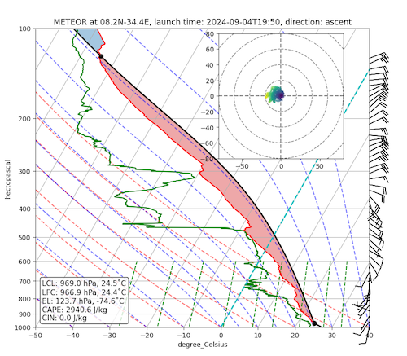
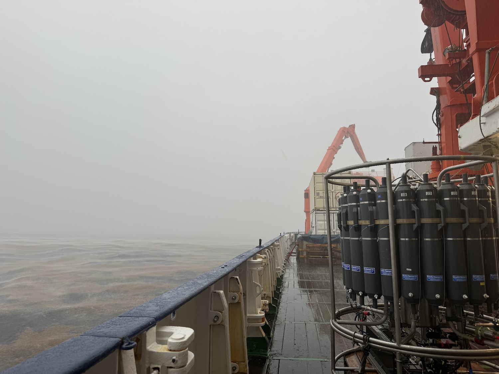
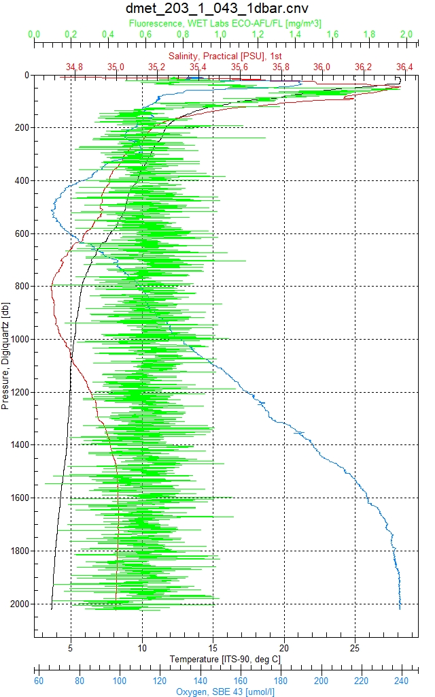

{logo}`BOWTIE`

# {front}`report_id`

## Summary

RV Meteor continues its trek westward towards the Pirata buoy at 8N, 38W. We had hoped to meet HALO today, but unfortunately their flight was cancelled due to technical issues. We hope that they are back in the air soon!

We held our regular daily briefing and science discussion at 10:20 LT. Hauke Schmidt presented some preliminary findings from our radiosondes and discussed a few interesting science questions that have emerged from that data: (1)  Can our radiosondes help us learn about African Easterly Waves passing over us? (2) What causes the commonly occuring stable layer near the freezing level? Initial results indicate signals in the moisture and wind fields that seem to correspond to African Easterly Waves. Hauke also shared plots of the lapse rate as a function of time, latitude, precipitable water, and precipitable water percentile; the stable layers seem to occur at any values of these variables. An example of one of these stable layers from the radiosonde launched yesterday at 17:50 LT/19:50 UTC is shown in the SkewT diagram below - see where the temperature and dewpoint (red and green) lines diverge just above 500 hPa. Further work will investigate these stable layers in more detail, including in km-scale model simulations that are being performed.

Today we performed two standard stations. Typically, a station includes slow steaming for ocean turbulence measurements (MSS), a CTD, sometimes a drone flight while the ship is stationary for a CTD, and manuevers for the SEA-POL radar. The default schedule is for a station to be completed every degree traveled, or about every 6 hours. CTD stands for conductivity, temperature, depth sensors, which are attached to a large metal rosette that is lowered via a cable towards the sea floor (see photo below). In addition to the CTD sensors, the rosette also contains a set of bottles that can be remotely signaled to close as the rosette ascends back up the water column. The on board scientist decides the depths at which to close each individual bottle to collect a water sample, based on the profiles of temperature, salinity, and oxygen measured while the rosette descended (see figure below for an example from a CTD a few days ago). Most of our CTD profiles go down to 2000 m depth, though we occassionally do shorter ones to shallower depths for plankton sampling, and also have done one "full-depth" CTD, where we went all the way down to the ocean floor - a depth of 4473 m at our position at 7.08N, 24.45W on 22.08. 

After the CTD rosette is brought back on deck, scientists take water samples from each bottle which are used to study the physical properties of water, such as the dissolved oxygen concentration, at specific depths. Oxygen needs to be sampled as soon as the CTD is back on deck so that the dissolved oxygen in the water does not begin to change concentrations. When taking the water sample, scientists are careful that it is free of air bubbles that might contaminate the sample.  First the sampling tube is squeezed as water from the bottle flows through it to remove air bubbles, and then the sample flask is rinsed with the same water. We allow water of at least three times the volume of flask to flow over it, while slowly rotating the flask -- again, to avoid air bubbles. I had the chance to help take water samples a few nights ago, and got to experience water from 1636 m depth flowing over my hands -- it was COLD (a few degrees C above freezing). After the flask is filled until overflowing, two reagents are added and the top is carefully placed. Finally, the flask is shaken vigorously to mix the reagent. Two samples are taken from each bottle, for comparison. After letting the samples sit for 2-12 hours, a titration procedure is performed to measure the concentration of dissolved oxygen in the water sample. An acid is added to dissolve the precipitate back into solution, and a magnet stirrer mixes the sample. Next, known amounts of thiosulfate are added until all the oxygen has reacted. This is determined by observing the color changes in the sample as it changes from purple to clear. At the point that it becomes clear, the titration volume of the thiosulfate solution is noted, which is proportional to the concentration of dissolved oxygen. We are having a bit of a contest to see who can take the "best" water samples, as indicated by two oxygen measurements that are very close together. The water samples that I collected had dissolved oxygen concentrations of 237.37 and 237.72 micro-mol/L, respectively - not too bad for a rookie!

## Remarks
- Meteor is in the UTC-2 time zone.
- Radiosondes were launched on the normal 3-hourly schedule.
- We expect that HALO will fly over us tomorrow (06.09) during their rescheduled transfer flight, while we are stationed near 8N, 38W deploying oceanographic instruments.

## Plans
- 05.09 - 06.09 02:00 LT: Steam to central Atlantic Pirata buoy at 8N, 38W, perform an MSS, CTD, and SEA-POL circle after arriving.
- 06.09: Deploy three gliders, one drift buoy, and one drift buoy with WireWalker near 8N, 38W.
- 07.09 - 11.09: Perform partial ITCZ transect along 38 W (details TBD), return to 8N, 38W to recover the oceanographic instruments. 

## Events

Time (Local) | Comment
------------- | -----
23:36 - 00:07 | MSS
00:13 - 01:35 | Incubation CTD
02:31 - 02:48 | Incubation CTD
03:30 - 03:40 | SEA-POL circles
07:53 - 08:22 | MSS
08:41 - 09:20 | Plankton CTD
09:40 - 10:00 | SEA-POL circle
10:20 | Meeting led by D. Klocke, presentation by H. Schmidt
13:15 - 13:49 | MSS
13:38 - 15:12 | CTD
15:25 - 16:05 | SEA-POL circle 

