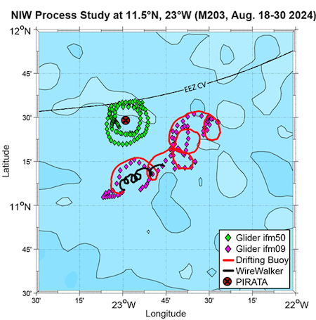

{logo}`BOWTIE`

# {front}`report_id`

## Summary

RV Meteor arrived at the Pirata buoy at 8N, 38W this morning. After a microstructure measurement, CTD, SEA-POL circle, and some fishing to stock up for our planned BBQ tomorrow (Bergfest, marking the midpoint of our cruise), we positioned to deploy oceanographic instruments. First, we deployed two gliders and one drift buoy near the Pirata buoy. We then held our position at 7.93N and 38W to wait for HALO to fly over us on their transfer flight from Cape Verde to Barbados. They flew over us at 11:03 LT/13:03 UTC, and while we did some RHI scans along their flight path with SEA-POL, there wasn't much to see -- only a teeny tiny rain shower far away from the ship. We then re-positioned to deploy an additional glider and drift buoy with WireWalker a bit further north, at 8.5N, 38W.

In our first deployment of gliders and drifters, we deployed one glider that circled the Pirata buoy (at 11.5N, 23W), one glider that followed a drift buoy, and a second drift buoy with the WireWalker profiling the top 750m of the ocean. During that 11-day deployment, we observed strong inertial oscillations in the ocean surface layer - see the clockwise rotating circular currents in the figure below, courtesy Marcus Dengler. The inertial oscillations were excited by clockwise rotating winds on the northern flank of westward-propagating African Easterly Waves, which transfer momentum from the atmosphere to the ocean. This leads to increased turbulent mixing which is critical for the surface heat budget. The currents measured by our gliders and drifters are a great example of inertial balance, in which the Coriolis and centrifugal accelerations acting on a rotating fluid are in balance. Since the pressure gradient force needs to be weak for this balance to hold, it does not occur in the atmosphere, but as our observations show, can be quite prominent in the ocean! It will be interesting to see what we find when we recover the autonomous instruments we deployed today in 5-6 days. Due to the strong equatorial counter current of up to 2 kts, we expect the drifters to move quite a bit to the east before we pick them up again. We don't necessarily expect the inertial oscillations to be as strong in this region, now that we are in the central Atlantic and a bit further south.

We also had our usual daily briefing and science discussion. Hans Segura shared a few slides to motivate discussion about a BOW-TIE dataset. The goal would be for different instruments to write their data in a common file format and structure. This would better facilitate comparison between different instruments; for example, making it easier to analyze all ocean and atmosphere vertical profile data together.

## Remarks
- Meteor is in the UTC-2 time zone.
- Radiosondes were launched on the normal 3-hourly schedule.

## Plans
- 07.09 - 11.09: Head north along or just east of 38W towards the northern edge of the ITCZ, then return to 8N, 38W to recover the oceanographic instruments. 

## Events

Time (Local) | Comment
------------- | -----
03:53 - 04:29 | MSS
05:30 - 06:45 | CTD
06:50 - 07:10 | SEA-POL circle
08:54 - 09:08 | Deploy glider
09:25 - 09:36 | Deploy glider
10:17 - 10:36 | Deploy drift buoy
10:20 | Meeting led by D. Klocke, presentation by H. Segura
11:03 | HALO overpass, coordinated SEA-POL scans
15:03 - 15:20 | Deploy glider
15:50 - 16:26 | Deploy drift buoy with WireWalker
16:46 - 17:24 | MSS
17:34 - 18:49 | CTD
18:55 - 19:15 | SEA-POL circles

