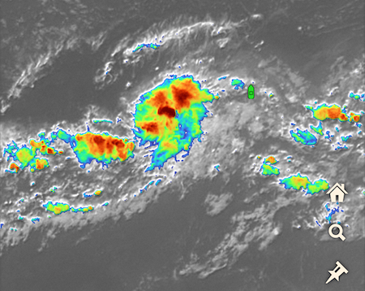
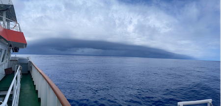
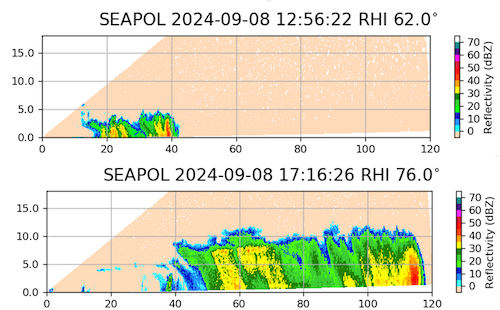
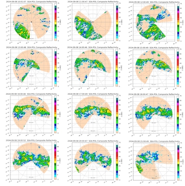

{logo}`BOWTIE`

# {front}`report_id`

## Summary

RV Meteor continues to steam north towards the northern edge of the ITCZ, which has been perturbed by a developing tropical low. We spent our day chasing a rainband on the expanding edge of the tropical low to our west, which is identified by the National Hurricane Center (NHC) as Invest 92L near 13N, 42.5W (see our position as of 17:00 LT/19:00 UTC this evening relative to satellite imagery of the invest in the figure below, from Windy.com). NHC gave the system a 60 percent chance of forming a tropical depression within 48 hours. 

In the morning, we encountered a west to east propagating squall line, which was well-organized despite how shallow the convection was (echo tops around 4-6 km; see top panel of RHI scan below). During the drone flight as the squall line approached us, they measured winds of 13 m/s. The shipborne measurements indicated that the wind speed was less than 1.1 m/s prior to 9:26 LT/11:26 UTC then accelerated to 11.4 m/s by 9:32 LT/11:32 UTC. The photo below shows the approaching squall line, courtesy Michael Bell.

By midday, this had evolved into a rainband stretched from west to east about 30 nmi to our north, and we followed this rainband for most of afternoon as we were both moving north at 10 kts. The convection deepened throughout the day, with echo tops around 10 km by mid-afternoon (see bottom panel of RHI scan below). The second figure below shows the evolution of the convection throughout the day, from 10 to 21 UTC. The rainband held together for an impressively long time, over 9 hours, before starting to lose its organization and weaken around 17:30 LT/19:30 UTC. By 20:00 LT/22:00 UTC it had mostly dissipated, though new convection began entering our radar range from the southwest associated with the northeast edge of the invest.

There was no daily briefing today, since it was Sunday. While we had intended to steam north until we crossed the northern edge of the ITCZ, due to its continued drift north following to the circulation of the tropical low and our time constraints, we turned around at 15.17N, 37.75 W. We are on a tight time clock to make it to Barbados on schedule while still achieving all our science objectives, including a third deployment of oceanographic instruments in the western Atlantic and another partial transect of the ITCZ. We are now headed to recover the instruments that we deployed at 8N, 38W a few days ago, starting first with a drift buoy that has already drifted more than a degree East (you can track it [here](https://data.geomar.de/realtime/data/project/300434067159110/img/300434067159110_pos_105.png)). 

## Remarks
- Meteor is in the UTC-2 time zone.
- Radiosondes were launched on the normal 3-hourly schedule. 

## Plans
- 09.09 - 12.09: Return to 8N, 38W to recover the deployed oceanographic instruments. 
- 12.09 - 16.09: Head west towards 10N, 47W

## Events

Time (Local) | Comment
------------- | -----
08:07 - 08:33 | MSS
08:38 - 09:21 | Plankton CTD
08:45 - 09:53 | Drone flight
10:00 - 10:20 | SEA-POL circle
16:58 - 18:12 | CTD
17:06 - 18:41 | Drone flight
19:45 - 20:05 | SEA-POL circle
23:34 - 00:04 | MSS

